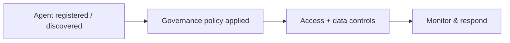

# Feature deep-dive — template

!!! info "Complexity: _Low / Medium / High_ · Est. time: _~N–N min_"
    Replace with the real rating and a one-line justification. Keep this admonition **at the top** of every feature page.

!!! note "This is a scaffold"
    This page shows the **standard 10-section template**. When filling it in, **ground every fact in [Microsoft Learn](https://learn.microsoft.com/microsoft-agent-365/)** and cite URLs in Sources. Mark anything unverifiable as **⚠️ Not verified on Microsoft Learn**.

## 1. Description

_What the capability does, when to use it, and key concepts (observe / govern / secure)._



## 2. Prerequisites

=== "Licensing"
    _Agent 365 per-user license; E5 prerequisite. Link the availability/prerequisites section._
=== "Roles & permissions"
    _AI admin / Entra / Purview / Defender roles required (least privilege)._
=== "Other"
    _Agent registry sync, MCP-connected services, and dependencies._

## 3. Complexity & time

_Justify the rating (registry setup, cross-product policy configuration)._

## 4. Generate sample data

```text
Example scaffold — replace with a real, grounded approach.
Register or onboard a test agent (or use a pre-integrated ecosystem agent),
then exercise it against test data to produce observable activity.
```

## 5. Recommended setup

_Sensible defaults (baseline security templates, least-privilege access packages, pilot scope)._

## 6. Step-by-step configuration

=== "Microsoft 365 admin center"
    1. _Step in the Agent 365 registry / agent settings…_
=== "Entra / Purview / Defender"
    1. _Step in the relevant product portal…_

## 7. Verification

!!! success "What 'good' looks like"
    _Describe the expected end state (agent visible in registry, governed, protected)._

## 8. Extensibility

_SDK/CLI, MCP-connected services, third-party agents, and integration requirements._

## 9. Industry use cases

=== "Financial services"
    _…_
=== "Telco"
    _…_
=== "Public sector & SOE"
    _…_
=== "Energy & resources"
    _…_
=== "Manufacturing & conglomerates"
    _…_

## 10. Sources

- [Overview of Microsoft Agent 365](https://learn.microsoft.com/microsoft-agent-365/overview)
- _Add the specific Microsoft Learn URLs used on this page._
