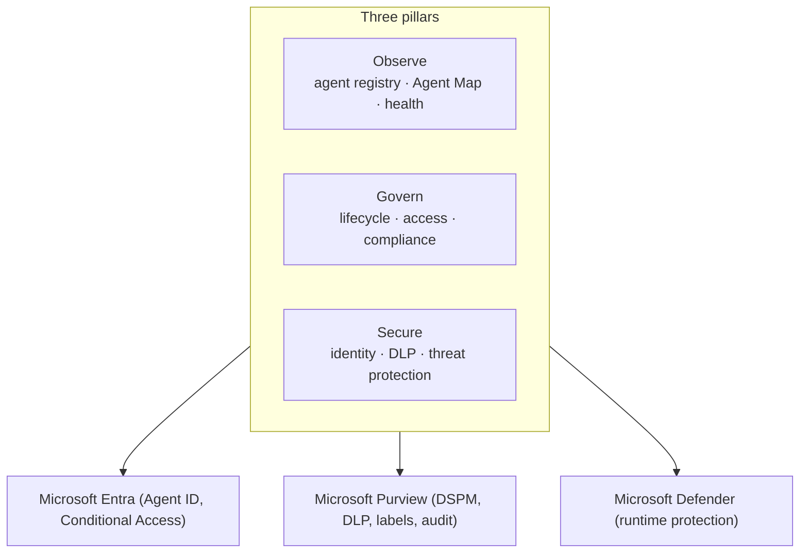

# Microsoft Agent 365

## Observe, govern, and secure your AI agents
Microsoft Agent 365 provides the ability to **observe**, **govern**, and **secure** the growing number of AI agents within organizations — extending Microsoft's identity, data, and threat-defense capabilities across your agent ecosystem.

!!! info "Section status: scaffolded"
    This section uses the **same template** as Purview and is **ready to be filled in**. The overview is grounded in Microsoft Learn; deep-dives will follow the [feature template](feature-template.md).

## What Microsoft Agent 365 is

Agent 365 lets organizations **securely deploy and scale AI agents** with centralized visibility, lifecycle management, and policy-driven governance. It extends **Microsoft Entra** (identity & access), **Microsoft Purview** (data security & compliance), and **Microsoft Defender** (threat protection) to agents, and uses **Agent ID** to secure agent identities and their access to resources.

## The three pillars

-   :material-eye:{ .lg .middle } __Observe__

    ---

    Real-time visibility via a centralized **agent registry** and **Agent Map** — adoption, activity, and agent health from a single admin experience.

-   :material-gavel:{ .lg .middle } __Govern__

    ---

    Consistent guardrails — **lifecycle management**, **access control**, and **compliance** across the Microsoft 365 admin center, Entra, and Purview.

-   :material-shield-lock:{ .lg .middle } __Secure__

    ---

    End-to-end protection — **Entra** least-privilege access, **Purview** data protection (DLP, labels, DSPM), and **Defender** runtime threat detection.

## Where this section is going

Each capability will get a deep-dive page following the workshop template (description → prerequisites → complexity & time → sample data → policy → step-by-step → verification → extensibility → industry use cases → sources).

[:octicons-arrow-right-24: See the feature template](feature-template.md){ .md-button .md-button--primary }

!!! note "Availability & prerequisites"
    Per Microsoft Learn, Microsoft Agent 365 is **generally available for the Commercial segment on a per-user basis (as of May 1, 2026)** and works best with **Microsoft E5** as a prerequisite; at least one user must have a qualifying Agent 365 license. Confirm current details on Learn for your tenant.

## Sources

- [Overview of Microsoft Agent 365](https://learn.microsoft.com/microsoft-agent-365/overview)
- [Secure AI agents at scale using Microsoft Agent 365](https://learn.microsoft.com/security/security-for-ai/agent-365-security)
- [Microsoft Purview data security and compliance protections for Agent 365](https://learn.microsoft.com/purview/ai-agent-365)
- [What is Microsoft Entra Agent ID?](https://learn.microsoft.com/entra/agent-id/what-is-microsoft-entra-agent-id)
