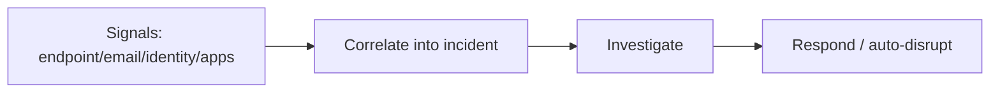

# Feature deep-dive — template

!!! info "Complexity: _Low / Medium / High_ · Est. time: _~N–N min_"
    Replace with the real rating and a one-line justification. Keep this admonition **at the top** of every feature page.

!!! note "This is a scaffold"
    This page shows the **standard 10-section template**. When filling it in, **ground every fact in [Microsoft Learn](https://learn.microsoft.com/defender-xdr/)** and cite URLs in Sources. Mark anything unverifiable as **⚠️ Not verified on Microsoft Learn**.

## 1. Description

_What the service/feature does, when to use it, and key concepts._



## 2. Prerequisites

=== "Licensing"
    _Which plan/add-on is required. Link the Defender licensing requirements._
=== "Roles & permissions"
    _Least-privilege Defender/Unified RBAC roles required._
=== "Other"
    _Onboarding, connectors, and data source prerequisites._

## 3. Complexity & time

_Justify the rating (onboarding, connector setup, tuning)._

## 4. Generate sample data

```powershell
# Example scaffold — replace with a real, grounded approach.
# Many Defender services provide safe evaluation/simulation tools; reference the
# official simulation guidance rather than creating real threats.
```

!!! warning "Use official simulations only"
    To generate test detections, use Microsoft's **official evaluation/attack-simulation** tooling. Never introduce real malware or attacks.

## 5. Recommended policy setup

_Sensible defaults for a first deployment (baseline policies, safe/audit modes first)._

## 6. Step-by-step configuration

=== "Portal"
    1. _Step in the Microsoft Defender portal…_
=== "PowerShell / API"
    ```powershell
    # ...grounded commands...
    ```

## 7. Verification

!!! success "What 'good' looks like"
    _Describe the expected end state (alert raised, incident correlated, response executed)._

## 8. Extensibility

_Integrations (Sentinel, Security Copilot, third-party), APIs, and requirements._

## 9. Industry use cases

=== "Financial services"
    _…_
=== "Telecommunication"
    _…_
=== "Public sector & SOE"
    _…_
=== "Energy & resources"
    _…_
=== "Manufacturing & conglomerates"
    _…_

## 10. Sources

- [What is Microsoft Defender XDR?](https://learn.microsoft.com/defender-xdr/microsoft-365-defender)
- _Add the specific Microsoft Learn URLs used on this page._
