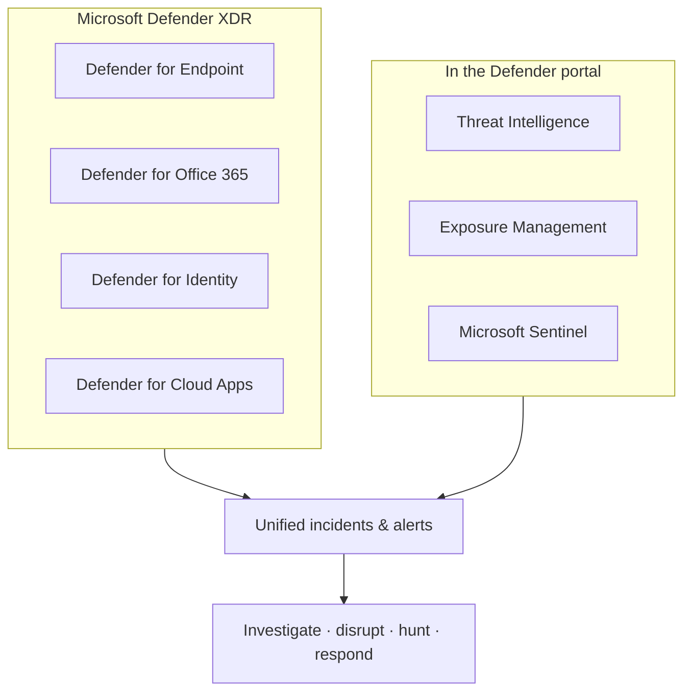

# Microsoft Defender

## Unified threat protection (XDR)
Microsoft Defender XDR unifies and coordinates **threat protection** across devices and endpoints, identities, email, Microsoft 365 services, and SaaS apps — collecting, correlating, and analyzing signals from a single portal.

!!! info "Section status: scaffolded"
    This section uses the **same template** as Purview and is **ready to be filled in**. The overview is grounded in Microsoft Learn; deep-dives will follow the [feature template](feature-template.md).

## What Microsoft Defender is

**Microsoft Defender XDR** consolidates threat signals across assets so you can **monitor, investigate, and respond** from the **[Microsoft Defender portal](https://security.microsoft.com)**. It provides automatic attack disruption, self-healing for compromised assets, and cross-product threat hunting.

## Services in the Defender family

-   :material-laptop:{ .lg .middle } __Defender for Endpoint__

    ---

    Preventive protection, post-breach detection, automated investigation and response for devices.

-   :material-email-alert:{ .lg .middle } __Defender for Office 365__

    ---

    Protects email and Office 365 resources against phishing, malware, and business email compromise.

-   :material-account-search:{ .lg .middle } __Defender for Identity__

    ---

    Uses Active Directory signals to detect compromised identities and malicious insider actions.

-   :material-cloud-lock:{ .lg .middle } __Defender for Cloud Apps__

    ---

    Visibility, data controls, and threat protection for SaaS and PaaS cloud apps.

-   :material-radar:{ .lg .middle } __Threat Intelligence & Exposure Management__

    ---

    Threat intelligence for SOC operations and attack-surface/exposure management.

## Where this section is going

Each service will get a deep-dive page following the workshop template (description → prerequisites → complexity & time → sample data → policy → step-by-step → verification → extensibility → industry use cases → sources).

[:octicons-arrow-right-24: See the feature template](feature-template.md){ .md-button .md-button--primary }

!!! warning "Licensing & prerequisites"
    Defender XDR licensing requirements must be met before you enable the service. Confirm the current [licensing requirements](https://learn.microsoft.com/defender-xdr/prerequisites) for each Defender service.

## Sources

- [What is Microsoft Defender XDR?](https://learn.microsoft.com/defender-xdr/microsoft-365-defender)
- [Microsoft Defender XDR in the Defender portal](https://learn.microsoft.com/unified-secops/defender-xdr-portal)
- [Microsoft Defender portal](https://learn.microsoft.com/unified-secops/overview-defender-portal)
- [Zero Trust with Microsoft Defender XDR](https://learn.microsoft.com/defender-xdr/zero-trust-with-microsoft-365-defender)
