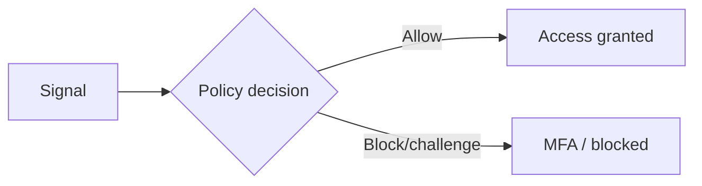

# Feature deep-dive — template

!!! info "Complexity: _Low / Medium / High_ · Est. time: _~N–N min_"
    Replace this with the real rating and a one-line justification (for example, *"Medium because it requires Conditional Access design and a pilot group."*). Put this admonition **at the top** of every feature page.

!!! note "This is a scaffold"
    This page shows the **standard 10-section template** every feature deep-dive follows. When filling it in, **ground every fact, feature name, prerequisite, and step in [Microsoft Learn](https://learn.microsoft.com/entra/)** and cite the URLs in the Sources block. Mark anything unverifiable as **⚠️ Not verified on Microsoft Learn**.

## 1. Description

_What the feature does, when to use it, and the key concepts a newcomer needs._ Add a Mermaid diagram for architecture or flow where it helps:



## 2. Prerequisites

=== "Licensing"

    _Which license/SKU is required (for example Entra ID P1 vs P2, Entra Suite). Link the service description._

=== "Roles & permissions"

    _Least-privilege roles required to configure and to operate the feature._

=== "Other"

    _Connectivity, directory data, dependencies, supported platforms._

## 3. Complexity & time

_Already summarized in the top admonition — briefly justify the rating here (what drives the effort)._

## 4. Generate sample data

_A ready-to-run script (PowerShell / Microsoft Graph / CLI) to create representative sample data or test objects so a reader can exercise the feature in a lab._

```powershell
# Example scaffold — replace with a real, grounded script.
Connect-MgGraph -Scopes "User.ReadWrite.All"
# ...create test users/groups/apps to exercise the feature...
```

## 5. Recommended policy setup

_Sensible default configuration for a first-time deployment (start narrow, in report-only/pilot mode, then expand)._

## 6. Step-by-step configuration

_Numbered, screenshot-backed walkthrough. Use content tabs for multiple methods; paginate into consecutive nav sub-pages ("Part 1..N") with a "Step X of N" badge if long._

=== "Portal"

    1. _Step…_

=== "PowerShell / Graph"

    ```powershell
    # ...grounded commands...
    ```

## 7. Verification

_Concrete steps to confirm the feature works — what to click and what "good" looks like._

!!! success "What 'good' looks like"
    _Describe the expected end state._

## 8. Extensibility

_Customization options, third-party integrations, and the requirements/prerequisites for each._

## 9. Industry use cases

=== "Financial services"
    _…_
=== "Telco"
    _…_
=== "Public sector & SOE"
    _…_
=== "Energy & resources"
    _…_
=== "Manufacturing & conglomerates"
    _…_

## 10. Sources

- [What is Microsoft Entra?](https://learn.microsoft.com/entra/fundamentals/what-is-entra)
- _Add the specific Microsoft Learn URLs used on this page._
