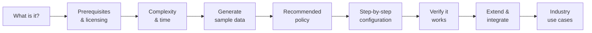

# Microsoft Security Workshop

## From "what is this?" to "I configured it and verified it works."
A hands-on, beginner-friendly learning series for the **Microsoft Security** product family — built for customers and partners who are new to each product. Follow it in order, or jump straight to the product you need.

!!! tip "How to use this workshop"
    Every feature page follows the **same template**: what it is → prerequisites & licensing → complexity & time → a sample-data script for your lab → recommended policy → a screenshot-backed step-by-step → verification → extensibility → industry use cases. Use the **Previous / Next** buttons at the bottom of each page to walk the series in order, and the **search** box (top) to jump anywhere.

!!! info "Grounded in Microsoft Learn"
    Every fact, feature name, prerequisite, and step is grounded in **[Microsoft Learn](https://learn.microsoft.com/)** and cited in a **Sources** block at the bottom of each page. Anything that can't be verified on Microsoft Learn is flagged **⚠️ Not verified on Microsoft Learn** rather than stated as fact.

## Choose a product

-   :material-shield-account:{ .lg .middle } __Microsoft Purview__ &nbsp; Built

    ---

    Unified **data security, compliance, and governance**. Protect and govern sensitive data across its lifecycle — DLP, Information Protection, Insider Risk, eDiscovery, Data Map & Unified Catalog, and more.

    [:octicons-arrow-right-24: Start with Purview](purview/index.md)

-   :material-account-key:{ .lg .middle } __Microsoft Entra__ &nbsp; Soon

    ---

    **Identity and network access** — verify every identity, secure access to any resource, and enforce least privilege.

    [:octicons-arrow-right-24: Preview section](entra/index.md)

-   :material-cellphone-cog:{ .lg .middle } __Microsoft Intune__ &nbsp; Soon

    ---

    **Endpoint and app management** — configure, secure, and monitor devices and applications across platforms.

    [:octicons-arrow-right-24: Preview section](intune/index.md)

-   :material-security:{ .lg .middle } __Microsoft Defender__ &nbsp; Soon

    ---

    **Threat protection** across endpoints, identities, email, cloud apps, and cloud workloads (XDR).

    [:octicons-arrow-right-24: Preview section](defender/index.md)

-   :material-radar:{ .lg .middle } __Microsoft Sentinel__ &nbsp; Soon

    ---

    Cloud-native **SIEM and SOAR** — collect, detect, investigate, and respond to threats at cloud scale.

    [:octicons-arrow-right-24: Preview section](sentinel/index.md)

-   :material-robot:{ .lg .middle } __Microsoft Security Copilot__ &nbsp; Soon

    ---

    **Generative-AI assistant** for security and IT teams — investigate, summarize, and respond faster.

    [:octicons-arrow-right-24: Preview section](security-copilot/index.md)

-   :material-account-supervisor-circle:{ .lg .middle } __Microsoft Agent 365__ &nbsp; Soon

    ---

    Managing and securing the **agent workforce** — identity, control, and observability for AI agents.

    [:octicons-arrow-right-24: Preview section](agent-365/index.md)

## What "done" looks like for each feature

## Why this exists

Security products are deep, and the hardest part for a newcomer is knowing *where to start* and *how to prove it works*. This workshop pairs every instruction with a supporting diagram or screenshot from Microsoft Learn, splits long walkthroughs into readable **Part 1 → Part N** pages, and always ends with a **verification** step so you can confirm success in your own lab.

!!! note "Independent educational content"
    This is an independent, community-style workshop that curates and links to official Microsoft Learn documentation. It is not an official Microsoft publication. Always confirm licensing and steps against the linked Microsoft Learn pages for your tenant.
