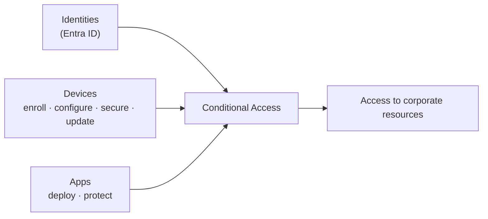

# Microsoft Intune

## Manage and secure endpoints and apps
Microsoft Intune is a **cloud-based endpoint management** service that secures and manages your organization's **devices and apps** — enroll, configure, secure, and update devices, and deploy and protect apps.

!!! info "Section status: scaffolded"
    This section uses the **same template** as Purview and is **ready to be filled in**. The overview is grounded in Microsoft Learn; deep-dives will follow the [feature template](feature-template.md).

## What Microsoft Intune is

Intune manages user access to organizational resources and simplifies **app and device management** across mobile devices, desktops, and virtual endpoints — for both **organization-owned and personal** devices. It runs **entirely in the cloud** (no on-premises infrastructure required) and supports the **Zero Trust** model. Supported platforms include **Android, iOS/iPadOS, Linux, macOS, tvOS, visionOS, and Windows**.

## Core capability areas

-   :material-cellphone-link:{ .lg .middle } __Device enrollment & configuration__

    ---

    Enroll devices and push configuration profiles (Wi-Fi, VPN, email, certificates) across platforms.

-   :material-shield-check:{ .lg .middle } __Endpoint security__

    ---

    Security baselines, disk encryption, firewall, endpoint detection, and policies like Windows LAPS.

-   :material-apps:{ .lg .middle } __App management (MAM)__

    ---

    Deploy and protect apps, including app protection policies for personal (BYOD) devices.

-   :material-check-decagram:{ .lg .middle } __Compliance & Conditional Access__

    ---

    Device compliance policies feed Entra Conditional Access to gate resource access.

## Where this section is going

Each capability will get a deep-dive page following the workshop template (description → prerequisites → complexity & time → sample data → policy → step-by-step → verification → extensibility → industry use cases → sources).

[:octicons-arrow-right-24: See the feature template](feature-template.md){ .md-button .md-button--primary }

!!! note "Managed from the Intune admin center + Graph"
    You manage Intune from the **Microsoft Intune admin center**, and every action is backed by a **Microsoft Graph API** call, so operations can be automated.

## Sources

- [What is Microsoft Intune?](https://learn.microsoft.com/intune/fundamentals/what-is-intune)
- [Microsoft Intune service description](https://learn.microsoft.com/intune/fundamentals/service-description)
- [Microsoft Intune core concepts](https://learn.microsoft.com/intune/fundamentals/core-concepts)
- [Zero Trust with Microsoft Intune](https://learn.microsoft.com/intune/fundamentals/zero-trust)
