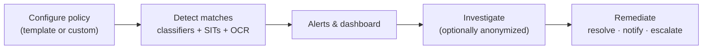

# Communication Compliance

*Detect and remediate inappropriate or risky messages across Teams, Viva Engage, and Exchange — build a policy and triage an alert, all on this page.*

## Lab details

| Level | Audience | Estimated time | What you'll build |
|---|---|---|---|
| 200 · Intermediate | Compliance / HR-linked reviewer | ~45–60 min | A first policy from a template plus a triaged alert |

!!! info "Complexity: Medium · Est. time: ~45–60 min for a first policy"
    Permissions and privacy settings need care (Global Admins have **no** access by default), but policy templates make the first policy quick. Investigation/remediation is an ongoing workflow.

## Why this matters

Harassment, threats, and regulatory leakage often show up in everyday messages. Communication Compliance surfaces the risky few from the many — with privacy safeguards and pseudonymization built in.

## 1. Description

<div class="video-embed">
<iframe src="https://www.youtube-nocookie.com/embed/sRng0zP83BM" title="Microsoft Learn: Communication Compliance (SC-401)" loading="lazy" allow="accelerometer; autoplay; clipboard-write; encrypted-media; gyroscope; picture-in-picture; web-share" referrerpolicy="strict-origin-when-cross-origin" allowfullscreen></iframe>
</div>
<p class="video-caption"><strong>▶ Watch — Communication Compliance in Microsoft Purview (SC-401)</strong><br>Microsoft Learn · 13:23 — How Communication Compliance identifies messages that may contain sensitive, inappropriate, or non-compliant content, how to review flagged items and understand why they triggered, and how to remediate.</p>

**Microsoft Purview Communication Compliance** helps you **detect, capture, and remediate** inappropriate or risky messages in your organization's communications — across **Microsoft Teams, Viva Engage, and Exchange Online** (and other connected channels). It uses **policy templates**, **trainable classifiers**, and **sensitive information types**, with a flexible **investigate → remediate** workflow.



!!! tip "When to use Communication Compliance"
    Use it to reduce **workplace harassment**, catch **regulatory/conduct** violations (for example, promises or offensive language), and detect **conflicts of interest** between groups.

### Built-in policy templates

- **Detect inappropriate text / images** (trainable classifiers, OCR for images)
- **Detect sensitive info** (sensitive information types)
- **Detect conflict of interest** (between two groups)
- **Regulatory compliance** scenarios

## 2. Prerequisites

=== "Licensing"

    Users covered by a Communication Compliance policy must have a **Microsoft Purview** suite (formerly Microsoft 365 E5 Compliance) license, an **Office 365 E3 + Advanced Compliance** add-on, or equivalent. Confirm on the [service description](https://learn.microsoft.com/office365/servicedescriptions/microsoft-365-service-descriptions/microsoft-365-tenantlevel-services-licensing-guidance/microsoft-purview-service-description).

=== "Roles"

    Six role groups manage the solution. **Global Administrators don't have access by default** — you must add users to a Communication Compliance role group (for example *Communication Compliance*, *Communication Compliance Admins*, *Analysts*, *Investigators*, *Viewers*). Allow up to **30 minutes** for role changes to apply.

=== "Other"

    - **Auditing** enabled (for signals).
    - Decide whether to use an **adaptive scope** (create it before the policy).
    - Optionally enable **username anonymization** for privacy.

## 3. Generate sample data (test messages)

"Sample data" here means test messages that trip a policy. In a lab, send benign but policy-triggering messages between test users.

```powershell
# Example: send a test email that a "sensitive info" or keyword policy can detect (Microsoft Graph).
Connect-MgGraph -Scopes "Mail.Send"

$body = @{
  message = @{
    subject = "LAB test - conflict of interest keyword"
    body = @{ contentType = "Text"; content = "This is a lab test mentioning insider tip and account 4111 1111 1111 1111." }
    toRecipients = @(@{ emailAddress = @{ address = "reviewer@contoso.onmicrosoft.com" } })
  }
}
Send-MgUserMail -UserId "sender@contoso.onmicrosoft.com" -BodyParameter $body
Write-Host "Sent a lab test message." -ForegroundColor Green
```

For Teams/Viva Engage, post a benign test message containing your policy's keyword or classifier trigger from a scoped test user.

## 4. Recommended policy setup

!!! tip "Start from a template, small scope, anonymized"
    Begin with **Detect inappropriate text** over a **small pilot group**, with **anonymization on** and a couple of named **reviewers**.

| Setting | Recommended start |
|---|---|
| Template | **Detect inappropriate text** |
| Scope | A pilot group (Teams channel / DL) |
| Reviewers | 1–2 named compliance/HR reviewers |
| Privacy | **Anonymize usernames** during review |
| OCR | On, if images are in scope |
| Notice templates | Create one reminder template |

## 5. Step-by-step configuration

1. In the **[Microsoft Purview portal](https://purview.microsoft.com)** → **Settings → Role groups**, add your reviewers to a **Communication Compliance** role group.
2. Open the **Communication Compliance** solution → **Policies → Create policy**.
3. Select a **template** (for example *Detect inappropriate text*), or **Custom policy**.
4. Set the **policy name**, **users/groups in scope**, and **reviewers**. (For *Detect conflict of interest*, choose **two** groups.)
5. (Optional) **Customize policy** to add conditions, sensitive info types, or enable **OCR**.
6. **Create** the policy. Matches begin generating **alerts** on the dashboard.
7. (Optional) Create **notice templates** and enable **anonymization** under **Settings → Communication Compliance → Privacy**.

## 6. Verification

1. Send the lab test message(s) from a scoped test user.
2. Open **Communication Compliance → Alerts** (or **Policies → your policy → Alerts**).
3. Confirm the message appears as an **alert** with the matched condition (classifier/SIT/keyword).
4. Practice the **remediation** workflow: resolve, send a **notice**, or **escalate** to a reviewer.

!!! success "What 'good' looks like"
    Your test message surfaces as an alert with the right policy match; reviewers can investigate (optionally anonymized) and remediate; notices send successfully.

## 7. Extensibility

- **Third-party / connected sources** — bring in non-Microsoft communications via [data connectors](https://learn.microsoft.com/purview/archive-third-party-data) for supervision.
- **Custom trainable classifiers** — train classifiers on your own examples.
- **Adaptive scopes** — dynamically scope policies by attribute.
- **Insider Risk Management** — correlate risky communications with insider-risk signals.

### Integration requirements

| Integration | Requirement |
|---|---|
| Non-Microsoft channels | Configured data connectors |
| Custom classifiers | Trainable classifier training data |
| Adaptive scopes | Scope created before the policy |

## 8. Industry use cases

=== "Financial services"

    Supervise trader/advisor communications for **market-abuse and conduct** violations; detect **conflicts of interest** between deal and research teams.

=== "Telecommunication"

    Detect **harassment** and inappropriate content across a large frontline workforce in Teams.

=== "Public sector & SOE"

    Monitor for **leakage of sensitive information** and inappropriate conduct with privacy safeguards.

=== "Energy & resources"

    Catch **safety-critical** or **collusion** language in operational channels.

=== "Manufacturing & conglomerates"

    Supervise cross-BU communications for **IP-sharing** and conduct issues.

## Change management & rollout

Never switch a new policy on for the whole tenant at once. Roll it out in controlled waves so you protect data **without surprising users or blocking legitimate work**. This scans employee messages, so privacy safeguards and scope are as important as the technical rollout.

| Phase | What you do | Who's affected | Move on when… |
|---|---|---|---|
| **1. Pilot** | Create one policy from a **template** with a **small scope** and **pseudonymization on**; pilot with a couple of trained reviewers. | Pilot scope | Alerts are relevant; reviewers can triage; privacy controls verified |
| **2. Expand** | Widen scope and add policies gradually; align reviewers and escalation with HR/Legal. | Department(s) | Triage volume manageable; workflow agreed |
| **3. Tenant-wide** | Extend to the intended population with documented privacy controls and approvals. | Intended population | Steady state; alerts understood |
| **4. Operate** | Tune conditions to cut noise; review reviewer access; report on outcomes. | Ongoing | — |

!!! tip "Least-disruption levers"
    - **Start in a safe mode:** **small scope + pseudonymization** before widening.
    - **Communicate first:** coordinate with **HR, Legal, privacy, and works councils**; disclose monitoring per local law.
    - **Keep a rollback path:** narrow scope or pause a policy; keep pseudonymization on.
    - **Log the change:** record scope, approver, and date in your change-management system (e.g., a change ticket).

## Summary & golden rules

- Grant access explicitly — **Global Admins have none** by default.
- Start from a **template** and scope to a small group first.
- Keep **pseudonymization** and privacy controls on.
- Treat review as an **ongoing workflow**, coordinated with HR/Legal.

## 9. Sources

- [Learn about Communication Compliance](https://learn.microsoft.com/purview/communication-compliance-solution-overview)
- [Get started with Communication Compliance](https://learn.microsoft.com/purview/communication-compliance-configure)
- [Communication Compliance policies](https://learn.microsoft.com/purview/communication-compliance-policies)
- [Assign permissions in Communication Compliance](https://learn.microsoft.com/purview/communication-compliance-permissions)
- [Plan for Communication Compliance](https://learn.microsoft.com/purview/communication-compliance-plan)
