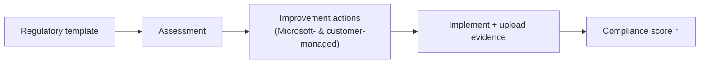

# Compliance Manager

!!! info "Complexity: Low–Medium · Est. time: ~30–45 min to first assessment"
    Creating an assessment from a template is quick. The ongoing work is completing **improvement actions** and keeping evidence current — that's a program, not a one-time task.

## 1. Description

**Microsoft Purview Compliance Manager** helps you **automatically assess and manage compliance** across your multicloud environment. It provides:

- **Prebuilt assessments** for common industry and regional standards and regulations (plus custom assessments).
- **Workflow** to complete risk assessments in a single tool.
- **Step-by-step improvement actions** (Microsoft-managed and customer-managed).
- A **risk-based compliance score** that measures your progress.

!!! tip "When to use Compliance Manager"
    Use it to **operationalize** a regulation (ISO 27001, NIST, GDPR, local laws) — turning it into concrete, trackable actions with an auditable score.

## 2. Prerequisites

=== "Licensing"

    Compliance Manager is available with **Office 365 and Microsoft 365** licenses (including **Business Premium**) and to **GCC / GCC High / DoD**. **Assessment availability** and management capabilities depend on your licensing agreement (some templates are premium). See the [service description](https://learn.microsoft.com/office365/servicedescriptions/microsoft-365-service-descriptions/microsoft-365-tenantlevel-services-licensing-guidance/microsoft-purview-service-description#microsoft-purview-compliance-manager).

=== "Roles"

    | Task | Compliance Manager role |
    |---|---|
    | Read only | **Compliance Manager Reader** |
    | Edit data + create assessments | **Compliance Manager Contribution** |
    | Edit data (no create) | **Compliance Manager Assessor** |
    | Manage assessments, templates, tenant data; assign actions | **Compliance Manager Administration** |

    Corresponding Entra roles include Global Reader/Security Reader (read), Compliance Administrator (edit), and Compliance Data/Security Administrator (admin). Follow least privilege.

## 3. Generate sample data (an assessment to work)

"Sample data" here is a **starter assessment** you can improve. Use the built-in **Data Protection Baseline** template (available broadly) as your practice assessment, then complete a few improvement actions.

!!! note "Mostly a portal workflow"
    Compliance Manager is primarily a portal experience; there isn't a customer-facing "generate data" script. Instead, create the Data Protection Baseline assessment (below) and upload sample evidence (for example, a screenshot or PDF of a policy) to an improvement action.

## 4. Recommended setup

!!! tip "Start with the baseline, then add one regulation"
    Begin with the **Data Protection Baseline**, then add **one** regulation most relevant to you (for example ISO/IEC 27001 or a local privacy law). Assign improvement-action owners.

| Recommendation | Why |
|---|---|
| Start with **Data Protection Baseline** | Broadly available; good foundation |
| Add **one** priority regulation | Focus effort |
| Assign **action owners** | Accountability |
| Upload **evidence** as you go | Audit-ready |
| Set **alert policies** | Catch score-affecting changes |

## 5. Step-by-step configuration

1. Sign in to the **[Microsoft Purview portal](https://purview.microsoft.com)** → **Compliance Manager**.
2. Under **Settings → Compliance Manager → User access** (or **Role groups**), assign the right **Compliance Manager** roles.
3. Open the **Assessments** tab → **Add assessment**.
4. On **Base your assessment on a regulation**, **Select regulation** (for example *Data Protection Baseline*), choose a **group**, and designate **services**.
5. Open the assessment and work its **improvement actions** — implement the control, set status, add notes, and **upload evidence**.
6. Watch your **compliance score** update (report changes can take ~24 hours).

## 6. Verification

1. Confirm the new assessment appears on the **Assessments** page with a **score contribution**.
2. Complete one **customer-managed improvement action** (mark implemented + upload evidence).
3. Confirm the action's **points** are reflected and your **compliance score** increases (allow ~24 h).
4. Open **Reports** to see the score history.

!!! success "What 'good' looks like"
    You have at least one assessment, at least one completed improvement action with evidence, and a compliance score that moves as you complete actions.

## 7. Extensibility

- **Connectors** — assess non-Microsoft services (for example **Salesforce**, **Zoom**) via built-in connectors.
- **Custom assessments** — extend a regulatory template with your own controls and actions.
- **Alert policies** — get notified of changes affecting your score.
- **Premium templates** — hundreds of regulation templates depending on licensing.

### Integration requirements

| Integration | Requirement |
|---|---|
| Non-Microsoft services | Activate the relevant connector |
| Custom assessments | Compliance Manager Administration/Assessor role |
| Premium templates | Supporting licensing / regulation licenses |

## 8. Industry use cases

=== "Financial services"

    Operationalize **PCI DSS**, **SOX**, and local banking regulations with tracked improvement actions and audit evidence.

=== "Telco"

    Manage **privacy and lawful-intercept** obligations across regions with per-regulation assessments.

=== "Public sector & SOE"

    Demonstrate compliance with **government security frameworks** to auditors with a measurable score.

=== "Energy & resources"

    Track **critical-infrastructure / NERC-CIP-style** controls and evidence.

=== "Manufacturing & conglomerates"

    Roll up **ISO 27001** and regional privacy assessments across business units.

## 9. Sources

- [Microsoft Purview Compliance Manager](https://learn.microsoft.com/purview/compliance-manager)
- [Get started with Compliance Manager](https://learn.microsoft.com/purview/compliance-manager-setup)
- [Build and manage assessments in Compliance Manager](https://learn.microsoft.com/purview/compliance-manager-assessments)
- [Working with connectors in Compliance Manager](https://learn.microsoft.com/purview/compliance-manager-connectors)
- [Compliance Manager regulations](https://learn.microsoft.com/purview/compliance-manager-regulations)
