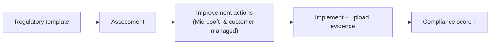

# Compliance Manager

*Assess and improve your compliance posture with prebuilt assessments and a risk-based score — create an assessment and act on it, all on this page.*

## Lab details

| Level | Audience | Estimated time | What you'll build |
|---|---|---|---|
| 100 · Foundational | Compliance / GRC administrator | ~1.5–2 hrs (all 4 surfaces); ~30 min for the first assessment | A first assessment from a template with tracked improvement actions |

!!! info "Complexity: Low–Medium · Est. time: ~1.5–2 hrs total (all 4 surfaces); ~30 min to first assessment"
    Creating an assessment from a template is quick. The ongoing work is completing **improvement actions** and keeping evidence current — that's a program, not a one-time task.

## Why this matters

"Are we compliant?" is hard to answer across dozens of regulations. Compliance Manager turns that into a **measurable score** with concrete improvement actions you can assign and evidence.

## Overview video

<iframe src="https://www.youtube-nocookie.com/embed/VrZbvZ3dMmg" title="Microsoft Purview Compliance Manager demo" loading="lazy" allow="accelerometer; autoplay; clipboard-write; encrypted-media; gyroscope; picture-in-picture; web-share" referrerpolicy="strict-origin-when-cross-origin" allowfullscreen></iframe>

<strong>▶ Watch — Microsoft Purview Compliance Manager: full demo</strong> 2W Tech · 9:51 — An in-depth demo: access Compliance Manager, navigate its key features, understand your compliance score, and implement improvement actions to manage regulatory compliance across Microsoft 365 and other clouds.

## Introduction

**Microsoft Purview Compliance Manager** helps you **automatically assess and manage compliance** across your multicloud environment. It provides:

- **Prebuilt assessments** for common industry and regional standards and regulations (plus custom assessments).
- **Workflow** to complete risk assessments in a single tool.
- **Step-by-step improvement actions** (Microsoft-managed and customer-managed).
- A **risk-based compliance score** that measures your progress.

!!! tip "When to use Compliance Manager"
    Use it to **operationalize** a regulation (ISO 27001, NIST, GDPR, local laws) — turning it into concrete, trackable actions with an auditable score.

## Core concepts

| Term | What it means |
|---|---|
| **Assessment** | A grouping of controls for a regulation you're measuring against |
| **Regulatory template** | A prebuilt control set for a standard/law (e.g., ISO 27001, GDPR) |
| **Improvement action** | A concrete control to implement (Microsoft- or customer-managed) |
| **Evidence** | Proof you attach to an action (screenshot, policy, export) |
| **Compliance score** | A risk-based measure of your progress |

## Prerequisites

=== "Licensing"

    Compliance Manager is available with **Office 365 and Microsoft 365** licenses (including **Business Premium**) and to **GCC / GCC High / DoD**. **Assessment availability** and management capabilities depend on your licensing agreement (some templates are premium). See the [service description](https://learn.microsoft.com/office365/servicedescriptions/microsoft-365-service-descriptions/microsoft-365-tenantlevel-services-licensing-guidance/microsoft-purview-service-description#microsoft-purview-compliance-manager).

=== "Roles"

    | Task | Compliance Manager role |
    |---|---|
    | Read only | **Compliance Manager Reader** |
    | Edit data + create assessments | **Compliance Manager Contribution** |
    | Edit data (no create) | **Compliance Manager Assessor** |
    | Manage assessments, templates, tenant data; assign actions | **Compliance Manager Administration** |

    Corresponding Entra roles include Global Reader/Security Reader (read), Compliance Administrator (edit), and Compliance Data/Security Administrator (admin). Follow least privilege.

## What you'll accomplish

By the end of this lab you will:

- [x] Assign least-privilege **Compliance Manager** roles
- [x] Create the **Data Protection Baseline** assessment and work an action
- [x] Add a **regulation** and a **custom** assessment
- [x] Assess **non-Microsoft** services via a connector

## Use cases covered

Each use case is one way to implement Compliance Manager, walked through as **preconfig → configure → validate**:

| # | Surface | What you configure | Time |
|---|---|---|---|
| 1 | **Baseline assessment** | Data Protection Baseline + an improvement action | ~30–45 min |
| 2 | **Regulation assessment** | An assessment from a regulation template | ~20 min |
| 3 | **Custom assessment** | Your own controls and actions | ~30 min |
| 4 | **Connectors** | Assess non-Microsoft services | ~20 min |

## Generate lab data

"Sample data" here is a **starter assessment** you can improve. Use the built-in **Data Protection Baseline** template (available broadly) as your practice assessment, then complete a few improvement actions.

!!! note "Mostly a portal workflow"
    Compliance Manager is primarily a portal experience; there isn't a customer-facing "generate data" script. Instead, create the Data Protection Baseline assessment (below) and upload sample evidence (for example, a screenshot or PDF of a policy) to an improvement action.

## Recommended setup

!!! tip "Start with the baseline, then add one regulation"
    Begin with the **Data Protection Baseline**, then add **one** regulation most relevant to you (for example ISO/IEC 27001 or a local privacy law). Assign improvement-action owners.

| Recommendation | Why |
|---|---|
| Start with **Data Protection Baseline** | Broadly available; good foundation |
| Add **one** priority regulation | Focus effort |
| Assign **action owners** | Accountability |
| Upload **evidence** as you go | Audit-ready |
| Set **alert policies** | Catch score-affecting changes |

## Use case 1 — Baseline assessment

*Get your first compliance score by creating the **Data Protection Baseline** assessment and completing one improvement action — the fastest way to start measuring.*

### Preconfig

Assign **Compliance Manager** roles (Reader / Contribution / Assessor / Administration) under **Settings → Compliance Manager → Role groups**.

### Configure

1. **[Microsoft Purview portal](https://purview.microsoft.com)** → **Compliance Manager → Assessments → Add assessment**.
2. Base it on **Data Protection Baseline**, choose a **group**, and designate **services**.
3. Open the assessment and work an **improvement action** — implement the control, set status, add notes, **upload evidence**.

### Validate

1. Confirm the assessment appears with a **score contribution**.
2. Complete one **customer-managed** action and confirm the **compliance score** increases (allow ~24 h); check **Reports**.

---

## Use case 2 — Regulation assessment

*Operationalize **ISO/IEC 27001** (or GDPR, or a local privacy law) by spinning up its assessment and assigning its controls to owners.*

### Preconfig

Use case 1 roles; know which regulation you must meet (some templates are premium).

### Configure

1. **Assessments → Add assessment** → **Select regulation** (e.g., *ISO/IEC 27001*).
2. Assign a **group**, designate **services**, and assign **action owners**.

### Validate

1. Confirm the regulation assessment appears with its controls and score.
2. Complete an action and confirm points apply.

---

## Use case 3 — Custom assessment

*Build a **custom assessment** for an internal security standard that no template covers, with your own controls and evidence.*

### Preconfig

**Compliance Manager Administration/Assessor** role.

### Configure

1. **Assessment templates → Create/extend a template** — add your **custom controls** and **improvement actions**.
2. Create an **assessment** from your custom template.

### Validate

1. Confirm the custom assessment and its controls appear.
2. Confirm completing a custom action moves the score.

---

## Use case 4 — Connectors (non-Microsoft services)

*Pull **Salesforce** or **Zoom** configuration into your compliance score via a connector, so non-Microsoft services are measured too.*

### Preconfig

The relevant **connector** available for your licensing.

### Configure

1. Activate the built-in **connector** for the service.
2. Map its signals to the relevant **assessment(s)**.

### Validate

1. Confirm the connector is active and feeding data.
2. Confirm the service's controls contribute to the score.

## Extensibility

- **Connectors** — assess non-Microsoft services (for example **Salesforce**, **Zoom**) via built-in connectors.
- **Custom assessments** — extend a regulatory template with your own controls and actions.
- **Alert policies** — get notified of changes affecting your score.
- **Premium templates** — hundreds of regulation templates depending on licensing.

### Integration requirements

| Integration | Requirement |
|---|---|
| Non-Microsoft services | Activate the relevant connector |
| Custom assessments | Compliance Manager Administration/Assessor role |
| Premium templates | Supporting licensing / regulation licenses |

## Industry use cases

=== "Financial services"

    Operationalize **PCI DSS**, **SOX**, and local banking regulations with tracked improvement actions and audit evidence.

=== "Telecommunication"

    Manage **privacy and lawful-intercept** obligations across regions with per-regulation assessments.

=== "Public sector & SOE"

    Demonstrate compliance with **government security frameworks** to auditors with a measurable score.

=== "Energy & resources"

    Track **critical-infrastructure / NERC-CIP-style** controls and evidence.

=== "Manufacturing & conglomerates"

    Roll up **ISO 27001** and regional privacy assessments across business units.

## Change management & rollout

Roll this out as a program rather than a switch. Compliance Manager doesn't touch user data or block anything — rollout is about ownership and cadence, not disruption.

| Phase | What you do | Who's affected | Move on when… |
|---|---|---|---|
| **1. Pilot** | Create **one assessment** from a template that maps to a real obligation; assign a pilot owner to a few improvement actions. | Pilot owner | Score reflects reality; owners understand actions/evidence |
| **2. Expand** | Add assessments for other regulations; assign action owners across teams; set an evidence cadence. | Action owners | Actions progressing; evidence being attached |
| **3. Tenant-wide** | Operationalize as a compliance **program** with regular reviews and reporting to leadership. | Compliance program | Steady state; reporting in place |
| **4. Operate** | Track the score trend; refresh evidence; add assessments as obligations change. | Ongoing | — |

!!! tip "Least-disruption levers"
    - **Start in a safe mode:** no user impact — treat as a **program rollout**, not a technical switch.
    - **Communicate first:** assign action owners and set expectations for evidence and deadlines.
    - **Keep a rollback path:** not applicable — assessments are informational; simply reprioritize as needed.
    - **Log the change:** record scope, approver, and date in your change-management system (e.g., a change ticket).

## Summary & golden rules

- Create your first assessment from a **template** that matches a real obligation.
- Work **improvement actions** by impact; assign owners.
- Attach **evidence** and keep it current — auditors ask for it.
- Track the score as a **trend**, not a one-time number.

## Sources

- [Microsoft Purview Compliance Manager](https://learn.microsoft.com/purview/compliance-manager)
- [Get started with Compliance Manager](https://learn.microsoft.com/purview/compliance-manager-setup)
- [Build and manage assessments in Compliance Manager](https://learn.microsoft.com/purview/compliance-manager-assessments)
- [Working with connectors in Compliance Manager](https://learn.microsoft.com/purview/compliance-manager-connectors)
- [Compliance Manager regulations](https://learn.microsoft.com/purview/compliance-manager-regulations)
