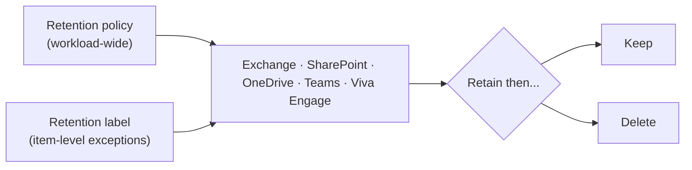

# Data Lifecycle Management

*Retain what you need and delete what you don't, using retention policies and labels — create a policy and verify it, all on this page.*

## Lab details

| Level | Audience | Estimated time | What you'll build |
|---|---|---|---|
| 200 · Intermediate | Compliance / records administrator | ~45–60 min | A first retention policy (and optional label) across Microsoft 365 |

!!! info "Complexity: Medium · Est. time: ~45–60 min for a first retention policy"
    A single retention policy across Microsoft 365 is quick. Complexity rises with **retention labels for exceptions**, **event-based retention**, mailbox archiving, and adaptive scopes.

## Why this matters

Keeping everything forever is a liability; deleting too soon breaks compliance. DLM lets you set **defensible, automatic** retain-and-delete rules so data lives exactly as long as it should.

## Overview video

<div class="video-embed">
<iframe src="https://www.youtube-nocookie.com/embed/Zvpkvp-gbq8" title="Data Lifecycle Management retention policies (SC-401)" loading="lazy" allow="accelerometer; autoplay; clipboard-write; encrypted-media; gyroscope; picture-in-picture; web-share" referrerpolicy="strict-origin-when-cross-origin" allowfullscreen></iframe>
</div>
<p class="video-caption"><strong>▶ Watch — Data Lifecycle Management: retention policies (SC-401)</strong><br>Cloud Scholars · 11:55 — A hands-on walkthrough: build real-world retention strategies with retention policies and adaptive scopes, and apply retention across Exchange, SharePoint, and more.</p>

## Introduction

**Microsoft Purview Data Lifecycle Management (DLM)** — formerly Microsoft Information Governance — helps you **keep what you need and delete what you don't**. It uses **retention policies**, **retention labels**, and **retention label policies** to enforce retain/delete settings across Microsoft 365 workloads, and includes **email archiving** capabilities.



!!! note "DLM vs. Records Management"
    Use **retention policies** (DLM) for broad "keep/delete" governance. For **high-value business, legal, or regulatory records**, use **retention labels with [Records Management](records-management.md)** instead.

!!! tip "When to use DLM"
    Use DLM to meet retention/deletion obligations at scale — for example, delete Teams chats after a set period, or retain SharePoint content for a required number of years.

## Core concepts

| Term | What it means |
|---|---|
| **Retention policy** | Workload-wide retain/delete settings (no user action) |
| **Retention label** | Item-level retention for exceptions (published or auto-applied) |
| **Retain then delete** | Keep for a period, then delete automatically |
| **Adaptive scope** | Dynamically targets users/sites by attribute |
| **Event-based retention** | Starts the retention clock on an event (e.g., contract end) |

## Prerequisites

=== "Licensing"

    **Retention policies** are broadly available (**Microsoft 365 E3/E5/A3/A5/G3/G5**, **Business Premium**, **Office 365 E3/E5**, and Information Protection & Governance plans). Some capabilities (e.g., **auto-apply** labels, **event-based** retention) require higher tiers. Retention for **Copilot/AI** locations needs **pay-as-you-go** billing. Confirm on the [service description](https://learn.microsoft.com/office365/servicedescriptions/microsoft-365-service-descriptions/microsoft-365-tenantlevel-services-licensing-guidance/microsoft-purview-service-description#microsoft-purview-data-lifecycle-&-records-management).

=== "Roles"

    Add compliance staff to the **Compliance Administrator** role group, or create a role group with the **Retention Management** role (**View-Only Retention Management** for read-only). Mailbox archiving/inactive-mailbox tasks need **Exchange** permissions (for example the **Mail Recipients** role via Recipient Management / Organization Management).

## What you'll accomplish

By the end of this lab you will:

- [x] Create a **retention policy** (retain then delete) on a pilot scope
- [x] Publish **retention labels** for item-level exceptions
- [x] Target policies with **adaptive scopes**
- [x] Configure **event-based** retention and **mailbox archiving**

## Use cases covered

Each use case is one way to implement Data Lifecycle Management, walked through as **preconfig → configure → validate**:

| # | Surface | What you configure | Time |
|---|---|---|---|
| 1 | **Retention policy (static)** | A retain-then-delete policy on a pilot site | ~45 min |
| 2 | **Retention labels** | Item-level retention for exceptions | ~30 min |
| 3 | **Adaptive scopes** | Attribute-based dynamic targeting | ~30 min |
| 4 | **Event-based retention** | Start the clock on an event | ~30 min |
| 5 | **Mailbox archiving / PST** | Archive mailboxes + PST import | ~45 min |

## Generate lab data

Retention acts on real content, so seed a site/mailbox with disposable items. Reuse the [Information Protection sample script](../data-security/information-protection/index.md#generate-lab-data), then upload the files to a test SharePoint site or OneDrive that your retention policy will cover.

```powershell
$lab = Join-Path $env:USERPROFILE 'DLM-Lab-Data'
New-Item -ItemType Directory -Path $lab -Force | Out-Null
1..5 | ForEach-Object {
    "Disposable lab document #$_ created $(Get-Date -Format o)" |
        Set-Content (Join-Path $lab "doc-$_.txt")
}
Write-Host "Created $((Get-ChildItem $lab).Count) files in $lab. Upload to a test site the policy will cover." -ForegroundColor Green
```

## Recommended policy setup

!!! tip "One broad retention policy, then labels for exceptions"
    Start with a **single retention policy** that retains (or deletes) content across your main workloads, then add **retention labels** only where specific items need different handling.

| Setting | Recommended start |
|---|---|
| Type | **Retention policy** (not label) first |
| Locations | SharePoint + OneDrive (add Exchange/Teams as needed) |
| Action | **Retain then delete** after a set period |
| Scope | **Static** to a pilot site first; adaptive later |
| Labels | Add for **exceptions** only |

## Use case 1 — Retention policy (static scope)

*The broad "keep/delete" control — one policy across chosen workloads.*

### Preconfig

Compliance / **Retention Management** roles, and a **pilot site** seeded with [disposable content](#generate-lab-data).

### Configure

=== "Portal"

    1. **[Microsoft Purview portal](https://purview.microsoft.com)** → **Data Lifecycle Management → Policies → Retention policies → New retention policy**. Name it (e.g., `Baseline retention`).
    2. Choose **locations** (SharePoint/OneDrive; add Exchange/Teams as needed) — scope to a **pilot site**.
    3. Set retention: **Retain items for** *N* years, then **delete** (or retain only / delete only). **Submit**.

=== "PowerShell"

    ```powershell
    Connect-IPPSSession -UserPrincipalName admin@contoso.onmicrosoft.com
    New-RetentionCompliancePolicy -Name "Baseline retention" `
        -SharePointLocation "https://contoso.sharepoint.com/sites/pilot"
    New-RetentionComplianceRule -Name "Retain 3y then delete" `
        -Policy "Baseline retention" -RetentionDuration 1095 -RetentionComplianceAction Delete
    ```

### Validate the config

1. Confirm the policy shows **On/Success**.
2. Try to permanently delete a covered item before the period ends — it should be **preserved** (recoverable).
3. Confirm items past the period are deleted on schedule; check the **audit log**.

---

## Use case 2 — Retention labels (item-level exceptions)

*Apply different retention to specific items than the broad policy.*

### Preconfig

Use case 1 policy in place.

### Configure

1. **Data Lifecycle Management → Labels → Create a label** — set the **period** and **action** (retain / retain-then-delete / delete).
2. **Label policies → Publish labels** to a pilot site/library (or auto-apply by SIT/keyword with higher-tier licensing).

### Validate the config

1. Apply the label to a test item.
2. Confirm the item follows the **label's** retention (not just the policy's).

---

## Use case 3 — Adaptive scopes

*Target policies dynamically by directory attribute instead of a static list.*

### Preconfig

The attribute values you'll scope on (e.g., Department, Country).

### Configure

1. **Data Lifecycle Management → Adaptive scopes → Create** — choose **users/sites/groups** and the **attribute query**.
2. Create (or edit) a retention policy and choose **Adaptive** scope, selecting your scope.

### Validate the config

1. Confirm the policy targets exactly the users/sites matching the attribute.
2. Change an attribute and confirm scope membership updates.

---

## Use case 4 — Event-based retention

*Start the retention clock on a business event (contract end, employee departure).*

### Preconfig

Higher-tier licensing; an **event type** defined.

### Configure

1. Create a **retention label** with **retention period based on an event** and pick the **event type**.
2. Publish/auto-apply it, and record the **asset ID / keywords** that tie items to events.
3. Create the matching **event** to start the clock.

### Validate the config

1. Trigger the event and confirm labeled items begin their retention from the event date.

---

## Use case 5 — Mailbox archiving / PST import

*Give users archive mailboxes and bring legacy PSTs under governance.*

### Preconfig

**Exchange** permissions (Mail Recipients / Organization Management); for PST, the **Import service** + Azure Storage.

### Configure

1. Enable **archive mailboxes** (and **auto-expanding archiving**) for users.
2. For legacy data, use the **Import service** (network upload or drive shipping) to bring **PSTs** into mailboxes, then apply retention.

### Validate the config

1. Confirm a user's **archive mailbox** appears and receives archived items.
2. Confirm imported PST content lands in the mailbox and is covered by retention.

## Extensibility

- **Retention labels + auto-apply** — classify items by SIT, keyword, or trainable classifier and apply retention automatically.
- **Event-based retention** — start the clock on an event (for example employee departure, contract end).
- **Adaptive scopes** — dynamically target users/sites by attribute.
- **Archiving** — inactive mailboxes, archive mailboxes, auto-expanding archiving, and **PST import**.

### Integration requirements

| Integration | Requirement |
|---|---|
| Auto-apply labels | Higher-tier licensing (E5/IPG) |
| Event-based retention | Event type + label configuration |
| PST import | Import service + Azure Storage |
| AI/Copilot locations | Pay-as-you-go billing |

## Industry use cases

=== "Financial services"

    Retain communications and records for **regulated periods** (for example 5–7 years) and delete afterward to reduce liability.

=== "Telecommunication"

    Apply **CDR / subscriber-data** retention and defensible deletion at scale.

=== "Public sector & SOE"

    Meet **public-records retention** schedules with event-based retention.

=== "Energy & resources"

    Retain **safety and inspection** records for mandated durations.

=== "Manufacturing & conglomerates"

    Standardize retention across BUs while allowing **exceptions** via labels.

## Change management & rollout

Never switch a new policy on for the whole tenant at once. Roll it out in controlled waves so you protect data **without surprising users or blocking legitimate work**. Retention that **deletes** is irreversible, so pilot on a small scope and prefer retain-only before retain-then-delete.

| Phase | What you do | Who's affected | Move on when… |
|---|---|---|---|
| **1. Pilot** | Apply a **retain-only** policy (or a retention label) to a **small/adaptive scope**; verify behavior before any deletion. | Pilot scope | Content is retained as expected; no unexpected holds |
| **2. Expand** | Introduce **retain-then-delete** for well-understood data types; widen scope team-by-team. | Department(s) | Deletion behavior validated; stakeholders signed off |
| **3. Tenant-wide** | Apply the retention plan tenant-wide via policies/adaptive scopes after comms. | All users | Steady state; disposition understood |
| **4. Operate** | Review policies as regulations change; add labels for exceptions; monitor disposition. | Ongoing | — |

!!! tip "Least-disruption levers"
    - **Start in a safe mode:** **retain-only** and a **small/adaptive scope** before enabling deletion.
    - **Communicate first:** tell record owners what's retained/deleted and when; coordinate with Legal.
    - **Keep a rollback path:** retention changes take time to propagate — piloting avoids surprises; adjust scope to pause new deletions.
    - **Log the change:** record scope, approver, and date in your change-management system (e.g., a change ticket).

## Summary & golden rules

- Start with **one broad retention policy**; add labels for exceptions.
- Decide **retain, delete, or retain-then-delete** per data type.
- Test in a **small scope** before tenant-wide rollout.
- Document the **why** (regulation/policy) behind each rule.

## Sources

- [Learn about data lifecycle management](https://learn.microsoft.com/purview/data-lifecycle-management)
- [Get started with data lifecycle management](https://learn.microsoft.com/purview/get-started-with-data-lifecycle-management)
- [Learn about retention policies and retention labels](https://learn.microsoft.com/purview/retention)
- [Create retention policies](https://learn.microsoft.com/purview/create-retention-policies)
- [Archive mailboxes](https://learn.microsoft.com/purview/archive-mailboxes)
