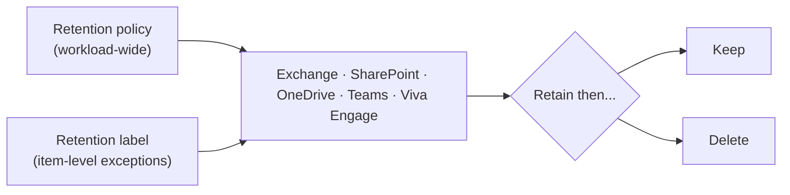

# Data Lifecycle Management

!!! info "Complexity: Medium · Est. time: ~45–60 min for a first retention policy"
    A single retention policy across Microsoft 365 is quick. Complexity rises with **retention labels for exceptions**, **event-based retention**, mailbox archiving, and adaptive scopes.

## 1. Description

**Microsoft Purview Data Lifecycle Management (DLM)** — formerly Microsoft Information Governance — helps you **keep what you need and delete what you don't**. It uses **retention policies**, **retention labels**, and **retention label policies** to enforce retain/delete settings across Microsoft 365 workloads, and includes **email archiving** capabilities.



!!! note "DLM vs. Records Management"
    Use **retention policies** (DLM) for broad "keep/delete" governance. For **high-value business, legal, or regulatory records**, use **retention labels with [Records Management](records-management.md)** instead.

!!! tip "When to use DLM"
    Use DLM to meet retention/deletion obligations at scale — for example, delete Teams chats after a set period, or retain SharePoint content for a required number of years.

## 2. Prerequisites

=== "Licensing"

    **Retention policies** are broadly available (**Microsoft 365 E3/E5/A3/A5/G3/G5**, **Business Premium**, **Office 365 E3/E5**, and Information Protection & Governance plans). Some capabilities (e.g., **auto-apply** labels, **event-based** retention) require higher tiers. Retention for **Copilot/AI** locations needs **pay-as-you-go** billing. Confirm on the [service description](https://learn.microsoft.com/office365/servicedescriptions/microsoft-365-service-descriptions/microsoft-365-tenantlevel-services-licensing-guidance/microsoft-purview-service-description#microsoft-purview-data-lifecycle-&-records-management).

=== "Roles"

    Add compliance staff to the **Compliance Administrator** role group, or create a role group with the **Retention Management** role (**View-Only Retention Management** for read-only). Mailbox archiving/inactive-mailbox tasks need **Exchange** permissions (for example the **Mail Recipients** role via Recipient Management / Organization Management).

## 3. Generate sample content

Retention acts on real content, so seed a site/mailbox with disposable items. Reuse the [Information Protection sample script](../data-security/information-protection/index.md#3-generate-sample-content-for-your-lab), then upload the files to a test SharePoint site or OneDrive that your retention policy will cover.

```powershell
$lab = Join-Path $env:USERPROFILE 'DLM-Lab-Data'
New-Item -ItemType Directory -Path $lab -Force | Out-Null
1..5 | ForEach-Object {
    "Disposable lab document #$_ created $(Get-Date -Format o)" |
        Set-Content (Join-Path $lab "doc-$_.txt")
}
Write-Host "Created $((Get-ChildItem $lab).Count) files in $lab. Upload to a test site the policy will cover." -ForegroundColor Green
```

## 4. Recommended policy setup

!!! tip "One broad retention policy, then labels for exceptions"
    Start with a **single retention policy** that retains (or deletes) content across your main workloads, then add **retention labels** only where specific items need different handling.

| Setting | Recommended start |
|---|---|
| Type | **Retention policy** (not label) first |
| Locations | SharePoint + OneDrive (add Exchange/Teams as needed) |
| Action | **Retain then delete** after a set period |
| Scope | **Static** to a pilot site first; adaptive later |
| Labels | Add for **exceptions** only |

## 5. Step-by-step configuration

=== "Portal"

    1. In the **[Microsoft Purview portal](https://purview.microsoft.com)** → **Data Lifecycle Management → Policies → Retention policies → New retention policy**.
    2. Name it (for example `Baseline retention`).
    3. Choose **locations** (SharePoint sites, OneDrive accounts; add Exchange/Teams if needed) — scope to a **pilot site** to start.
    4. Set retention: **Retain items for** *N* years, then **delete** (or retain only / delete only).
    5. **Review** and **Submit**. Allow time for the policy to take effect.
    6. (Optional) Create **retention labels** for item-level exceptions and **publish** them.

=== "PowerShell"

    ```powershell
    Connect-IPPSSession -UserPrincipalName admin@contoso.onmicrosoft.com

    # Create a retention policy scoped to a pilot SharePoint site.
    New-RetentionCompliancePolicy -Name "Baseline retention" `
        -SharePointLocation "https://contoso.sharepoint.com/sites/pilot"

    # Add a rule: retain for 3 years then delete.
    New-RetentionComplianceRule -Name "Retain 3y then delete" `
        -Policy "Baseline retention" `
        -RetentionDuration 1095 `
        -RetentionComplianceAction Delete
    ```

## 6. Verification

1. Confirm the policy shows **On/Success** in **Policies** (initial deployment can take time).
2. Test retention: try to permanently delete a covered item before the period ends — it should be **preserved** (recoverable), not truly gone.
3. For **delete** actions, confirm items past the retention period are removed on schedule.
4. Check the **audit log** for retention-related events.

!!! success "What 'good' looks like"
    Covered content is retained for the configured period (deletion is prevented/recoverable), and content is deleted on schedule after the period — verifiable in the workload and the audit log.

## 7. Extensibility

- **Retention labels + auto-apply** — classify items by SIT, keyword, or trainable classifier and apply retention automatically.
- **Event-based retention** — start the clock on an event (for example employee departure, contract end).
- **Adaptive scopes** — dynamically target users/sites by attribute.
- **Archiving** — inactive mailboxes, archive mailboxes, auto-expanding archiving, and **PST import**.

### Integration requirements

| Integration | Requirement |
|---|---|
| Auto-apply labels | Higher-tier licensing (E5/IPG) |
| Event-based retention | Event type + label configuration |
| PST import | Import service + Azure Storage |
| AI/Copilot locations | Pay-as-you-go billing |

## 8. Industry use cases

=== "Financial services"

    Retain communications and records for **regulated periods** (for example 5–7 years) and delete afterward to reduce liability.

=== "Telco"

    Apply **CDR / subscriber-data** retention and defensible deletion at scale.

=== "Public sector & SOE"

    Meet **public-records retention** schedules with event-based retention.

=== "Energy & resources"

    Retain **safety and inspection** records for mandated durations.

=== "Manufacturing & conglomerates"

    Standardize retention across BUs while allowing **exceptions** via labels.

## 9. Sources

- [Learn about data lifecycle management](https://learn.microsoft.com/purview/data-lifecycle-management)
- [Get started with data lifecycle management](https://learn.microsoft.com/purview/get-started-with-data-lifecycle-management)
- [Learn about retention policies and retention labels](https://learn.microsoft.com/purview/retention)
- [Create retention policies](https://learn.microsoft.com/purview/create-retention-policies)
- [Archive mailboxes](https://learn.microsoft.com/purview/archive-mailboxes)
