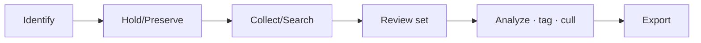

# eDiscovery

*Identify, hold, collect, review, and export electronically stored information for legal matters — run a Standard case end to end, all on this page.*

## Lab details

| Level | Audience | Estimated time | What you'll build |
|---|---|---|---|
| 200 · Intermediate | Legal / eDiscovery administrator | ~45–75 min | A Standard case with a search, a hold, and an export |

!!! info "Complexity: Medium–High · Est. time: ~45–75 min for a first case (Standard)"
    A Standard case (search + hold + export) is approachable. **Premium** (custodians, legal-hold notifications, review sets, analytics, predictive coding) is a full EDRM workflow that takes longer to master.

## Why this matters

When litigation or investigation hits, you must **preserve and produce** the right data — fast and defensibly. eDiscovery gives you a repeatable, auditable EDRM workflow instead of scrambling.

## Overview video

<div class="video-embed">
<iframe src="https://www.youtube-nocookie.com/embed/-25S-Vz7u1Q" title="Microsoft Mechanics: Advanced eDiscovery" loading="lazy" allow="accelerometer; autoplay; clipboard-write; encrypted-media; gyroscope; picture-in-picture; web-share" referrerpolicy="strict-origin-when-cross-origin" allowfullscreen></iframe>
</div>
<p class="video-caption"><strong>▶ Watch — Do more with Advanced eDiscovery in Microsoft 365</strong><br>Microsoft Mechanics · 7:07 — How to run eDiscovery investigations of any type (policy violations, GDPR requests): create a case, identify custodians and data sources, run searches, review and tag documents, and export the results.</p>

## Introduction

**Electronic discovery (eDiscovery)** is the process of identifying and delivering **electronically stored information (ESI)** for use as evidence in investigations and legal cases. **Microsoft Purview eDiscovery** lets you identify, hold, collect, review, and export content across Microsoft 365 services: **Exchange Online, SharePoint, OneDrive, Microsoft Teams, Microsoft 365 Groups, and Viva Engage**.

| Tier | What you get |
|---|---|
| **Content search** | Keyword queries + conditions, export results, role-based access |
| **eDiscovery (Standard)** | Adds **cases**, per-case eDiscovery managers, and **eDiscovery holds** |
| **eDiscovery (Premium)** | Adds **custodian management**, **legal-hold notifications**, advanced indexing, **review sets**, filtering, tagging, **analytics**, and **predictive coding** |



!!! tip "When to use eDiscovery"
    Use it for **litigation, regulatory requests, and internal investigations** — anywhere you must preserve and produce relevant content with defensible chain-of-custody.

## Core concepts

| Term | What it means |
|---|---|
| **Case** | A container that scopes a matter's holds, searches, and exports |
| **Hold** | Preserves content so it can't be lost while a matter is active |
| **Search** | A keyword/condition query across content locations |
| **Review set** (Premium) | A collected set you filter, tag, and cull before export |
| **Custodian** (Premium) | A person of interest whose data is preserved and collected |

## Prerequisites

=== "Licensing"

    **Content search** and **eDiscovery (Standard)** are broadly available with enterprise subscriptions. **eDiscovery (Premium)** requires **Office 365 E5 / Microsoft 365 E5** (or E5 add-ons); when Premium features analyze a custodian's data, that **custodian** must have the appropriate license. Confirm on the [service description](https://learn.microsoft.com/office365/servicedescriptions/microsoft-365-service-descriptions/microsoft-365-tenantlevel-services-licensing-guidance/microsoft-purview-service-description#microsoft-purview-ediscovery).

=== "Roles"

    eDiscovery uses granular RBAC roles: **Case Management**, **Compliance Search**, **Preview**, **Export**, **Review**, **Hold**, and more. Assign users to the **eDiscovery Manager** role group (managers see only their cases) or **eDiscovery Administrator** (all cases). See [Assign permissions in eDiscovery](https://learn.microsoft.com/purview/edisc-permissions).

## What you'll accomplish

By the end of this lab you will:

- [x] Seed searchable content with a unique matter keyword
- [x] Create a **case**, place a **hold**, and run a **search**
- [x] **Export** the results (or push to a review set in Premium)
- [x] Know how to scale to **custodians, review sets, and analytics**

## Use cases covered

| # | Use case | Outcome | Time |
|---|---|---|---|
| 1 | **Run a Standard eDiscovery case** | A case with a hold, search, and export | ~45–75 min |
| 2 | **Verify the case results** | Preserved, found, and exported items | ~15 min |

## Generate lab data

Seed mailboxes/sites with findable content, then search for it.

```powershell
# Send test emails containing a unique matter keyword you can later search for.
Connect-MgGraph -Scopes "Mail.Send"
$keyword = "Project-Falcon-LABMATTER"

1..3 | ForEach-Object {
  $body = @{ message = @{
    subject = "$keyword note $_"
    body = @{ contentType = "Text"; content = "Lab evidence item $_ referencing $keyword." }
    toRecipients = @(@{ emailAddress = @{ address = "custodian@contoso.onmicrosoft.com" } })
  } }
  Send-MgUserMail -UserId "sender@contoso.onmicrosoft.com" -BodyParameter $body
}
Write-Host "Sent test items containing keyword '$keyword'." -ForegroundColor Green
```

Use the unique keyword (`Project-Falcon-LABMATTER`) as your search query.

## Recommended setup

!!! tip "Create a case, hold, then search — in that order"
    Preserve first (**hold**) so relevant data can't be lost, then **search** within the case, then **export** (Standard) or push to a **review set** (Premium).

| Recommendation | Why |
|---|---|
| One **case** per matter | Clean scoping and access control |
| **Hold** custodians early | Defensible preservation |
| Narrow **search** queries | Reduce noise/volume |
| Premium: use **review sets** | Filter, tag, and cull before export |

## Use case 1 — Run a Standard eDiscovery case

1. In the **[Microsoft Purview portal](https://purview.microsoft.com)** → **eDiscovery** → **Create case** (name it after the matter).
2. (Standard/Premium) Add an **eDiscovery hold** on relevant content locations (mailboxes/sites) to preserve data.
3. Create a **search** in the case using your **keyword query** (for example `Project-Falcon-LABMATTER`) and conditions.
4. Review the **statistics/sample**, refine the query, then **add results to a review set** (Premium) or **export** (Standard).
5. (Premium) In the **review set**, **filter**, **tag**, run **analytics**, and cull non-relevant items.
6. **Export** the responsive items with metadata for production.

## Use case 2 — Verify the case results

1. Run the case search for your unique keyword.
2. Confirm the **test items** appear in the search **statistics/preview**.
3. Confirm the **hold** is active on the custodian's locations (preserved even if a user deletes an item).
4. **Export** (or add to a review set) and confirm the exported package contains the items + metadata.

!!! success "What 'good' looks like"
    Your seeded items are found by the case search, preserved by the hold, and exportable with metadata and a defensible audit trail.

## Extensibility

- **Compliance boundaries** — limit which locations/cases eDiscovery managers can access (for multi-region or multi-BU separation).
- **Graph eDiscovery APIs** — automate case, hold, search, and export operations.
- **Premium analytics & predictive coding** — machine-learning-assisted review to prioritize relevant content.
- **Audit integration** — export includes audit logs for chain-of-custody.

### Integration requirements

| Integration | Requirement |
|---|---|
| Compliance boundaries | Agency/attribute configuration; applicable eDiscovery licensing |
| Graph automation | Graph permissions for eDiscovery APIs |
| Premium review/analytics | E5 / E5 eDiscovery add-on |

## Industry use cases

=== "Financial services"

    Respond to **regulator information requests** and litigation with preserved, searchable communications.

=== "Telecommunication"

    Handle **subpoenas and disputes** across email, Teams, and SharePoint at scale.

=== "Public sector & SOE"

    Fulfill **freedom-of-information** and legal requests with defensible collection.

=== "Energy & resources"

    Support **contract and environmental litigation** with custodian-based holds.

=== "Manufacturing & conglomerates"

    Manage **IP and supplier disputes** with compliance boundaries per business unit.

## Change management & rollout

Roll this out by matter, not tenant-wide. eDiscovery is used by a small team per case, so “rollout” is about roles, process, and defensibility rather than broad impact.

| Phase | What you do | Who's affected | Move on when… |
|---|---|---|---|
| **1. Pilot** | Run **one Standard case** end-to-end (hold → search → export) with least-privilege roles for a pilot legal/IT user. | Pilot case team | Case workflow works; audit trail is clean |
| **2. Expand** | Onboard more reviewers/matters; standardize case naming, holds, and export handling. | Legal/IT reviewers | Repeatable process; roles scoped per matter |
| **3. Tenant-wide** | Make eDiscovery the standard for legal/investigation matters; graduate to **Premium** where needed. | All matters | Steady state; process documented |
| **4. Operate** | Review holds and cases regularly; release stale holds; keep the process documented. | Ongoing | — |

!!! tip "Least-disruption levers"
    - **Start in a safe mode:** **one Standard case** with least-privilege roles before scaling.
    - **Communicate first:** align **Legal, HR, and IT**; agree who opens cases and handles exports.
    - **Keep a rollback path:** release holds to restore normal retention; scope roles tightly.
    - **Log the change:** record scope, approver, and date in your change-management system (e.g., a change ticket).

## Summary & golden rules

- Put a **legal hold** on before you search or collect.
- Scope searches by **custodian, keyword, and date** to control volume.
- Keep a clean **case audit trail** for defensibility.
- Graduate to **Premium** for custodians, review sets, and analytics.

## Sources

- [Learn about eDiscovery](https://learn.microsoft.com/purview/edisc)
- [Get started with eDiscovery](https://learn.microsoft.com/purview/edisc-get-started)
- [Assign permissions in eDiscovery](https://learn.microsoft.com/purview/edisc-permissions)
- [Export search results in eDiscovery](https://learn.microsoft.com/purview/edisc-search-export)
- [eDiscovery (legacy solutions overview)](https://learn.microsoft.com/purview/ediscovery)
