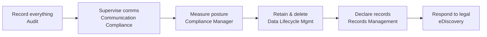

# Microsoft Purview — Data Compliance

!!! info "Complexity: Low to read · Est. time: ~10 min"
    This is the module map for Purview **data compliance**. Each solution below has its own deep-dive page with prerequisites, sample data, recommended policy, step-by-step, and verification.

## What "data compliance" means in Purview

Microsoft Purview **data compliance** solutions help your organization **minimize compliance risk and meet regulatory requirements** — recording what happened (Audit), supervising communications (Communication Compliance), measuring posture (Compliance Manager), retaining and deleting content on schedule (Data Lifecycle Management), responding to legal matters (eDiscovery), and managing high-value records (Records Management).

## Solutions in this module

-   :material-history:{ .lg .middle } __Audit__

    ---

    Search a unified log of user and admin activity for forensic, IT, compliance, and legal investigations.

    [:octicons-arrow-right-24: Open Audit](audit.md)

-   :material-message-alert:{ .lg .middle } __Communication Compliance__

    ---

    Detect and remediate inappropriate or risky messages across Teams, Viva Engage, and Exchange.

    [:octicons-arrow-right-24: Open Communication Compliance](communication-compliance.md)

-   :material-clipboard-check:{ .lg .middle } __Compliance Manager__

    ---

    Assess and improve compliance posture against regulations with assessments, improvement actions, and a score.

    [:octicons-arrow-right-24: Open Compliance Manager](compliance-manager.md)

-   :material-recycle:{ .lg .middle } __Data Lifecycle Management__

    ---

    Keep what you need and delete what you don't, using retention policies and labels.

    [:octicons-arrow-right-24: Open Data Lifecycle Management](data-lifecycle-management.md)

-   :material-gavel:{ .lg .middle } __eDiscovery__

    ---

    Identify, hold, collect, review, and export content for legal and investigative matters.

    [:octicons-arrow-right-24: Open eDiscovery](ediscovery.md)

-   :material-archive:{ .lg .middle } __Records Management__

    ---

    Declare, manage, and defensibly dispose of high-value records with a file plan.

    [:octicons-arrow-right-24: Open Records Management](records-management.md)

## How these solutions relate

- **Audit** underpins everything — investigations, Insider Risk, and eDiscovery all rely on the audit log.
- **Data Lifecycle Management** and **Records Management** share the same building blocks: **retention policies**, **retention labels**, and **retention label policies**. DLM is for broad "keep/delete"; Records Management adds **file plan**, **records declaration**, and **disposition review** for high-value items.
- **Compliance Manager** measures posture across these solutions and recommends **improvement actions**.
- **eDiscovery** and **Communication Compliance** are the investigative/supervisory workflows.

## Licensing at a glance

!!! warning "Confirm per-solution entitlements"
    Some capabilities (Audit Standard, Compliance Manager, retention policies) are broadly available; others (Audit Premium, eDiscovery Premium, Communication Compliance, advanced retention/records settings) typically require **Microsoft 365 E5** or the **Microsoft Purview** suite. Always confirm against the [Microsoft Purview service description](https://learn.microsoft.com/office365/servicedescriptions/microsoft-365-service-descriptions/microsoft-365-tenantlevel-services-licensing-guidance/microsoft-purview-service-description).

## Sources

- [Microsoft Purview data compliance solutions](https://learn.microsoft.com/purview/purview-compliance)
- [Learn about auditing solutions](https://learn.microsoft.com/purview/audit-solutions-overview)
- [Learn about Communication Compliance](https://learn.microsoft.com/purview/communication-compliance-solution-overview)
- [Microsoft Purview Compliance Manager](https://learn.microsoft.com/purview/compliance-manager)
- [Data lifecycle and records management in Microsoft Purview](https://learn.microsoft.com/purview/manage-data-governance)
- [Learn about eDiscovery](https://learn.microsoft.com/purview/edisc)
