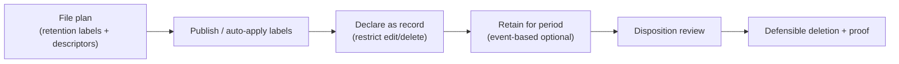

# Records Management

!!! info "Complexity: Medium–High · Est. time: ~60–90 min for a first file plan + label"
    Records management shares retention building blocks with DLM but adds **file plan**, **records declaration**, **event-based retention**, and **disposition review** — governance work that benefits from records-management expertise.

## 1. Description

**Microsoft Purview Records Management** helps you manage **high-value items** for **business, legal, or regulatory record-keeping**. You **declare items as records** (or **regulatory records**) using **retention labels**, organize them with a **file plan**, and **defensibly dispose** of them with **disposition reviews** and proof of deletion.



!!! note "Records Management vs. DLM"
    Both use retention policies/labels. **Records Management** adds records **declaration**, **file plan** management, and **disposition** — use it for items with **legal/regulatory** significance. For broad keep/delete, use [Data Lifecycle Management](data-lifecycle-management.md).

!!! tip "When to use Records Management"
    Use it when regulators or corporate policy require **immutable records**, a **retention schedule (file plan)**, and **auditable disposition**.

## 2. Prerequisites

=== "Licensing"

    Records management is supported across several subscriptions; specific settings (records declaration, event-based retention, disposition) have feature-level requirements — generally **Microsoft 365 E5/A5/G5**, **Purview** suite, or **E5 Information Protection & Governance**. Retention for **Copilot/AI** locations needs **pay-as-you-go** billing. Confirm on the [service description](https://learn.microsoft.com/office365/servicedescriptions/microsoft-365-service-descriptions/microsoft-365-tenantlevel-services-licensing-guidance/microsoft-purview-service-description#microsoft-purview-data-lifecycle-&-records-management).

=== "Roles"

    Add records staff to the **Records Management** admin role group (grants all records features). To access **file plan**, you need **Retention Manager** or **View-only Retention Manager**. Follow least privilege.

## 3. Generate sample data (a file plan to import)

File plan supports **bulk import** of retention labels from a spreadsheet. This script creates a starter CSV you can import (adjust columns to the current file plan import template on Learn).

```powershell
$lab = Join-Path $env:USERPROFILE 'Records-Lab'
New-Item -ItemType Directory -Path $lab -Force | Out-Null

$labels = @(
  [pscustomobject]@{ LabelName="Contracts-7yr"; RetentionDuration=2555; RetentionAction="Retain"; IsRecordLabel="TRUE";  ReferenceId="LEGAL-001" }
  [pscustomobject]@{ LabelName="Invoices-5yr";  RetentionDuration=1825; RetentionAction="RetainThenDelete"; IsRecordLabel="TRUE"; ReferenceId="FIN-002" }
)
$csv = Join-Path $lab 'file-plan.csv'
$labels | Export-Csv -Path $csv -NoTypeInformation -Encoding UTF8
Write-Host "Wrote starter file plan to $csv (adjust to the current import template)." -ForegroundColor Green
Get-Content $csv
```

Also seed some documents to label — reuse the [DLM sample script](data-lifecycle-management.md#3-generate-sample-content).

## 4. Recommended setup

!!! tip "Start with one record label, applied manually"
    Create **one** record retention label (for example *Contracts – 7 years*), **publish** it to a pilot library, apply it manually, and practice a **disposition review**. Automate later.

| Recommendation | Why |
|---|---|
| One **record** label first | Learn declaration + disposition safely |
| Publish to a **pilot** library | Limit blast radius |
| Enable **disposition review** | Human check before deletion |
| Use **file plan descriptors** | Track regulatory references |

## 5. Step-by-step configuration

1. In the **[Microsoft Purview portal](https://purview.microsoft.com)** → **Records Management → File plan**.
2. **Create a label** (or **Import** your file-plan CSV): set the **retention period**, the **action** (retain / retain-then-delete), and **mark items as a record**. Add **file plan descriptors** (reference ID, category).
3. Optionally configure **event-based retention** (start the clock on an event).
4. Go to **Label policies → Publish labels** and publish to a **pilot** SharePoint library.
5. In the library, **apply** the label to a test document (it's now a **record** — edits/deletes are restricted).
6. When the retention period ends, complete the **disposition review** and record **proof of disposition**.

## 6. Verification

1. Confirm the label appears in **File plan** and is **published** to the pilot library.
2. Apply it to a document and confirm it's **declared a record** (attempting to delete/edit is blocked or versioned per settings).
3. For a short test retention period, confirm the item enters a **disposition review** at the end.
4. Complete the review and confirm **proof of disposition** is recorded.

!!! success "What 'good' looks like"
    A test document is declared a record, protected from improper deletion, routed to a disposition review at period end, and disposed of with an auditable record.

## 7. Extensibility

- **Auto-apply labels** — declare records automatically by SIT, keyword/searchable property, trainable classifier, or cloud attachment.
- **Event-based retention** — align retention to business events (contract end, employee departure).
- **Regulatory records** — the strictest tier (immutable label; can't be removed or changed).
- **File plan import/export** — manage large retention schedules in bulk.

### Integration requirements

| Integration | Requirement |
|---|---|
| Auto-apply | Higher-tier licensing; classifier/SIT config |
| Regulatory records | Records Management + policy enabling regulatory records |
| Disposition proof | Disposition review configured; appropriate roles |

## 8. Industry use cases

=== "Financial services"

    Manage **contracts, trade records, and statements** as immutable records with mandated retention and disposition.

=== "Telco"

    Retain **regulatory filings and subscriber agreements** on a defensible schedule.

=== "Public sector & SOE"

    Implement a **public-records file plan** with disposition review and proof of deletion.

=== "Energy & resources"

    Keep **safety, environmental, and inspection records** as regulatory records.

=== "Manufacturing & conglomerates"

    Standardize a **corporate records schedule** across BUs with file plan descriptors.

## 9. Sources

- [Learn about records management](https://learn.microsoft.com/purview/records-management)
- [Get started with records management](https://learn.microsoft.com/purview/get-started-with-records-management)
- [Use file plan to create and manage retention labels](https://learn.microsoft.com/purview/file-plan-manager)
- [Manage content disposition](https://learn.microsoft.com/purview/disposition)
- [Start retention when an event occurs (event-based retention)](https://learn.microsoft.com/purview/event-driven-retention)
