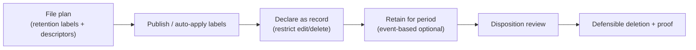

# Records Management

*Declare, manage, and defensibly dispose of high-value records using a file plan and retention labels — build a plan and label, all on this page.*

## Lab details

| Level | Audience | Estimated time | What you'll build |
|---|---|---|---|
| 300 · Advanced | Records / compliance manager | ~2.75 hrs (all 6 surfaces); ~45 min for the first file plan + label | A file plan with a retention label and a disposition-review step |

!!! info "Complexity: Medium–High · Est. time: ~2.75 hrs total (all 6 surfaces); ~45 min for a first file plan + label"
    Records management shares retention building blocks with DLM but adds **file plan**, **records declaration**, **event-based retention**, and **disposition review** — governance work that benefits from records-management expertise.

## Why this matters

Some content is a formal **record** — contracts, filings, safety documents — with legal disposal obligations. Records Management enforces that lifecycle and proves you did it, defensibly.

## Overview video

<div class="video-embed">
<iframe src="https://www.youtube-nocookie.com/embed/gEBJPaS5_Q0" title="Microsoft Purview Records Management deep dive" loading="lazy" allow="accelerometer; autoplay; clipboard-write; encrypted-media; gyroscope; picture-in-picture; web-share" referrerpolicy="strict-origin-when-cross-origin" allowfullscreen></iframe>
</div>
<p class="video-caption"><strong>▶ Watch — Microsoft Purview Records Management: deep dive</strong><br>Bruce Miller EDRMS · 5:58 — A records-management specialist's deep dive: which capabilities work well (and which to avoid), how to automate compliance, and how to handle limitations like case records.</p>

## Introduction

**Microsoft Purview Records Management** helps you manage **high-value items** for **business, legal, or regulatory record-keeping**. You **declare items as records** (or **regulatory records**) using **retention labels**, organize them with a **file plan**, and **defensibly dispose** of them with **disposition reviews** and proof of deletion.



!!! note "Records Management vs. DLM"
    Both use retention policies/labels. **Records Management** adds records **declaration**, **file plan** management, and **disposition** — use it for items with **legal/regulatory** significance. For broad keep/delete, use [Data Lifecycle Management](data-lifecycle-management.md).

!!! tip "When to use Records Management"
    Use it when regulators or corporate policy require **immutable records**, a **retention schedule (file plan)**, and **auditable disposition**.

## Core concepts

| Term | What it means |
|---|---|
| **File plan** | The retention schedule — labels plus regulatory descriptors |
| **Retention label** | Applies retention (and record status) to items |
| **Records declaration** | Marking an item a record so edits/deletes are restricted |
| **Disposition review** | A human check before an item is deleted |
| **Regulatory record** | The strictest, immutable record tier |

## Prerequisites

=== "Licensing"

    Records management is supported across several subscriptions; specific settings (records declaration, event-based retention, disposition) have feature-level requirements — generally **Microsoft 365 E5/A5/G5**, **Purview** suite, or **E5 Information Protection & Governance**. Retention for **Copilot/AI** locations needs **pay-as-you-go** billing. Confirm on the [service description](https://learn.microsoft.com/office365/servicedescriptions/microsoft-365-service-descriptions/microsoft-365-tenantlevel-services-licensing-guidance/microsoft-purview-service-description#microsoft-purview-data-lifecycle-&-records-management).

=== "Roles"

    Add records staff to the **Records Management** admin role group (grants all records features). To access **file plan**, you need **Retention Manager** or **View-only Retention Manager**. Follow least privilege.

## What you'll accomplish

By the end of this lab you will:

- [x] Build a **file plan** and publish a record retention label
- [x] **Declare records** and confirm edit/delete restrictions
- [x] Configure **event-based** retention and **disposition review**
- [x] Use **regulatory records** and **auto-apply** labels

## Use cases covered

Each use case is one way to implement Records Management, walked through as **preconfig → configure → validate**:

| # | Surface | What you configure | Time |
|---|---|---|---|
| 1 | **File plan + label** | A record retention label from a file plan | ~45 min |
| 2 | **Records declaration** | Mark items as records (edit/delete restricted) | ~20 min |
| 3 | **Event-based retention** | Start retention on an event | ~30 min |
| 4 | **Disposition review** | Human review before deletion | ~20 min |
| 5 | **Regulatory records** | The strictest, immutable tier | ~20 min |
| 6 | **Auto-apply** | Auto-declare by SIT/keyword/classifier | ~30 min |

## Generate lab data

File plan supports **bulk import** of retention labels from a spreadsheet. This script creates a starter CSV you can import (adjust columns to the current file plan import template on Learn).

```powershell
$lab = Join-Path $env:USERPROFILE 'Records-Lab'
New-Item -ItemType Directory -Path $lab -Force | Out-Null

$labels = @(
  [pscustomobject]@{ LabelName="Contracts-7yr"; RetentionDuration=2555; RetentionAction="Retain"; IsRecordLabel="TRUE";  ReferenceId="LEGAL-001" }
  [pscustomobject]@{ LabelName="Invoices-5yr";  RetentionDuration=1825; RetentionAction="RetainThenDelete"; IsRecordLabel="TRUE"; ReferenceId="FIN-002" }
)
$csv = Join-Path $lab 'file-plan.csv'
$labels | Export-Csv -Path $csv -NoTypeInformation -Encoding UTF8
Write-Host "Wrote starter file plan to $csv (adjust to the current import template)." -ForegroundColor Green
Get-Content $csv
```

Also seed some documents to label — reuse the [DLM sample script](data-lifecycle-management.md#generate-lab-data).

## Recommended setup

!!! tip "Start with one record label, applied manually"
    Create **one** record retention label (for example *Contracts – 7 years*), **publish** it to a pilot library, apply it manually, and practice a **disposition review**. Automate later.

| Recommendation | Why |
|---|---|
| One **record** label first | Learn declaration + disposition safely |
| Publish to a **pilot** library | Limit blast radius |
| Enable **disposition review** | Human check before deletion |
| Use **file plan descriptors** | Track regulatory references |

## Use case 1 — File plan & retention label

*Build a retention schedule for **contracts** — a file plan with a 7-year record label — the backbone you'll publish and apply in every use case below.*

### Preconfig

**Records Management** / **Retention Manager** roles; a starter [file plan CSV](#generate-lab-data) and content to label.

### Configure

1. **[Microsoft Purview portal](https://purview.microsoft.com)** → **Records Management → File plan**.
2. **Create a label** (or **Import** your CSV): set the **retention period** and **action**, add **file plan descriptors** (reference ID, category).
3. **Label policies → Publish labels** to a **pilot** SharePoint library.

### Validate

1. Confirm the label appears in **File plan** and is **published**.
2. Confirm a pilot user can **apply** it to a document.

---

## Use case 2 — Records declaration

*Mark a signed contract as a **record** so no one can edit or delete it before its retention period ends.*

### Preconfig

A published label from Use case 1.

### Configure

1. Edit the label → **mark items as a record** (or **regulatory record** for the strictest tier — see Use case 5).
2. Publish and apply it to a test document.

### Validate

1. Apply the label and confirm the item is **declared a record**.
2. Confirm attempts to **delete/edit** are blocked or versioned per settings.

---

## Use case 3 — Event-based retention

*Start a personnel file's retention clock on the employee's **departure**, not on a fixed date — event-based retention for records.*

### Preconfig

An **event type** defined; a retention label.

### Configure

1. Create/edit a record label with **retention period based on an event**; pick the **event type**.
2. Record the **asset ID / keywords** tying items to the event; publish/auto-apply.
3. Create the matching **event** to start the clock.

### Validate

1. Trigger the event and confirm labeled items begin retention from the event date.

---

## Use case 4 — Disposition review

*Require a records manager to review and approve each expired contract before it's deleted — with proof of disposition.*

### Preconfig

**Disposition** roles; a label with a (short, for testing) retention period.

### Configure

1. On the record label, enable **disposition review** and assign **reviewers** (one or more stages).
2. Publish and apply it.

### Validate

1. When the period ends, confirm the item enters a **disposition review**.
2. Complete the review and confirm **proof of disposition** is recorded.

---

## Use case 5 — Regulatory records

*Apply the strictest **regulatory record** label to SEC-mandated filings, so the label itself can never be removed or its retention shortened.*

### Preconfig

**Regulatory records** enabled in Records Management settings (a policy switch), plus roles.

### Configure

1. Enable **regulatory records** for your tenant.
2. Create a label as a **regulatory record** and publish it (note: cannot be un-declared).

### Validate

1. Apply the regulatory-record label to a test item.
2. Confirm the label/record **can't be removed or changed** and content is locked.

---

## Use case 6 — Auto-apply record labels

*Auto-declare any document containing a contract number as a record — by SIT, keyword, or classifier — instead of relying on users to do it.*

### Preconfig

Higher-tier licensing; a **SIT / keyword / trainable classifier** to match on.

### Configure

1. **Auto-apply a label** policy → choose the **condition** (SIT, keyword/searchable property, trainable classifier, or cloud attachment) and the **record label**.
2. Run in **simulation** first, then enable.

### Validate

1. Add content matching the condition.
2. Confirm the **record label auto-applies** and the item is declared a record.

## Extensibility

- **Auto-apply labels** — declare records automatically by SIT, keyword/searchable property, trainable classifier, or cloud attachment.
- **Event-based retention** — align retention to business events (contract end, employee departure).
- **Regulatory records** — the strictest tier (immutable label; can't be removed or changed).
- **File plan import/export** — manage large retention schedules in bulk.

### Integration requirements

| Integration | Requirement |
|---|---|
| Auto-apply | Higher-tier licensing; classifier/SIT config |
| Regulatory records | Records Management + policy enabling regulatory records |
| Disposition proof | Disposition review configured; appropriate roles |

## Industry use cases

=== "Financial services"

    Manage **contracts, trade records, and statements** as immutable records with mandated retention and disposition.

=== "Telecommunication"

    Retain **regulatory filings and subscriber agreements** on a defensible schedule.

=== "Public sector & SOE"

    Implement a **public-records file plan** with disposition review and proof of deletion.

=== "Energy & resources"

    Keep **safety, environmental, and inspection records** as regulatory records.

=== "Manufacturing & conglomerates"

    Standardize a **corporate records schedule** across BUs with file plan descriptors.

## Change management & rollout

Never switch a new policy on for the whole tenant at once. Roll it out in controlled waves so you protect data **without surprising users or blocking legitimate work**. Records declaration and disposition affect what users can edit and delete, so pilot the file plan and keep disposition review on.

| Phase | What you do | Who's affected | Move on when… |
|---|---|---|---|
| **1. Pilot** | Pilot a small **file plan** with one or two retention labels on a single library/site; enable **disposition review** so nothing auto-deletes unreviewed. | Pilot site | Labels apply; records behave as expected; disposition review works |
| **2. Expand** | Add file-plan entries and labels; widen to more sites/teams; involve records owners. | Department(s) | Declaration/retention validated; reviewers ready |
| **3. Tenant-wide** | Publish the file plan/labels to the intended scope after comms + training. | All in-scope sites | Steady state; disposition understood |
| **4. Operate** | Run disposition reviews on schedule; refine the file plan as obligations change. | Ongoing | — |

!!! tip "Least-disruption levers"
    - **Start in a safe mode:** pilot the **file plan** and keep **disposition review** on before broad rollout.
    - **Communicate first:** tell content owners what becomes a record and how disposition works.
    - **Keep a rollback path:** unpublish a label or narrow scope; disposition review prevents premature deletion.
    - **Log the change:** record scope, approver, and date in your change-management system (e.g., a change ticket).

## Summary & golden rules

- Build a **file plan** before creating labels at scale.
- Use **records declaration** for content that must be immutable.
- Enable **disposition review** so deletions are approved and logged.
- Align retention triggers with **event-based** timing where needed.

## Sources

- [Learn about records management](https://learn.microsoft.com/purview/records-management)
- [Get started with records management](https://learn.microsoft.com/purview/get-started-with-records-management)
- [Use file plan to create and manage retention labels](https://learn.microsoft.com/purview/file-plan-manager)
- [Manage content disposition](https://learn.microsoft.com/purview/disposition)
- [Start retention when an event occurs (event-based retention)](https://learn.microsoft.com/purview/event-driven-retention)
