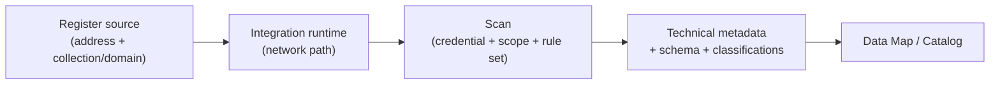

# Data Map

*Register and scan on-premises, multicloud, and SaaS sources to build a unified map of your estate — run a first scan, all on this page.*

## Lab details

| Level | Audience | Estimated time | What you'll build |
|---|---|---|---|
| 300 · Advanced | Data / platform administrator | ~60–90 min | A Data Map account with a registered source and a completed scan |

!!! info "Complexity: Medium–High · Est. time: ~60–90 min for a first scan"
    Creating the account and scanning a cloud source is approachable. Complexity rises with **on-premises sources** (self-hosted integration runtime), **credentials/networking**, and **custom scan rule sets**.

## Why this matters

You can't govern what you can't see. The Data Map automatically discovers and classifies data across clouds and on-prem, giving governance and security a **shared, current picture** of the estate.

## Overview video

<div class="video-embed">
<iframe src="https://www.youtube-nocookie.com/embed/f8EUen2iuWs" title="Purview data mapping explained" loading="lazy" allow="accelerometer; autoplay; clipboard-write; encrypted-media; gyroscope; picture-in-picture; web-share" referrerpolicy="strict-origin-when-cross-origin" allowfullscreen></iframe>
</div>
<p class="video-caption"><strong>▶ Watch — Purview data mapping explained: collections, scans &amp; labels</strong><br>Peter Rising · 15:21 — A quick but complete explainer of Microsoft Purview data mapping — collections, scans, and labels — covering the essentials of building a map of your data estate.</p>

## Introduction

**Microsoft Purview Data Map** is the technical foundation of data governance. After you **register** a data source, you **scan** it to capture **technical metadata**, **extract schema**, and apply **classifications** — building a unified map of your data estate across **on-premises, multicloud, and SaaS** sources.



!!! tip "When to use Data Map"
    Use Data Map to answer "**what data do we have, where, and what's in it**" across databases, storage, and SaaS — the prerequisite for cataloging and governing it.

## Core concepts

| Term | What it means |
|---|---|
| **Collection / domain** | Organizational containers that also govern permissions |
| **Registration** | Giving Purview a source's address and mapping it to a collection |
| **Integration runtime** | The compute that connects to a source (Azure or self-hosted) |
| **Scan rule set** | The classifications a scan checks for (default or custom) |
| **Classification** | A label applied to data based on a detected pattern |

## Prerequisites

=== "Licensing / account"

    You need a **Microsoft Purview account** (only **one per tenant**). Start in the **[Microsoft Purview portal](https://purview.microsoft.com)**; use the **free version** to test and **upgrade to enterprise** for full features. Review [data governance billing](https://learn.microsoft.com/purview/data-governance-billing).

=== "Roles"

    - **Data Source Administrator** + **Data Reader** to register and manage a source.
    - **Collection administrator / Domain admin** to manage collections/domains and assign roles.
    - **Data curators** to manage assets and classifications in the catalog.

=== "Connectivity & credentials"

    - Choose the right **[integration runtime](https://learn.microsoft.com/purview/data-map-integration-runtime-choose)** (Azure auto-resolve for cloud; **self-hosted** for on-premises/private networks).
    - Prepare **credentials** — the **Purview Managed Identity** is the simplest for supported Azure sources; other sources support key/secret or service principal.

## What you'll accomplish

By the end of this lab you will:

- [x] Register and scan a **cloud source**; confirm classifications
- [x] Scan an **on-premises** source via the self-hosted runtime
- [x] Build a **custom scan rule set** with custom classifications
- [x] Schedule **incremental** scans and view **lineage**

## Use cases covered

Each use case is one way to build the map, walked through as **preconfig → configure → validate**:

| # | Surface | What you configure | Time |
|---|---|---|---|
| 1 | **Cloud source scan** | Register + scan an Azure/cloud source | ~60 min |
| 2 | **On-premises source** | Self-hosted runtime + on-prem scan | ~60–90 min |
| 3 | **Custom scan rule sets** | Custom classifications for your data | ~30 min |
| 4 | **Scheduled / incremental + lineage** | Recurring scans and lineage | ~30 min |

## Generate lab data

Create an Azure Blob Storage container with sample files so you have something to register and scan.

```azurecli
# Create a resource group + storage account + container, then upload sample files.
az group create --name purview-lab-rg --location eastus

az storage account create \
  --name purviewlab$RANDOM --resource-group purview-lab-rg \
  --sku Standard_LRS --kind StorageV2

# (Use the account name printed above.)
az storage container create --account-name <storageAccount> --name sample-data

# Upload a couple of sample CSVs containing classifiable data.
echo "name,email,card" > sample.csv
echo "Test User,test@contoso.com,4111 1111 1111 1111" >> sample.csv
az storage blob upload --account-name <storageAccount> \
  --container-name sample-data --file sample.csv --name sample.csv
```

The `card` column contains a synthetic credit-card-format value so the scan's classifiers have something to detect.

## Recommended setup

!!! tip "Start with one cloud source and the default rule set"
    Register **one** Azure source, scan it with the **system default scan rule set** and **Managed Identity**, then review classifications before adding more sources or custom rules.

| Recommendation | Why |
|---|---|
| One source first | Learn the flow end to end |
| **Managed Identity** credential | Simplest for supported Azure sources |
| **System default** rule set | Broad classification coverage |
| Scope the scan | Faster, cheaper first run |
| Schedule **incremental** scans | Keep the map current |

## Use case 1 — Cloud source scan

*Discover and classify data in a cloud source (Azure, AWS, GCP) — the fastest way to start the map.*

### Preconfig

A **Microsoft Purview account**, **Data Source Administrator + Data Reader** roles, and a **credential** (Purview **Managed Identity** is simplest for Azure). Create a [sample cloud source](#generate-lab-data).

### Configure

1. **[Microsoft Purview portal](https://purview.microsoft.com)** → **Data Map → Data sources → Register**; choose the source type (e.g., **Azure Blob Storage**) and map it to a **collection/domain**.
2. Select the source → **New scan**; pick a **credential** (Managed Identity), **Test connection**, **Continue**.
3. **Scope** the scan, choose the **system default scan rule set**, set a **schedule**, and **Save and run**.

### Validate the config

1. Confirm the scan status is **Completed** with assets discovered.
2. Open a scanned asset and confirm **schema** + **classifications** (e.g., *Credit Card Number* on the `card` column).

---

## Use case 2 — On-premises source (self-hosted runtime)

*Extend the map to on-prem file shares, SQL, and other private-network sources.*

### Preconfig

A **self-hosted integration runtime** installed on a machine with network access to the source, plus source **credentials** (key/secret or service principal).

### Configure

1. **Data Map → Integration runtimes** → install and register a **self-hosted integration runtime**.
2. **Register** the on-prem source and map it to a collection.
3. **New scan** → choose the **self-hosted runtime** and credential; scope and run.

### Validate the config

1. Confirm the scan completes via the self-hosted runtime.
2. Confirm on-prem assets, schema, and classifications appear in the map.

---

## Use case 3 — Custom scan rule sets & classifications

*Detect data unique to your business (e.g., national IDs, account formats) that built-in classifiers miss.*

### Preconfig

**Data curator** role; the pattern/keywords for your custom classification.

### Configure

1. **Data Map → Classification rules** → create a **custom classification** (regex/keyword-based).
2. **Scan rule sets** → create a **custom scan rule set** that includes your classification.
3. Run a scan using the custom rule set.

### Validate the config

1. Confirm scanned assets carry your **custom classification** where the pattern matches.

---

## Use case 4 — Scheduled / incremental scans & lineage

*Keep the map current automatically and see how data moves.*

### Preconfig

A registered, previously-scanned source.

### Configure

1. On the source's scan, set a **recurring (incremental)** schedule.
2. Where supported, enable **lineage** capture (e.g., via Data Factory / Fabric integration).

### Validate the config

1. Confirm a re-run **incremental** scan completes faster than the full scan.
2. Confirm **lineage** shows how the asset is produced/consumed (where available).

## Extensibility

- **Broad source support** — Azure, other clouds (for example Amazon Redshift/S3), databases, Fabric, and on-premises via self-hosted runtime.
- **Custom scan rule sets & classifications** — detect data unique to your business.
- **Lineage** — capture how data moves and transforms across systems.
- **REST APIs** — automate registration, scanning, and catalog operations.

### Integration requirements

| Integration | Requirement |
|---|---|
| On-premises sources | Self-hosted integration runtime + credentials |
| Custom classifications | Data curator role; classification rules |
| Managed Identity scanning | Purview Managed Identity granted read on the source |
| API automation | Purview REST API permissions |

## Industry use cases

=== "Financial services"

    Map **databases and warehouses** holding PII/PCI data and classify columns for downstream protection.

=== "Telecommunication"

    Inventory **subscriber and network data** across clouds to know where sensitive data lives.

=== "Public sector & SOE"

    Build a **data estate map** for sovereignty and residency assessments.

=== "Energy & resources"

    Catalog **operational, geospatial, and IP data** across hybrid environments.

=== "Manufacturing & conglomerates"

    Discover and classify **ERP/PLM data** across business units and clouds.

## Change management & rollout

Roll this out one source at a time rather than scanning everything at once. Scanning consumes source and network capacity, so start small and use incremental scans to avoid load.

| Phase | What you do | Who's affected | Move on when… |
|---|---|---|---|
| **1. Pilot** | Register and scan **one cloud source** with a scoped scan rule set; prefer **managed identity** and run off-peak. | Pilot source owners | Scan completes; classifications look right; no source impact |
| **2. Expand** | Add more sources (then on-prem via the runtime); schedule **incremental** scans; tune rule sets. | More source owners | Coverage growing; scan load acceptable |
| **3. Tenant-wide** | Onboard the remaining estate on a schedule; standardize scan rule sets and credentials. | All sources | Steady state; cost/coverage understood |
| **4. Operate** | Monitor scan health and cost; refresh classifications; feed the Unified Catalog. | Ongoing | — |

!!! tip "Least-disruption levers"
    - **Start in a safe mode:** **one source + incremental**, scoped scans, run off-peak.
    - **Communicate first:** coordinate with source/data owners and networking before scanning production systems.
    - **Keep a rollback path:** pause or unschedule scans; scanning is read-only but can be throttled.
    - **Log the change:** record scope, approver, and date in your change-management system (e.g., a change ticket).

## Summary & golden rules

- Start with **one cloud source**; add on-prem later via the runtime.
- Use **managed identity** where possible for scan credentials.
- Schedule **incremental scans** instead of full rescans.
- Let classifications flow into the **Unified Catalog** for curation.

## Sources

- [Microsoft Purview Data Map](https://learn.microsoft.com/purview/data-map)
- [Scan data sources in Data Map](https://learn.microsoft.com/purview/data-map-scan-data-sources)
- [Data sources that connect to Data Map](https://learn.microsoft.com/purview/data-map-data-sources)
- [Create a Microsoft Purview account](https://learn.microsoft.com/purview/create-microsoft-purview-portal)
- [Manage domains and collections in Data Map](https://learn.microsoft.com/purview/data-map-domains-collections-manage)
