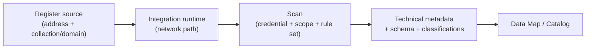

# Data Map

!!! info "Complexity: Medium–High · Est. time: ~60–90 min for a first scan"
    Creating the account and scanning a cloud source is approachable. Complexity rises with **on-premises sources** (self-hosted integration runtime), **credentials/networking**, and **custom scan rule sets**.

## 1. Description

**Microsoft Purview Data Map** is the technical foundation of data governance. After you **register** a data source, you **scan** it to capture **technical metadata**, **extract schema**, and apply **classifications** — building a unified map of your data estate across **on-premises, multicloud, and SaaS** sources.



!!! tip "When to use Data Map"
    Use Data Map to answer "**what data do we have, where, and what's in it**" across databases, storage, and SaaS — the prerequisite for cataloging and governing it.

### Key concepts

- **Collections / domains** — organizational containers that also govern **permissions**.
- **Registration** — giving Purview the address of a source and mapping it to a collection/domain.
- **Integration runtime** — the compute that connects to the source (Azure-hosted or self-hosted for on-prem).
- **Scan rule set** — the classifications the scan checks for (system default or custom).
- **Classifications** — labels applied to data based on detected patterns.

## 2. Prerequisites

=== "Licensing / account"

    You need a **Microsoft Purview account** (only **one per tenant**). Start in the **[Microsoft Purview portal](https://purview.microsoft.com)**; use the **free version** to test and **upgrade to enterprise** for full features. Review [data governance billing](https://learn.microsoft.com/purview/data-governance-billing).

=== "Roles"

    - **Data Source Administrator** + **Data Reader** to register and manage a source.
    - **Collection administrator / Domain admin** to manage collections/domains and assign roles.
    - **Data curators** to manage assets and classifications in the catalog.

=== "Connectivity & credentials"

    - Choose the right **[integration runtime](https://learn.microsoft.com/purview/data-map-integration-runtime-choose)** (Azure auto-resolve for cloud; **self-hosted** for on-premises/private networks).
    - Prepare **credentials** — the **Purview Managed Identity** is the simplest for supported Azure sources; other sources support key/secret or service principal.

## 3. Generate sample data (a source to scan)

Create an Azure Blob Storage container with sample files so you have something to register and scan.

```azurecli
# Create a resource group + storage account + container, then upload sample files.
az group create --name purview-lab-rg --location eastus

az storage account create \
  --name purviewlab$RANDOM --resource-group purview-lab-rg \
  --sku Standard_LRS --kind StorageV2

# (Use the account name printed above.)
az storage container create --account-name <storageAccount> --name sample-data

# Upload a couple of sample CSVs containing classifiable data.
echo "name,email,card" > sample.csv
echo "Test User,test@contoso.com,4111 1111 1111 1111" >> sample.csv
az storage blob upload --account-name <storageAccount> \
  --container-name sample-data --file sample.csv --name sample.csv
```

The `card` column contains a synthetic credit-card-format value so the scan's classifiers have something to detect.

## 4. Recommended setup

!!! tip "Start with one cloud source and the default rule set"
    Register **one** Azure source, scan it with the **system default scan rule set** and **Managed Identity**, then review classifications before adding more sources or custom rules.

| Recommendation | Why |
|---|---|
| One source first | Learn the flow end to end |
| **Managed Identity** credential | Simplest for supported Azure sources |
| **System default** rule set | Broad classification coverage |
| Scope the scan | Faster, cheaper first run |
| Schedule **incremental** scans | Keep the map current |

## 5. Step-by-step configuration

1. In the **[Microsoft Purview portal](https://purview.microsoft.com)** → **Data Map → Data sources → Register**. Choose the source type (for example **Azure Blob Storage**) and map it to a **collection/domain**.
2. (On-prem only) Install and register a **self-hosted integration runtime**.
3. Select the source → **New scan**. Enter a **name**, pick a **credential** (for example **Managed Identity**), and choose the **collection/subcollection** to store metadata.
4. **Test connection**, then **Continue**.
5. **Scope** the scan (for Blob, pick folders), then choose a **scan rule set** (system default) — this defines which **classifications** are checked.
6. Set a **schedule** (once, or recurring incremental) and **Save and run**.
7. When complete, browse **Data Map** to see discovered assets, schema, and classifications.

## 6. Verification

1. Confirm the scan status is **Completed** with assets discovered.
2. Browse the source in **Data Map** and open a scanned asset — confirm **schema** and **classifications** (for example a *Credit Card Number* classification on the `card` column).
3. Search the catalog for the asset by name.
4. Re-run an **incremental** scan and confirm it completes faster.

!!! success "What 'good' looks like"
    Your source is registered, the scan completes, assets appear in the map with extracted schema, and sensitive columns carry the expected **classifications**.

## 7. Extensibility

- **Broad source support** — Azure, other clouds (for example Amazon Redshift/S3), databases, Fabric, and on-premises via self-hosted runtime.
- **Custom scan rule sets & classifications** — detect data unique to your business.
- **Lineage** — capture how data moves and transforms across systems.
- **REST APIs** — automate registration, scanning, and catalog operations.

### Integration requirements

| Integration | Requirement |
|---|---|
| On-premises sources | Self-hosted integration runtime + credentials |
| Custom classifications | Data curator role; classification rules |
| Managed Identity scanning | Purview Managed Identity granted read on the source |
| API automation | Purview REST API permissions |

## 8. Industry use cases

=== "Financial services"

    Map **databases and warehouses** holding PII/PCI data and classify columns for downstream protection.

=== "Telecommunication"

    Inventory **subscriber and network data** across clouds to know where sensitive data lives.

=== "Public sector & SOE"

    Build a **data estate map** for sovereignty and residency assessments.

=== "Energy & resources"

    Catalog **operational, geospatial, and IP data** across hybrid environments.

=== "Manufacturing & conglomerates"

    Discover and classify **ERP/PLM data** across business units and clouds.

## 9. Sources

- [Microsoft Purview Data Map](https://learn.microsoft.com/purview/data-map)
- [Scan data sources in Data Map](https://learn.microsoft.com/purview/data-map-scan-data-sources)
- [Data sources that connect to Data Map](https://learn.microsoft.com/purview/data-map-data-sources)
- [Create a Microsoft Purview account](https://learn.microsoft.com/purview/create-microsoft-purview-portal)
- [Manage domains and collections in Data Map](https://learn.microsoft.com/purview/data-map-domains-collections-manage)
