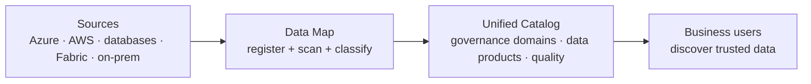

# Microsoft Purview — Data Governance

!!! info "Complexity: Medium to read · Est. time: ~10 min"
    This is the module map for Purview **data governance**. It differs from the Microsoft 365 security/compliance solutions: it governs your **broader data estate** (multicloud + on-premises) through a **Microsoft Purview account**, **Data Map**, and **Unified Catalog**.

## What "data governance" means in Purview

Microsoft Purview **data governance** helps you **map your data estate** and build a **federated** approach to governing data — delivering visibility, data confidence, and responsible innovation in the era of AI. It has two solutions that work together:

- **Data Map** — the technical foundation: register and **scan** sources to capture metadata, extract schema, and apply **classifications**.
- **Unified Catalog** — the business layer: organize data into **governance domains**, curate **data products**, add **glossary terms / OKRs**, and measure **data quality**.

## Solutions in this module

-   :material-map-search:{ .lg .middle } __Data Map__

    ---

    Register and scan on-premises, multicloud, and SaaS sources to build a unified map of your data estate with technical metadata and classifications.

    [:octicons-arrow-right-24: Open Data Map](data-map.md)

-   :material-book-open-variant:{ .lg .middle } __Unified Catalog__

    ---

    Curate and govern data with governance domains, data products, glossary terms, OKRs, and data quality — so people can discover trusted data.

    [:octicons-arrow-right-24: Open Unified Catalog](unified-catalog.md)

## The typical workflow

1. Assign a user the **Data Governance Administrator** role.
2. Use **Data Map** to **scan** your sources and capture metadata.
3. In **Unified Catalog**, build **governance domains** and curate **data products**.
4. Connect data to **business concepts** (OKRs, glossary terms, critical data elements).
5. **Improve data quality** with profiling and rules.

!!! note "Free vs. enterprise; one account per tenant"
    You can start with the **free version** to test capabilities and **upgrade to enterprise** for full data-governance features. Only **one Microsoft Purview account** is created per tenant. Review [billing for data governance](https://learn.microsoft.com/purview/data-governance-billing) before you start.

## Compatibility

- **Sources**: a broad set of **Azure**, other-cloud (for example **Amazon** sources), **database**, **Fabric**, and **on-premises** sources — see [Data sources that connect to Data Map](https://learn.microsoft.com/purview/data-map-data-sources).
- **Data quality**: rules currently run on **delta-format tables in ADLS Gen2 and Microsoft Fabric**, using the Purview **Managed Identity**.
- **Network**: choose the right **integration runtime** for your connectivity scenario.

## Sources

- [Microsoft Purview data governance solutions](https://learn.microsoft.com/purview/data-governance-overview)
- [Data governance with Microsoft Purview](https://learn.microsoft.com/purview/data-governance-solution)
- [Get started with Microsoft Purview data governance](https://learn.microsoft.com/purview/data-governance-get-started)
- [Plan for data governance](https://learn.microsoft.com/purview/data-governance-plan)
- [Data Map](https://learn.microsoft.com/purview/data-map) · [Unified Catalog](https://learn.microsoft.com/purview/unified-catalog)
