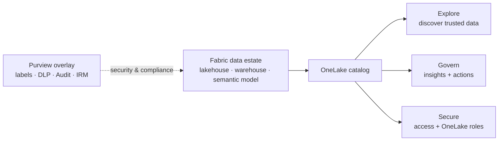

# Data Governance — the OneLake catalog

!!! info "Complexity: Medium to read · Est. time: ~10 min"
    This module governs your **Microsoft Fabric** data estate from the **OneLake catalog** — the built-in place to **discover**, **govern**, and **secure** Fabric data. Microsoft **Purview** stays in the picture as the **security & compliance overlay** (sensitivity labels, DLP, Audit, Insider Risk) on that data.

## What "data governance" means here

In Microsoft Fabric, data governance lives in the **OneLake catalog** — a single experience that comes with every Fabric tenant and is embedded in **Teams, Excel, and Copilot Studio**. It has three tabs:

- **Explore** — find and inspect trusted items (filters, details, lineage, permissions).
- **Govern** — governance-posture insights and recommended actions for the data you own (tenant-wide for admins).
- **Secure** — audit access and manage **OneLake security roles** across workspaces and items.

## Labs in this module

-   :material-magnify:{ .lg .middle } __OneLake catalog — Discover & govern__

    ---

    Find trusted Fabric items in the **Explore** tab, organize with **domains**, **endorse** high-value data, and act on **Govern**-tab recommendations.

    [:octicons-arrow-right-24: Open Discover & govern](onelake-discover-govern.md)

-   :material-shield-key:{ .lg .middle } __OneLake catalog — Secure__

    ---

    Audit **who has access** across workspaces and **manage OneLake security roles** on items — from the **Secure** tab.

    [:octicons-arrow-right-24: Open Secure](onelake-secure.md)

## The typical workflow

1. **Explore** the catalog to discover the items you need.
2. Organize the estate into **domains** and **endorse** trusted items.
3. Use the **Govern** tab to review posture and clear **recommended actions**.
4. Use the **Secure** tab to audit access and manage **OneLake security roles**.
5. Layer **Purview** security/compliance — **sensitivity labels**, **DLP for Fabric**, **Audit**, **Insider Risk** — on the same data.

!!! note "Governance is built into Fabric"
    The OneLake catalog comes with every Microsoft Fabric tenant — there's no separate governance service to deploy. Governance signals (labeling, DLP coverage, endorsement) surface directly on your Fabric items.

## How Purview overlays security & compliance on Fabric

Governance (discovery, endorsement, quality posture, access) is delivered by the **OneLake catalog**. Microsoft **Purview** protects and monitors that same Fabric data:

- **Information Protection** — apply **sensitivity labels** (and protection policies) to Fabric items.
- **Data Loss Prevention** — DLP policies for **lakehouses, warehouses, and semantic models**.
- **Audit** — Fabric user activity in the unified audit log.
- **Insider Risk Management** — Fabric-specific risk indicators (Power BI, lakehouse/warehouse exfiltration).

See [Information Protection](../data-security/information-protection/index.md), [DLP](../data-security/dlp/index.md), [Audit](../data-compliance/audit.md), and [Insider Risk Management](../data-security/insider-risk-management/index.md).

## Sources

- [OneLake catalog overview](https://learn.microsoft.com/fabric/governance/onelake-catalog-overview)
- [Find and explore data in the OneLake catalog](https://learn.microsoft.com/fabric/governance/onelake-catalog-explore)
- [Govern Fabric data](https://learn.microsoft.com/fabric/governance/onelake-catalog-govern)
- [Secure your Fabric data](https://learn.microsoft.com/fabric/governance/secure-your-data)
- [Use Microsoft Purview to govern Microsoft Fabric](https://learn.microsoft.com/fabric/governance/microsoft-purview-fabric)
