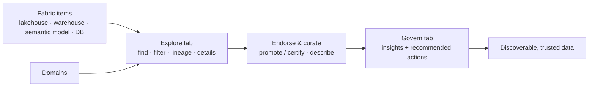

# OneLake catalog — Discover & govern

*Find trusted data across your Microsoft Fabric estate and improve its governance posture — the OneLake catalog's **Explore** and **Govern** tabs, all on this page.*

## Lab details

| Level | Audience | Estimated time | What you'll build |
|---|---|---|---|
| 200 · Intermediate | Fabric admin / data owner | ~1.5–2 hrs (all 4 use cases); ~20 min to explore & endorse a first item | A discoverable, domain-organized, endorsed Fabric estate with governance insights acted on |

!!! info "Complexity: Medium · Est. time: ~1.5–2 hrs total (all 4 use cases)"
    The OneLake catalog is built into Microsoft Fabric — there's no separate service to deploy. Complexity comes from organizing **domains**, driving **endorsement**, and acting on **Govern-tab recommendations** across a real estate.

## Why this matters

Analysts waste time hunting for the right table and second-guessing whether they can trust it. The **OneLake catalog** gives everyone in Microsoft Fabric one place to **discover** trusted items, and gives data owners a **governance posture** with concrete actions to improve labeling, endorsement, and quality.

## Introduction

The **OneLake catalog** is the central place in **Microsoft Fabric** to find, explore, use, and govern your data estate. It comes automatically with every Fabric tenant and is also embedded in **Microsoft Teams, Excel, and Copilot Studio**. It has three tabs — this lab covers the first two:

- **Explore** — browse every Fabric item you can access, with filters, in-context details, lineage, and permissions.
- **Govern** — governance-posture insights and recommended actions for the data you own (or, for admins, the whole tenant).

The **Secure** tab is covered in the [OneLake catalog — Secure](onelake-secure.md) lab.

!!! tip "When to use the OneLake catalog"
    Use it to answer "**what trusted data do we have in Fabric, and is it well governed?**" — for data consumers finding items and for data owners improving posture.

## Core concepts

| Term | What it means |
|---|---|
| **OneLake catalog** | The built-in Fabric experience to find, govern, and secure your data estate (Explore / Govern / Secure tabs) |
| **Item** | A Fabric object — lakehouse, warehouse, semantic model, database, mirrored item, or report |
| **Domain** | A business grouping of workspaces/items used to scope the catalog and its insights |
| **Endorsement** | **Promote** or **Certify** an item so consumers know it's trusted |
| **Governance insights** | Posture signals (labeling, endorsement, freshness, DLP coverage) shown on the Govern tab |
| **Recommended actions** | Guided fixes the Govern tab suggests to improve posture |

## Prerequisites

=== "Licensing & capacity"

    - The OneLake catalog is **included with Microsoft Fabric** — there's no separate governance service to buy. You need a **Microsoft Fabric** (or Power BI Premium) **capacity** and access to the Fabric portal.
    - The **Govern tab** admin insights are generated from the **Admin monitoring workspace**; viewing that content requires a **Power BI Pro** license **unless** the workspace is on a **Fabric capacity**. Copilot in the *View more* report requires an appropriately-sized capacity.

=== "Roles"

    - **Fabric administrator** — to see **tenant-wide** Govern-tab insights and to manage domains.
    - **Data owner / workspace Admin or Member** — to see and act on **your own items'** governance state.
    - To create **domains**, be a **Fabric admin** (or a delegated **domain admin**).

=== "Security & compliance overlays (Purview)"

    Governance in Fabric is delivered by the **OneLake catalog**; Microsoft **Purview** adds the **security & compliance** overlays that surface as catalog signals:

    - **Sensitivity labels** (Information Protection) on Fabric items.
    - **DLP policies** for Fabric (lakehouses, warehouses, semantic models).
    - **Audit** of Fabric activity and **Insider Risk** indicators for Fabric.

    See the [Information Protection](../data-security/information-protection/index.md) and [DLP](../data-security/dlp/index.md) labs.

## What you'll accomplish

By the end of this lab you will:

- [x] **Discover** Fabric items in the Explore tab with filters, details, and lineage
- [x] Organize the estate with **domains** and scope the catalog
- [x] **Endorse & curate** items so consumers can trust them
- [x] Review **Govern-tab** insights and act on **recommended actions**

## Use cases covered

Each use case is one OneLake catalog surface, walked through as **preconfig → configure → validate**:

| # | Surface | What you configure | Time |
|---|---|---|---|
| 1 | **Discover & explore** (Explore tab) | Find and inspect trusted items | ~20 min |
| 2 | **Organize with domains** | Group workspaces/items; scope the catalog | ~30 min |
| 3 | **Endorse & curate** | Promote/certify + describe items | ~20 min |
| 4 | **Govern posture** (Govern tab) | Review insights + take recommended actions | ~30 min |

## Set up lab data

The OneLake catalog works on **existing Fabric items**, so you need a workspace with something in it. In the **[Microsoft Fabric portal](https://app.fabric.microsoft.com)**:

1. Create (or pick) a **workspace** on a Fabric/Premium capacity.
2. Add a **Lakehouse** and load a sample (use **Get data → Sample**, or upload a CSV) so you have tables to discover, endorse, and profile.

## Recommended setup

!!! tip "Start with one domain and one certified item"
    Create **one** domain aligned to a real team, **certify** one high-value lakehouse or semantic model, then open the **Govern** tab and clear the top recommended action. Expand from there.

---

## Use case 1 — Discover & explore (Explore tab)

*Help an analyst find the certified "Sales FY26" lakehouse in seconds — filtering by domain, type, and endorsement, then checking its lineage and permissions before they trust it.*

### Preconfig

At least one workspace with data items (see [Set up lab data](#set-up-lab-data)). No other setup — the Explore tab is on by default.

### Configure

1. In the **[Microsoft Fabric portal](https://app.fabric.microsoft.com)**, select the **OneLake catalog** icon in the navigation pane → **Explore**.
2. Narrow the list with **filters**: **All items / My items / Endorsed items / Favorites**, plus the **item-type category**, **tags**, and **workspace** selectors.
3. Select an item to open its **details** in-context — review **Endorsement**, **Sensitivity**, **Owner**, **Refreshed**, **lineage**, and **permissions** without losing the list.
4. Use the **domain selector** to scope the catalog to a business domain (if domains exist).

### Validate

1. Confirm you can find a specific item by filtering on **Endorsed items** + item type.
2. Open its **lineage** and confirm upstream/downstream items appear.
3. Confirm the **Sensitivity** column reflects any Purview sensitivity label applied to the item.

---

## Use case 2 — Organize with domains

*Group all Finance lakehouses, warehouses, and reports into a **Finance** domain, so the catalog and its governance insights can be scoped to that business area.*

### Preconfig

**Fabric admin** (or delegated **domain admin**) rights.

### Configure

1. In the **Fabric admin portal → Domains**, create a **domain** (for example `Finance`) and, optionally, **subdomains**.
2. Assign **workspaces** to the domain and set **domain admins/contributors**.
3. Back in the **OneLake catalog → Explore**, use the **domain selector** to scope to the new domain.

### Validate

1. Confirm the **domain selector** now lists your domain and scopes the item list to it.
2. Confirm the **Govern** tab's insights and recommended actions can be **scoped by domain**.

---

## Use case 3 — Endorse & curate

*Mark the reviewed "Sales FY26" semantic model as **Certified** and give it a clear description, so consumers pick the trusted item instead of a random copy.*

### Preconfig

Be the **item owner** or have write permission on the item. Certification may be **restricted to an authorized group** by your Fabric admin.

### Configure

1. In the **OneLake catalog → Explore**, open the item's **options menu (…) → Manage** (or open the item's settings).
2. Under **Endorsement**, set **Promoted** or **Certified** (certification requires authorization).
3. Add a **description** and relevant **tags**; confirm the **sensitivity label** is set.

### Validate

1. Confirm the item shows a **Certified/Promoted** badge in the **Endorsement** column.
2. Filter the Explore tab by **Endorsed items** and confirm it appears (certified items list first).

---

## Use case 4 — Govern posture (Govern tab)

*As a data owner, see that 40% of your items are unlabeled, then follow the recommended action to close the gap and raise your governance posture.*

### Preconfig

Own at least a few items (data-owner view), or be a **Fabric admin** for the tenant-wide view. Admin insights come from the **Admin monitoring workspace** (refreshes daily).

### Configure

1. In the **OneLake catalog**, select the **Govern** tab.
2. Review the **insights** (labeling, endorsement, freshness, and — for admins — DLP coverage). Select **View more** for the full report: **Manage your data estate** / **Protect, secure & comply** / **Discover, trust & reuse**.
3. Open a **recommended action** card — read the insight, why it matters, and the steps — and complete it (for example, label unlabeled items or certify a key item).

### Validate

1. Refresh the Govern tab and confirm the **insight** improved after you acted (for example, fewer unlabeled items).
2. Confirm the completed recommendation drops off or its count decreases.

---

## Extensibility

- **Fabric Catalog Search REST API** — programmatically discover catalog metadata across workspaces.
- **OneLake shortcuts** — reference data in **ADLS Gen2, Amazon S3, Google Cloud Storage, Dataverse**, and Databricks Unity Catalog **without copying** it, so it's discoverable in the catalog.
- **Purview overlays** — **sensitivity labels**, **DLP for Fabric**, **Audit**, and **Insider Risk** indicators enrich catalog items with security/compliance signals.

## Summary & golden rules

- **Govern where the data lives** — in Fabric, discovery and governance happen in the **OneLake catalog**, not a separate catalog.
- **Domains first** — organize by business domain so insights and access are scoped sensibly.
- **Endorse to build trust** — certify the few high-value items; don't try to govern everything at once.
- **Act on recommendations** — the Govern tab turns posture gaps into concrete, guided fixes.

## Sources

- [OneLake catalog overview](https://learn.microsoft.com/fabric/governance/onelake-catalog-overview)
- [Find and explore data in the OneLake catalog](https://learn.microsoft.com/fabric/governance/onelake-catalog-explore)
- [Govern Fabric data (Govern tab)](https://learn.microsoft.com/fabric/governance/onelake-catalog-govern)
- [Endorsement overview](https://learn.microsoft.com/fabric/governance/endorsement-overview)
- [Fabric domains](https://learn.microsoft.com/fabric/governance/domains)
- [Use Microsoft Purview to govern Microsoft Fabric](https://learn.microsoft.com/fabric/governance/microsoft-purview-fabric)
