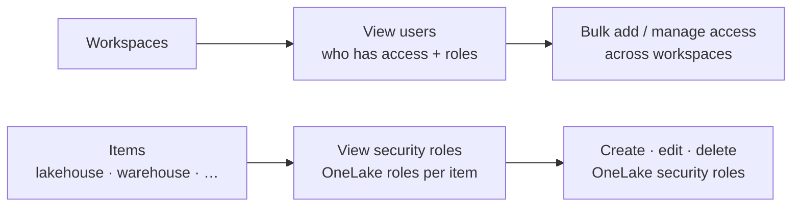

# OneLake catalog — Secure

*See who can access your Microsoft Fabric data and manage OneLake security roles from one place — the OneLake catalog's **Secure** tab, all on this page.*

## Lab details

| Level | Audience | Estimated time | What you'll build |
|---|---|---|---|
| 300 · Advanced | Fabric admin / workspace admin | ~1–1.5 hrs (all 3 use cases) | Audited workspace access plus a managed OneLake security role |

!!! info "Complexity: Medium–High · Est. time: ~1–1.5 hrs total (all 3 use cases)"
    Reviewing access is quick; designing **OneLake security roles** (table/folder access with row/column security that travels with the data) takes care. You need **Admin or Member** on a workspace to see and manage its data.

## Why this matters

In a shared data lake, over-permissioned workspaces are a real risk. The **Secure** tab centralizes **who has access** and lets admins manage **OneLake security roles** across items from a single place — instead of item by item.

## Introduction

The **Secure** tab of the OneLake catalog centralizes security management in Microsoft Fabric. It gives you a unified view of **workspace roles** and **OneLake security roles** across items, so admins can **audit** permissions and **create, edit, or delete** security roles without hunting through each item.

!!! tip "When to use the Secure tab"
    Use it for **access reviews** across many workspaces at once, for **bulk** onboarding/offboarding, and to manage **item-level data access** (OneLake security roles) centrally.

## Core concepts

| Term | What it means |
|---|---|
| **Secure tab** | The OneLake catalog surface for auditing and managing Fabric security in one place |
| **Workspace role** | Admin / Member / Contributor / Viewer on a workspace |
| **OneLake security role** | Item-level data access (table/folder, with row/column security) that travels with the data across shortcuts |
| **View users** | See every user/group/app with access to selected workspaces and their roles |
| **View security roles** | See, create, edit, and delete OneLake security roles across selected workspaces |

## Prerequisites

=== "Licensing & capacity"

    Included with **Microsoft Fabric** — no separate service. You need a **Fabric** (or Power BI Premium) capacity and access to the Fabric portal. **OneLake security roles** (OneLake data access roles) are a Fabric capability on supported item types.

=== "Roles"

    - **Admin or Member** on a workspace — required to **see and manage** that workspace's data on the Secure tab.
    - **Contributor / Viewer** — see only **their own** access.
    - Managing **OneLake security roles** requires the appropriate item permissions.

=== "Security & compliance overlays (Purview)"

    Pair Fabric item security with Microsoft **Purview**:

    - **Sensitivity labels + protection policies** to control access by label (Information Protection).
    - **DLP for Fabric** to prevent oversharing of sensitive lakehouse/warehouse/semantic-model data.

    See the [Information Protection](../data-security/information-protection/index.md) and [DLP](../data-security/dlp/index.md) labs.

## What you'll accomplish

By the end of this lab you will:

- [x] **Audit** who has access to selected workspaces and their roles
- [x] **Add/adjust workspace access** in bulk across workspaces
- [x] **Create, edit, or delete** a **OneLake security role** on an item

## Use cases covered

Each use case is one Secure-tab surface, walked through as **preconfig → configure → validate**:

| # | Surface | What you configure | Time |
|---|---|---|---|
| 1 | **Audit workspace access** (View users) | Review users/groups and their roles | ~20 min |
| 2 | **Manage workspace permissions** | Bulk add / edit / remove access | ~20 min |
| 3 | **OneLake security roles** (View security roles) | Create/edit/delete item data-access roles | ~30 min |

## Set up lab data

You need workspaces (with items) where you hold **Admin or Member**. In the **[Microsoft Fabric portal](https://app.fabric.microsoft.com)**, ensure you have at least two workspaces and a **Lakehouse** with a table, plus a couple of **test users/groups** to assign.

## Recommended setup

!!! tip "Audit first, then tighten"
    Start on **View users** to see current access across your workspaces, remove anything unexpected, then define a **OneLake security role** on one lakehouse to enforce least-privilege data access.

---

## Use case 1 — Audit workspace access (View users)

*Answer "who can see the Finance workspaces, and with what role?" for an access review — from one screen instead of opening each workspace.*

### Preconfig

**Admin or Member** on the workspaces you want to audit.

### Configure

1. In the **[Microsoft Fabric portal](https://app.fabric.microsoft.com)**, open the **OneLake catalog → Secure → View users**.
2. Select the **workspaces** to include from the **Workspaces** control.
3. Use the **All users by** filter (user type / workspace role / workspace) and the **search** control to focus on a person or group.

### Validate

1. Confirm each row shows a **user/group/app** with a **count of roles** across the selected workspaces.
2. Search a known user and confirm their roles match expectations.

---

## Use case 2 — Manage workspace permissions (bulk)

*Onboard five new analysts to the **Viewer** role across all Finance workspaces at once — and remove the summer interns when they leave — without touching each workspace.*

### Preconfig

**Admin or Member** on every target workspace (the update only applies where you have those rights).

### Configure

1. On **Secure → View users**, use the ribbon: **Add users**, or **Manage access** to edit or remove roles.
2. Under **Workspaces**, select one or more targets.
3. For **Members**, search the users/groups; choose the **Role** (for add/edit), then select **Update**.

### Validate

1. Re-open **View users** and confirm the users now hold the expected role across the selected workspaces.
2. For a removal, confirm the users no longer appear for those workspaces.

---

## Use case 3 — OneLake security roles (View security roles)

*Give the regional sales team access to only their **rows** of the customer table by managing a **OneLake security role** on the lakehouse — enforced wherever the data is used, even through shortcuts.*

### Preconfig

Permission to manage the item; identify the item, the **data** (tables/folders), and the **members** the role should cover.

### Configure

1. On **Secure → View security roles**, select the **workspaces** to include.
2. Review the roles (columns: **Item**, **Role name**, **Role type**, **Permission**, **Location**, **Data owner**).
3. Select a role to open the **OneLake security role** experience; **create** (New role / Duplicate), **edit** the **Data in role** and **Members in role**, or **delete** as needed.

### Validate

1. Confirm the new/edited role lists the intended **data** and **members**.
2. As a role member, confirm you can access **only** the permitted tables/folders (and rows/columns) — including through a **shortcut**.

---

## Extensibility

- **OneLake security** — table/folder roles with **row- and column-level** security that travel with the data across **shortcuts** and Fabric engines.
- **Purview overlays** — pair item security with **sensitivity labels + protection policies** and **DLP for Fabric** for defense in depth.

## Summary & golden rules

- **One place to audit** — use **View users** for access reviews across many workspaces at once.
- **Bulk, not item-by-item** — add/adjust access in bulk from the Secure tab.
- **Security travels with data** — OneLake security roles follow the data through shortcuts, so define them at the source.
- **Least privilege** — you need Admin/Member to manage a workspace; grant the minimum required.

## Sources

- [Secure your Fabric data (Secure tab)](https://learn.microsoft.com/fabric/governance/secure-your-data)
- [OneLake catalog overview](https://learn.microsoft.com/fabric/governance/onelake-catalog-overview)
- [Create and manage OneLake security roles](https://learn.microsoft.com/fabric/onelake/security/create-manage-roles)
- [Use Microsoft Purview to govern Microsoft Fabric](https://learn.microsoft.com/fabric/governance/microsoft-purview-fabric)
