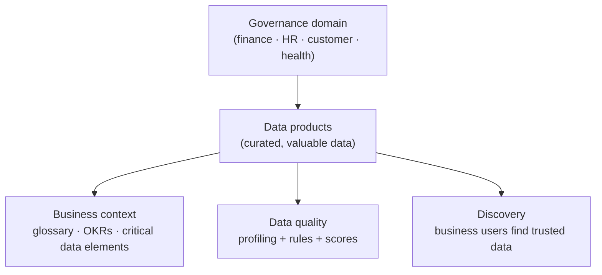

# Unified Catalog

*Govern data with governance domains, data products, glossary terms, and data quality — publish a first domain and product, all on this page.*

## Lab details

| Level | Audience | Estimated time | What you'll build |
|---|---|---|---|
| 300 · Advanced | Data steward / governance lead | ~2.25 hrs (all 3 surfaces); ~60 min for the first domain + product | A governance domain with a published data product and glossary terms |

!!! info "Complexity: Medium–High · Est. time: ~2.25 hrs total (all 3 surfaces); ~60 min for a first domain + product"
    Building a governance domain and publishing a data product is guided, but real value comes from **curation, glossary, and data-quality** work with data stewards — an ongoing program.

## Why this matters

Discovery isn't governance. The Unified Catalog turns raw data-map output into **trusted, business-described data products** people can find, understand, and use responsibly.

## Overview video

<iframe src="https://www.youtube-nocookie.com/embed/qBOI0lGQ4bA" title="Microsoft Mechanics: Unified Catalog" loading="lazy" allow="accelerometer; autoplay; clipboard-write; encrypted-media; gyroscope; picture-in-picture; web-share" referrerpolicy="strict-origin-when-cross-origin" allowfullscreen></iframe>

<strong>▶ Watch — Improve governance with the Unified Catalog</strong> Microsoft Mechanics · 1:04 — Locate, access, and trust the data you need with Microsoft Purview's Unified Catalog — AI-powered search, automated quality checks, and streamlined approval workflows so people can use data while staying compliant.

## Introduction

**Microsoft Purview Unified Catalog** is the business layer of data governance. It lets you organize your data estate into **governance domains**, curate **data products**, connect data to **business concepts** (glossary terms, critical data elements, OKRs), and measure **data quality** — so people across the organization can **discover trusted data** and innovate responsibly.

!!! tip "When to use Unified Catalog"
    Use it to move from a **technical map** (Data Map) to **business-ready governance** — publishing the *valuable* data as products people can find, trust, and use, without over-governing low-value data.

## Core concepts

| Term | What it means |
|---|---|
| **Governance domain** | A boundary of accountability (finance, HR, customer, health) |
| **Data product** | A curated, published set of data assets with usage guidance |
| **Glossary term / CDE / OKR** | Business context connected to data |
| **Data quality** | Profiling + rules across dimensions, producing scores |
| **Discovery** | How business users find trusted, published data |

## Prerequisites

=== "Licensing / account"

    A **Microsoft Purview account** with **data assets in Data Map**. Start free and **upgrade to enterprise** for full Unified Catalog features. Review [data governance billing](https://learn.microsoft.com/purview/data-governance-billing).

=== "Roles"

    - **Data Governance Administrator** — assign roles and create governance domains.
    - **Data product owner** — publish data products in a domain.
    - **Data quality steward** and **data profile steward** — run profiling and quality rules.

    Assign via **Settings → Roles and scopes → Role groups → Data Governance** (you need the **Role management** role to assign).

=== "For data quality"

    - Source must be **delta-format tables in ADLS Gen2 or Microsoft Fabric**.
    - The Purview **Managed Identity** must be able to read the source.
    - You need **owner / user access administrator** on the source for the quality scan.

## What you'll accomplish

By the end of this lab you will:

- [x] Publish a **governance domain** and a **data product**
- [x] Connect **business context** (glossary, CDEs, OKRs)
- [x] Run **profiling** and **data-quality** rules for a trust score

## Use cases covered

Each use case is one governance surface, walked through as **preconfig → configure → validate**:

| # | Surface | What you configure | Time |
|---|---|---|---|
| 1 | **Governance domain + data product** | Publish a discoverable data product | ~60 min |
| 2 | **Business context** | Glossary terms, CDEs, OKRs | ~30 min |
| 3 | **Data quality** | Profiling + quality rules | ~45 min |

## Generate lab data

Unified Catalog builds on **Data Map assets**, so first complete a [Data Map scan](data-map.md#use-case-1-cloud-source-scan) to populate assets. Then follow the Learn **sample setup** (a *Personal Health* domain example) to create your first governance domain and data product.

!!! note "Portal-driven"
    There isn't a customer-facing script to "generate" catalog content — you curate it in the portal from scanned assets. Use the [Sample setup for data governance](https://learn.microsoft.com/purview/data-governance-setup-sample) tutorial as ready-made lab data.

## Recommended setup

!!! tip "One domain, one data product, then quality"
    Create **one** governance domain aligned to a real team, publish **one** high-demand data product from scanned assets, then add a couple of **data-quality rules** to build trust.

| Recommendation | Why |
|---|---|
| Start with **one domain** | Establish ownership clearly |
| Publish the **most-requested** data | Avoid over-governing low-value data |
| Add **glossary terms / OKRs** | Give data business meaning |
| Run **profiling** before rules | Base rules on real data shape |

## Use case 1 — Governance domain & data product

*Bundle the scanned **Customer** tables into a published **data product** with an owner and usage guidance, so analysts can find and trust it.*

### Preconfig

**Data Governance Administrator** role and **scanned assets** in Data Map ([run a scan](data-map.md#use-case-1-cloud-source-scan) first).

### Configure

1. **Settings → Roles and scopes → Role groups → Data Governance** — add yourself/stewards.
2. **Unified Catalog → Catalog management → Governance domains → New** — name it (e.g., `Customer`), assign an **owner**, and **Publish**.
3. **Data products → New data product** — add **assets** from Data Map, a description, and **usage** guidance. **Publish**.

### Validate

1. Confirm the **domain** and **data product** show as **Published**.
2. As a business user with discovery access, **search** the catalog and find the product.

---

## Use case 2 — Business context (glossary, CDEs, OKRs)

*Attach a **glossary** definition of "Active Customer" and link an **OKR** to the data product, so business users understand what the data actually means.*

### Preconfig

A published data product (Use case 1).

### Configure

1. Add **glossary terms** and **critical data elements (CDEs)**; link them to the data product.
2. Define **OKRs** and associate the relevant data products.

### Validate

1. Confirm glossary terms / CDEs / OKRs are **linked** to the product and visible to discovery users.

---

## Use case 3 — Data quality (profiling + rules)

*Profile the customer table and add **completeness** and **uniqueness** rules, publishing a data-quality score so consumers know they can rely on it.*

### Preconfig

Source in **delta format (ADLS Gen2 or Microsoft Fabric)** and the Purview **Managed Identity** with read access.

### Configure

1. **Data quality** → connect the source and run **profiling**.
2. Define **data quality rules** across dimensions (accuracy, completeness, conformity, consistency, timeliness, uniqueness) and run them.

### Validate

1. Confirm a **data-quality score** appears on the data product after rules run.

## Extensibility

- **Data lineage** — show how data products are produced and consumed.
- **Data quality at scale** — profiling + rules across dimensions, with scheduled scans.
- **APIs & tutorials** — automate catalog and governance operations (see the Technical reference on Learn).
- **Integration with classification & labels** — sensitivity classifications from Data Map enrich catalog assets.

### Integration requirements

| Integration | Requirement |
|---|---|
| Data quality | Delta tables in ADLS Gen2 / Fabric; Managed Identity read access |
| Lineage | Source/lineage support; curation roles |
| API automation | Purview data-governance API permissions |

## Industry use cases

=== "Financial services"

    Publish trusted **customer and risk** data products with quality scores for analytics and regulatory reporting.

=== "Telecommunication"

    Federate governance across **network, billing, and CRM** domains with clear ownership.

=== "Public sector & SOE"

    Establish **accountable data domains** and discoverable data products for cross-agency reuse.

=== "Energy & resources"

    Curate **production and sustainability** data products with quality assurance.

=== "Manufacturing & conglomerates"

    Govern **supply-chain and product** data across BUs with domain ownership and OKRs.

## Change management & rollout

Roll this out one domain at a time. The catalog is additive (it curates, it doesn't block), so rollout is about steward adoption and data quality, not disruption.

| Phase | What you do | Who's affected | Move on when… |
|---|---|---|---|
| **1. Pilot** | Stand up **one governance domain** for a real business area; publish a single **data product** with owners and a short glossary. | Pilot stewards | Domain/product published; stewards understand the model |
| **2. Expand** | Add domains and data products with stewards; grow the glossary; introduce data-quality rules on stable products. | More stewards | Adoption growing; curation sustainable |
| **3. Tenant-wide** | Onboard the priority domains across the org with a stewardship operating model. | All priority domains | Steady state; model adopted |
| **4. Operate** | Curate continuously; track data quality and OKRs; retire stale products. | Ongoing | — |

!!! tip "Least-disruption levers"
    - **Start in a safe mode:** **one domain + one data product** before scaling curation.
    - **Communicate first:** recruit and enable **data stewards**; set curation expectations.
    - **Keep a rollback path:** unpublish a domain/product; catalog changes don't affect source data.
    - **Log the change:** record scope, approver, and date in your change-management system (e.g., a change ticket).

## Summary & golden rules

- Start with **one governance domain** tied to a real business area.
- Publish a **data product** with owners and a clear description.
- Grow the **glossary** with data stewards, not all at once.
- Wire in **data quality** rules once products are stable.

## Sources

- [Microsoft Purview Unified Catalog](https://learn.microsoft.com/purview/unified-catalog)
- [Get started with Microsoft Purview data governance](https://learn.microsoft.com/purview/data-governance-get-started)
- [Sample setup for data governance](https://learn.microsoft.com/purview/data-governance-setup-sample)
- [Data quality in Unified Catalog](https://learn.microsoft.com/purview/unified-catalog-data-quality)
- [Roles and permissions for data governance](https://learn.microsoft.com/purview/data-governance-roles-permissions)
