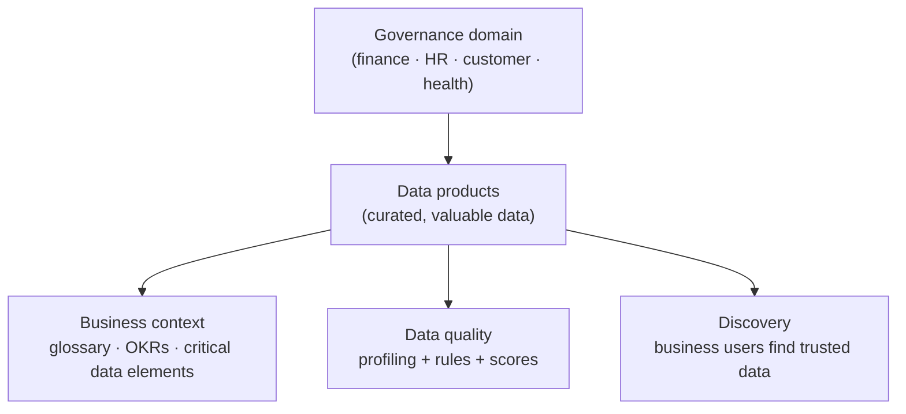

# Unified Catalog

*Govern data with governance domains, data products, glossary terms, and data quality — publish a first domain and product, all on this page.*

## Lab details

| Level | Audience | Estimated time | What you'll build |
|---|---|---|---|
| 300 · Advanced | Data steward / governance lead | ~60–120 min | A governance domain with a published data product and glossary terms |

!!! info "Complexity: Medium–High · Est. time: ~60–120 min for a first domain + data product"
    Building a governance domain and publishing a data product is guided, but real value comes from **curation, glossary, and data-quality** work with data stewards — an ongoing program.

## Why this matters

Discovery isn't governance. The Unified Catalog turns raw data-map output into **trusted, business-described data products** people can find, understand, and use responsibly.

## 1. Description

**Microsoft Purview Unified Catalog** is the business layer of data governance. It lets you organize your data estate into **governance domains**, curate **data products**, connect data to **business concepts** (glossary terms, critical data elements, OKRs), and measure **data quality** — so people across the organization can **discover trusted data** and innovate responsibly.

!!! tip "When to use Unified Catalog"
    Use it to move from a **technical map** (Data Map) to **business-ready governance** — publishing the *valuable* data as products people can find, trust, and use, without over-governing low-value data.

### Key concepts

- **Governance domain** — a boundary of accountability (functional like *finance/HR/sales*, or data like *product/customer/health*).
- **Data product** — a curated, published set of data assets with usage guidance.
- **Glossary terms / critical data elements / OKRs** — business context connected to data.
- **Data quality** — **profiling** plus **rules** across dimensions (accuracy, completeness, conformity, consistency, timeliness, uniqueness), producing scores.

## 2. Prerequisites

=== "Licensing / account"

    A **Microsoft Purview account** with **data assets in Data Map**. Start free and **upgrade to enterprise** for full Unified Catalog features. Review [data governance billing](https://learn.microsoft.com/purview/data-governance-billing).

=== "Roles"

    - **Data Governance Administrator** — assign roles and create governance domains.
    - **Data product owner** — publish data products in a domain.
    - **Data quality steward** and **data profile steward** — run profiling and quality rules.

    Assign via **Settings → Roles and scopes → Role groups → Data Governance** (you need the **Role management** role to assign).

=== "For data quality"

    - Source must be **delta-format tables in ADLS Gen2 or Microsoft Fabric**.
    - The Purview **Managed Identity** must be able to read the source.
    - You need **owner / user access administrator** on the source for the quality scan.

## 3. Generate sample data (scanned assets + a domain)

Unified Catalog builds on **Data Map assets**, so first complete a [Data Map scan](data-map.md#5-step-by-step-configuration) to populate assets. Then follow the Learn **sample setup** (a *Personal Health* domain example) to create your first governance domain and data product.

!!! note "Portal-driven"
    There isn't a customer-facing script to "generate" catalog content — you curate it in the portal from scanned assets. Use the [Sample setup for data governance](https://learn.microsoft.com/purview/data-governance-setup-sample) tutorial as ready-made lab data.

## 4. Recommended setup

!!! tip "One domain, one data product, then quality"
    Create **one** governance domain aligned to a real team, publish **one** high-demand data product from scanned assets, then add a couple of **data-quality rules** to build trust.

| Recommendation | Why |
|---|---|
| Start with **one domain** | Establish ownership clearly |
| Publish the **most-requested** data | Avoid over-governing low-value data |
| Add **glossary terms / OKRs** | Give data business meaning |
| Run **profiling** before rules | Base rules on real data shape |

## 5. Step-by-step configuration

1. In the **[Microsoft Purview portal](https://purview.microsoft.com)** → **Settings → Roles and scopes → Role groups → Data Governance**, add yourself/stewards.
2. Open **Unified Catalog → Catalog management → Governance domains → New**. Name it (for example `Customer`) and assign an **owner**.
3. **Publish** the governance domain.
4. Go to **Data products** in the domain → **New data product**. Add **data assets** from Data Map, a description, and **usage** guidance. **Publish** it.
5. Connect **business context** — add **glossary terms**, **critical data elements**, and **OKRs**.
6. Open **Data quality**, connect the source, run **profiling**, then define and run **data quality rules** to produce a quality score.

## 6. Verification

1. Confirm the **governance domain** and **data product** appear as **Published** in the catalog.
2. As a business user (with discovery access), **search** the catalog and find the data product with its description and usage.
3. Confirm **glossary terms/OKRs** are linked to the product.
4. Confirm a **data quality** score appears after profiling + rules run.

!!! success "What 'good' looks like"
    A published governance domain contains a discoverable data product with business context and a data-quality score — a trusted, findable asset rather than raw scanned metadata.

## 7. Extensibility

- **Data lineage** — show how data products are produced and consumed.
- **Data quality at scale** — profiling + rules across dimensions, with scheduled scans.
- **APIs & tutorials** — automate catalog and governance operations (see the Technical reference on Learn).
- **Integration with classification & labels** — sensitivity classifications from Data Map enrich catalog assets.

### Integration requirements

| Integration | Requirement |
|---|---|
| Data quality | Delta tables in ADLS Gen2 / Fabric; Managed Identity read access |
| Lineage | Source/lineage support; curation roles |
| API automation | Purview data-governance API permissions |

## 8. Industry use cases

=== "Financial services"

    Publish trusted **customer and risk** data products with quality scores for analytics and regulatory reporting.

=== "Telecommunication"

    Federate governance across **network, billing, and CRM** domains with clear ownership.

=== "Public sector & SOE"

    Establish **accountable data domains** and discoverable data products for cross-agency reuse.

=== "Energy & resources"

    Curate **production and sustainability** data products with quality assurance.

=== "Manufacturing & conglomerates"

    Govern **supply-chain and product** data across BUs with domain ownership and OKRs.

## Summary & golden rules

- Start with **one governance domain** tied to a real business area.
- Publish a **data product** with owners and a clear description.
- Grow the **glossary** with data stewards, not all at once.
- Wire in **data quality** rules once products are stable.

## 9. Sources

- [Microsoft Purview Unified Catalog](https://learn.microsoft.com/purview/unified-catalog)
- [Get started with Microsoft Purview data governance](https://learn.microsoft.com/purview/data-governance-get-started)
- [Sample setup for data governance](https://learn.microsoft.com/purview/data-governance-setup-sample)
- [Data quality in Unified Catalog](https://learn.microsoft.com/purview/unified-catalog-data-quality)
- [Roles and permissions for data governance](https://learn.microsoft.com/purview/data-governance-roles-permissions)
