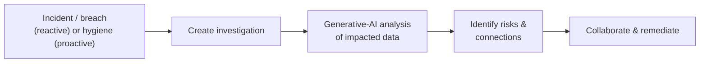

# Data Security Investigations

!!! warning "Preview feature"
    Microsoft Purview **Data Security Investigations** is in **preview**. Capabilities and prerequisites may change before general availability. Verify details on Microsoft Learn for your tenant.

!!! info "Complexity: High · Est. time: ~60–90 min setup (+ billing configuration)"
    DSI requires **two billing models** (pay-as-you-go storage + capacity/compute units) and careful permissions. The investigation experience itself is AI-assisted and fast, but initial enablement and billing take planning.

## 1. Description

**Microsoft Purview Data Security Investigations (DSI)** helps cybersecurity teams harness **generative AI** to **analyze and respond to** data security incidents, risky insiders, and data breaches. DSI quickly identifies risks from sensitive-data exposure, draws connections across impacted data, and helps teams collaborate to remediate — simplifying tasks that are traditionally time-consuming and complex.



!!! tip "When to use DSI"
    Use DSI when a **data incident** (leak, breach, risky insider) requires you to understand *what sensitive data was involved* and *who/what is impacted* — faster than manual review. It integrates with **Microsoft Defender XDR** so SOC teams can launch an investigation from an incident.

## 2. Prerequisites

=== "Licensing & billing"

    DSI uses **both** Purview billing models:

    - **Pay-as-you-go storage meter** — requires an **Azure subscription in the same tenant** and a **resource group**.
    - **Capacity billing** — dedicated **compute units** for AI analysis.

    Confirm plan details on the [service description](https://learn.microsoft.com/office365/servicedescriptions/microsoft-365-service-descriptions/microsoft-365-tenantlevel-services-licensing-guidance/microsoft-purview-service-description) and [DSI billing](https://learn.microsoft.com/purview/data-security-investigations-billing).

=== "Roles"

    - **Compliance Administrator** and **Organization Management** get **admin + contributor** access automatically.
    - **Data Security Management** and **Insider Risk Management** role groups get **contributor** access.
    - To configure **billing**, you need **Global Administrator** plus resource-group **Owner/Contributor**.

## 3. Generate sample data (stage an "incident" data set)

Stage a folder of mixed sensitive files that could represent an incident's impacted data. Reuse the [DLP sample-data script](dlp/index.md#3-generate-sample-data-for-your-lab), or run this to create a representative set:

```powershell
$lab = Join-Path $env:USERPROFILE 'DSI-Lab-Data'
New-Item -ItemType Directory -Path $lab -Force | Out-Null

1..3 | ForEach-Object {
    @"
CONFIDENTIAL customer record (LAB) #$_
Name: Test User $_
Card (synthetic): 4111 1111 1111 1111
National ID (synthetic): 900-$_-0000
"@ | Set-Content (Join-Path $lab "record-$_.txt")
}
Write-Host "Staged $((Get-ChildItem $lab).Count) files in $lab" -ForegroundColor Green
```

In practice, DSI investigations often start from data already identified by a **Defender XDR incident**, **DLP alert**, or **Insider Risk** case.

## 4. Recommended setup

!!! tip "Enable billing first, then scope narrowly"
    Configure the **Azure subscription/resource group** and **compute capacity** before your first investigation. Start with a **single, well-scoped incident** to learn the AI analysis workflow.

| Recommendation | Why |
|---|---|
| Reuse an existing Purview Azure subscription | One subscription manages pay-as-you-go across Purview |
| Assign least-privilege roles | Contributor for investigators, admin for owners |
| Start reactive | Investigate one real/simulated incident end to end |

## 5. Step-by-step configuration

1. In the **[Microsoft Purview portal](https://purview.microsoft.com/dsi)**, open **Data Security Investigations**. On first access, **read and agree** to the Privacy Statement, then **Get started**.
2. **Configure permissions** — use the setup task or the **Role groups** page to grant DSI access (Compliance Administrator / Organization Management for admins).
3. **Configure billing** — complete the **storage meter** (link Azure subscription + resource group) and **capacity** (compute units) setup tasks.
4. **Create an investigation** — add the impacted data set (for example results from a Defender incident or a data location), then run **AI analysis** to summarize risks and connections.
5. **Act** — review AI insights, collaborate with partner teams, and drive remediation.

!!! note "Start from Defender XDR"
    SOC teams with **Security Administrator/Operator** can launch a DSI investigation directly from a **Microsoft Defender** incident where a data set is affected. See [Create investigations in DSI from the Defender portal](https://learn.microsoft.com/defender-xdr/create-dsi-in-defender).

## 6. Verification

1. Confirm DSI shows **billing configured** (storage + capacity) with no setup-task warnings.
2. Create a test investigation over your staged data and run **AI analysis**.
3. Confirm the investigation surfaces the **sensitive information types** present and the **impacted entities**.
4. Confirm assigned users can access per their role (admin vs. contributor).

!!! success "What 'good' looks like"
    A test investigation completes AI analysis, lists the sensitive data found (for example credit-card and national-ID SITs), identifies impacted users, and lets your team collaborate on remediation.

## 7. Extensibility

- **Microsoft Defender XDR integration** — start investigations from SOC incidents.
- **Data Security Posture agent (preview)** — a Security Copilot agent surfaces posture insights within DSI (requires SCUs).
- **Insider Risk Management** — escalate risky-insider cases into an investigation.
- **Security Copilot** — natural-language investigation and summarization.

### Integration requirements

| Integration | Requirement |
|---|---|
| Defender XDR | Security Administrator/Operator; DSI Administrator to view in Purview |
| Posture agent | Security Copilot **SCUs** provisioned |
| Pay-as-you-go | Azure subscription + resource group in the same tenant |

## 8. Industry use cases

=== "Financial services"

    After a suspected leak of client PII, rapidly determine **which records and clients** are impacted for regulator notification timelines.

=== "Telco"

    Investigate a **subscriber-data breach** to scope exposure across support and billing repositories.

=== "Public sector & SOE"

    Assess a **citizen-data incident** with AI-assisted analysis while maintaining strict access controls and auditability.

=== "Energy & resources"

    Scope exposure of **operational or IP data** after a phishing-driven compromise.

=== "Manufacturing & conglomerates"

    Determine whether a compromised account touched **trade-secret designs** across business units.

## 9. Sources

- [Learn about Data Security Investigations](https://learn.microsoft.com/purview/data-security-investigations)
- [Get started with Data Security Investigations](https://learn.microsoft.com/purview/data-security-investigations-get-started)
- [Billing in Data Security Investigations](https://learn.microsoft.com/purview/data-security-investigations-billing)
- [Data Security Investigations permissions](https://learn.microsoft.com/purview/data-security-investigations-permissions)
- [Create investigations in DSI from the Microsoft Defender portal](https://learn.microsoft.com/defender-xdr/create-dsi-in-defender)
