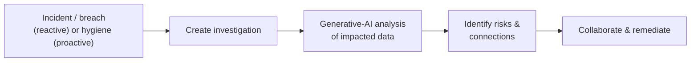

# Data Security Investigations

*Use generative AI to analyze and respond to data-security incidents, risky insiders, and breaches — enable it and run an investigation, all on this page.*

## Lab details

| Level | Audience | Estimated time | What you'll build |
|---|---|---|---|
| 300 · Advanced | SOC / Data-security administrator | ~60–90 min (+ billing setup) | An enabled DSI instance and an AI-assisted investigation over a staged incident |

!!! warning "Preview feature"
    Microsoft Purview **Data Security Investigations** is in **preview**. Capabilities and prerequisites may change before general availability. Verify details on Microsoft Learn for your tenant.

!!! info "Complexity: High · Est. time: ~60–90 min setup (+ billing configuration)"
    DSI requires **two billing models** (pay-as-you-go storage + capacity/compute units) and careful permissions. The investigation experience itself is AI-assisted and fast, but initial enablement and billing take planning.

## Why this matters

After a data incident, the hardest question is *"what sensitive data was actually involved, and who's impacted?"* DSI uses generative AI to answer that in minutes instead of days of manual review.

## Overview video

<div class="video-embed">
<iframe src="https://www.youtube-nocookie.com/embed/tgnY65zHd8g" title="Microsoft Mechanics: Data Security Investigations" loading="lazy" allow="accelerometer; autoplay; clipboard-write; encrypted-media; gyroscope; picture-in-picture; web-share" referrerpolicy="strict-origin-when-cross-origin" allowfullscreen></iframe>
</div>
<p class="video-caption"><strong>▶ Watch — Data Security Investigations in Microsoft Purview</strong><br>Microsoft Mechanics · 15:20 — Identify what data was actually exposed in a breach — not just where it moved, but what it contains and how sensitive it is. Search massive volumes with natural language, pinpoint the highest-risk content, and connect it to user activity.</p>

## Introduction

**Microsoft Purview Data Security Investigations (DSI)** helps cybersecurity teams harness **generative AI** to **analyze and respond to** data security incidents, risky insiders, and data breaches. DSI quickly identifies risks from sensitive-data exposure, draws connections across impacted data, and helps teams collaborate to remediate — simplifying tasks that are traditionally time-consuming and complex.



!!! tip "When to use DSI"
    Use DSI when a **data incident** (leak, breach, risky insider) requires you to understand *what sensitive data was involved* and *who/what is impacted* — faster than manual review. It integrates with **Microsoft Defender XDR** so SOC teams can launch an investigation from an incident.

## Core concepts

| Term | What it means |
|---|---|
| **Investigation** | A workspace where you analyze an incident's impacted data with AI |
| **Impacted data set** | The files/locations pulled in for analysis (e.g., from a Defender incident) |
| **AI analysis** | Generative-AI summarization of risks, sensitive data, and connections |
| **Storage meter (PAYG)** | Pay-as-you-go storage billed via an Azure subscription/resource group |
| **Capacity units** | Dedicated compute for the AI analysis |

## Prerequisites

=== "Licensing & billing"

    DSI uses **both** Purview billing models:

    - **Pay-as-you-go storage meter** — requires an **Azure subscription in the same tenant** and a **resource group**.
    - **Capacity billing** — dedicated **compute units** for AI analysis.

    Confirm plan details on the [service description](https://learn.microsoft.com/office365/servicedescriptions/microsoft-365-service-descriptions/microsoft-365-tenantlevel-services-licensing-guidance/microsoft-purview-service-description) and [DSI billing](https://learn.microsoft.com/purview/data-security-investigations-billing).

=== "Roles"

    - **Compliance Administrator** and **Organization Management** get **admin + contributor** access automatically.
    - **Data Security Management** and **Insider Risk Management** role groups get **contributor** access.
    - To configure **billing**, you need **Global Administrator** plus resource-group **Owner/Contributor**.

## What you'll accomplish

By the end of this lab you will:

- [x] Enable DSI: **billing** (storage + capacity) and roles
- [x] Run a **reactive** investigation over a staged incident
- [x] Launch an investigation from a **Defender XDR** incident
- [x] Run a **proactive / hygiene** investigation

## Use cases covered

Each use case is one way to implement DSI, walked through as **preconfig → configure → validate**:

| # | Surface | What you configure | Time |
|---|---|---|---|
| 1 | **Reactive investigation** | Enable DSI + investigate a staged incident | ~60–90 min (+ billing) |
| 2 | **Defender-XDR-initiated** | Launch DSI from a Defender incident | ~20 min |
| 3 | **Proactive / hygiene** | Investigate a data location for exposure | ~30 min |

## Generate lab data

Stage a folder of mixed sensitive files that could represent an incident's impacted data. Reuse the [DLP sample-data script](dlp/index.md#generate-lab-data), or run this to create a representative set:

```powershell
$lab = Join-Path $env:USERPROFILE 'DSI-Lab-Data'
New-Item -ItemType Directory -Path $lab -Force | Out-Null

1..3 | ForEach-Object {
    @"
CONFIDENTIAL customer record (LAB) #$_
Name: Test User $_
Card (synthetic): 4111 1111 1111 1111
National ID (synthetic): 900-$_-0000
"@ | Set-Content (Join-Path $lab "record-$_.txt")
}
Write-Host "Staged $((Get-ChildItem $lab).Count) files in $lab" -ForegroundColor Green
```

In practice, DSI investigations often start from data already identified by a **Defender XDR incident**, **DLP alert**, or **Insider Risk** case.

## Recommended setup

!!! tip "Enable billing first, then scope narrowly"
    Configure the **Azure subscription/resource group** and **compute capacity** before your first investigation. Start with a **single, well-scoped incident** to learn the AI analysis workflow.

| Recommendation | Why |
|---|---|
| Reuse an existing Purview Azure subscription | One subscription manages pay-as-you-go across Purview |
| Assign least-privilege roles | Contributor for investigators, admin for owners |
| Start reactive | Investigate one real/simulated incident end to end |

## Use case 1 — Reactive investigation (from an incident)

*Investigate a specific incident's impacted data with generative AI — the primary DSI workflow.*

### Preconfig

**Enable DSI once:** on first access in the **[Microsoft Purview portal](https://purview.microsoft.com/dsi)**, agree to the Privacy Statement, grant **roles** (Compliance Administrator / Organization Management), and complete **billing** — the **storage meter** (Azure subscription + resource group) and **capacity** (compute units) setup tasks. Stage a data set (your [lab files](#generate-lab-data)).

### Configure

1. **Data Security Investigations → Create an investigation**.
2. Add the **impacted data set** (staged files, a data location, or results from a Defender incident / DLP alert).
3. Run **AI analysis** to summarize risks, sensitive data, and connections.
4. Review insights, collaborate with partner teams, and drive **remediation**.

### Validate the config

1. Confirm billing shows **configured** (storage + capacity) with no setup warnings.
2. Confirm the investigation surfaces the **sensitive information types** present and the **impacted entities**.
3. Confirm assigned users have access per their **role** (admin vs. contributor).

---

## Use case 2 — Defender-XDR-initiated investigation

*Let the SOC start a DSI investigation straight from a Defender incident where data is affected.*

### Preconfig

DSI enabled (Use case 1). **Microsoft Defender XDR** with an incident affecting a data set, and **Security Administrator/Operator** (plus **DSI Administrator** to view in Purview).

### Configure

1. In the **Defender portal**, open an incident where a data set is affected.
2. Choose to **create a DSI investigation** from the incident — see [Create investigations in DSI from the Defender portal](https://learn.microsoft.com/defender-xdr/create-dsi-in-defender).

### Validate the config

1. Confirm the investigation opens in **Purview DSI** pre-populated with the incident's data.
2. Run **AI analysis** and confirm findings, then hand off to remediation.

---

## Use case 3 — Proactive / hygiene investigation

*Don't wait for an incident — proactively analyze a data location for sensitive-data exposure.*

### Preconfig

DSI enabled (Use case 1).

### Configure

1. **Create an investigation** scoped to a **data location** (not tied to an incident) — e.g., a SharePoint site or user data.
2. Run **AI analysis** to find sensitive data and exposure.

### Validate the config

1. Confirm the investigation surfaces sensitive content and **oversharing / exposure** risks.
2. Feed findings into remediation (DLP, labels, access changes).

## Extensibility

- **Microsoft Defender XDR integration** — start investigations from SOC incidents.
- **Data Security Posture agent (preview)** — a Security Copilot agent surfaces posture insights within DSI (requires SCUs).
- **Insider Risk Management** — escalate risky-insider cases into an investigation.
- **Security Copilot** — natural-language investigation and summarization.

### Integration requirements

| Integration | Requirement |
|---|---|
| Defender XDR | Security Administrator/Operator; DSI Administrator to view in Purview |
| Posture agent | Security Copilot **SCUs** provisioned |
| Pay-as-you-go | Azure subscription + resource group in the same tenant |

## Industry use cases

=== "Financial services"

    After a suspected leak of client PII, rapidly determine **which records and clients** are impacted for regulator notification timelines.

=== "Telecommunication"

    Investigate a **subscriber-data breach** to scope exposure across support and billing repositories.

=== "Public sector & SOE"

    Assess a **citizen-data incident** with AI-assisted analysis while maintaining strict access controls and auditability.

=== "Energy & resources"

    Scope exposure of **operational or IP data** after a phishing-driven compromise.

=== "Manufacturing & conglomerates"

    Determine whether a compromised account touched **trade-secret designs** across business units.

## Change management & rollout

Never switch a new capability on for the whole tenant at once. Roll it out in controlled waves so you protect data **without surprising users or blowing the budget**. DSI is preview and billed by usage, so pilot with one controlled investigation and tight access before wider use.

| Phase | What you do | Who's affected | Move on when… |
|---|---|---|---|
| **1. Pilot** | Configure **billing** and least-privilege roles; run **one** investigation over a staged/real incident with a small investigator group. | Pilot investigators | Investigation completes; costs and access are understood |
| **2. Expand** | Onboard more investigators and incident types; connect to Defender XDR incidents; set cost guardrails. | SOC team | Repeatable workflow; billing predictable |
| **3. Tenant-wide** | Make DSI the standard tool for in-scope incident types with agreed roles and budget. | All in-scope incidents | Steady state; spend understood |
| **4. Operate** | Monitor consumption; refine access; review investigation outcomes. | Ongoing | — |

!!! tip "Least-disruption levers"
    - **Start in a safe mode:** **one controlled investigation** with least-privilege roles.
    - **Communicate first:** align **SOC, Legal, and privacy**; agree who can launch investigations and on what data.
    - **Keep a rollback path:** restrict roles or pause new investigations; watch spend.
    - **Log the change:** record scope, approver, and date in your change-management system (e.g., a change ticket).

## Summary & golden rules

- Configure **billing** (Azure subscription + compute) before your first investigation.
- Start **reactive** — one real or simulated incident, end to end.
- Assign **least-privilege** roles (contributor for investigators, admin for owners).
- Launch investigations from a **Defender XDR** incident where possible.

## Sources

- [Learn about Data Security Investigations](https://learn.microsoft.com/purview/data-security-investigations)
- [Get started with Data Security Investigations](https://learn.microsoft.com/purview/data-security-investigations-get-started)
- [Billing in Data Security Investigations](https://learn.microsoft.com/purview/data-security-investigations-billing)
- [Data Security Investigations permissions](https://learn.microsoft.com/purview/data-security-investigations-permissions)
- [Create investigations in DSI from the Microsoft Defender portal](https://learn.microsoft.com/defender-xdr/create-dsi-in-defender)
