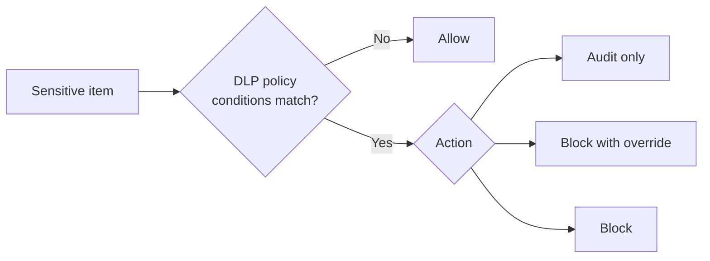

# Data Loss Prevention (DLP) — Part 1

!!! abstract "Step 1 of 4 · Overview & prerequisites"
    This walkthrough is split into four parts. Use the **Next** button at the bottom to move through them in order:
    **1. Overview & prerequisites** → 2. Recommended policy setup → 3. Step-by-step configuration → 4. Verification.

!!! info "Complexity: Medium · Est. time: ~45–90 min for a first policy"
    A first Microsoft 365 DLP policy in **simulation mode** is quick (~45 min). Add endpoint DLP (device onboarding), custom sensitive information types, or Adaptive Protection and it climbs to **High** because of device onboarding and tuning. Start simple, in simulation mode.

## 1. Description

**Microsoft Purview Data Loss Prevention (DLP)** helps protect your organization against the unintentional or accidental sharing of sensitive information — inside and outside your organization. Unintentional sharing of sensitive items can cause financial harm and may violate laws and regulations.

In a DLP policy, you define four things:

| You define… | Examples |
|---|---|
| **What** sensitive information to monitor for | Financial, health, medical, and privacy data |
| **Where** to monitor | Exchange, SharePoint, OneDrive, Teams, Windows/macOS devices, Fabric/Power BI, on-premises repositories |
| **Conditions** that must match | Items containing credit card, driver's license, or national ID numbers |
| **Actions** to take on a match | Audit, block the activity, or block with user override |



!!! tip "When to use DLP"
    Use DLP when you need to *stop sensitive data from leaving the right hands* — for example, blocking credit-card numbers from being emailed externally, warning users who paste customer data into consumer cloud apps, or auditing sensitive files copied to USB drives.

### Key concepts

- **Policy** — the container for locations, rules, conditions, and actions.
- **Rule** — conditions + actions inside a policy; a policy can have several rules.
- **Sensitive information type (SIT)** — a pattern (regex/function) such as a credit card number, or a **trainable classifier** that recognizes categories by example.
- **Simulation mode** — deploy a policy that only reports what it *would* do, without impacting users, so you can tune before enforcing.
- **Adaptive Protection** — dynamically adjusts DLP controls based on a user's calculated insider-risk level.

## 2. Prerequisites

=== "Licensing"

    DLP is broadly available; advanced capabilities are gated:

    - **Base DLP** for Microsoft 365 (Exchange/SharePoint/OneDrive/Teams) is included in subscriptions such as **E1, E3, E5, F1, and G-plans**.
    - **Endpoint DLP** requires your organization to be licensed for it (typically **Microsoft 365 E5**, E5 Compliance, or **E5 Information Protection & Governance**).
    - **Aggregated (threshold-based) alerts** require **E5/G5/A5**, or an **E1/F1/G1/E3/G3** plan with an add-on such as the Microsoft Purview suite.

    Always confirm against the [Microsoft Purview service description](https://learn.microsoft.com/office365/servicedescriptions/microsoft-365-service-descriptions/microsoft-365-tenantlevel-services-licensing-guidance/microsoft-365-security-compliance-licensing-guidance).

=== "Roles & permissions"

    To create and manage DLP policies, your account must belong to one of these role groups:

    - Compliance Administrator
    - Compliance Data Administrator
    - Security Administrator
    - Information Protection / Information Protection Admins

    To view the **DLP alert dashboard** you also need the *Manage alerts* role plus *DLP Compliance Management* (or *View-Only DLP Compliance Management*). Follow least privilege — see [Permissions in the Microsoft Purview portal](https://learn.microsoft.com/purview/purview-permissions).

=== "Endpoint DLP requirements"

    If you plan to protect **Windows devices** with endpoint DLP:

    - Windows 10 **x64** build **1809 or later** (or Windows 11).
    - Antimalware Client version **4.18.2202.x or later**.
    - Devices **onboarded** to Purview endpoint DLP — see [Onboarding tools and methods for Windows 10/11 devices](https://learn.microsoft.com/purview/device-onboarding-overview).

## 3. Generate sample data for your lab

To exercise DLP you need content that *looks* sensitive. The script below writes a few text files containing **synthetic, non-real** test values (fake credit-card-format numbers and fake national-ID-format numbers) into a folder you can then email, upload, or copy to trigger a DLP rule.

!!! warning "Synthetic data only"
    These numbers are **format-valid test values, not real credentials**. Use them only in a non-production lab tenant.

```powershell
# Generate synthetic "sensitive" files to exercise Microsoft Purview DLP.
# All values are fake, for lab testing only.
$labFolder = Join-Path $env:USERPROFILE 'DLP-Lab-Data'
New-Item -ItemType Directory -Path $labFolder -Force | Out-Null

# Well-known synthetic test card numbers (not real accounts).
$testCards = @(
    '4111 1111 1111 1111',  # Visa test number
    '5500 0000 0000 0004',  # Mastercard test number
    '3400 0000 0000 009'    # Amex test number
)

# Fake US SSN-format values in the reserved 900-xx-xxxx range (never issued).
$fakeSsns = 1..5 | ForEach-Object { '900-{0:00}-{1:0000}' -f (Get-Random -Max 99), (Get-Random -Max 9999) }

# 1) A "customer export" that mixes names with fake card numbers.
$rows = 1..5 | ForEach-Object {
    "Customer {0},Card {1},SSN {2}" -f $_, ($testCards | Get-Random), ($fakeSsns | Get-Random)
}
$rows | Set-Content (Join-Path $labFolder 'customer-export.csv')

# 2) A memo that trips a "credit card" sensitive information type.
@"
CONFIDENTIAL — Payment reconciliation (LAB TEST DATA)
Primary card on file: $($testCards[0])
Backup card: $($testCards[1])
Do not distribute outside Finance.
"@ | Set-Content (Join-Path $labFolder 'payment-memo.txt')

Write-Host "Created lab files in $labFolder" -ForegroundColor Green
Get-ChildItem $labFolder | Select-Object Name, Length
```

Copy this content to a file the reader can classify — for example, email `payment-memo.txt` to an external test mailbox, or upload `customer-export.csv` to a SharePoint site covered by your DLP policy.

## Continue

You now understand what DLP does, what you need, and you have test data. Next, design the policy.

[:octicons-arrow-right-24: Part 2 · Recommended policy setup](policy-setup.md){ .md-button .md-button--primary }

## Sources

- [Learn about Microsoft Purview Data Loss Prevention](https://learn.microsoft.com/purview/dlp-learn-about-dlp)
- [Plan for data loss prevention (DLP)](https://learn.microsoft.com/purview/dlp-overview-plan-for-dlp)
- [Get started with the Data Loss Prevention alerts](https://learn.microsoft.com/purview/dlp-alerts-get-started)
- [Get started with Endpoint data loss prevention](https://learn.microsoft.com/purview/endpoint-dlp-getting-started)
- [Permissions in the Microsoft Purview portal](https://learn.microsoft.com/purview/purview-permissions)
- [Microsoft 365 security & compliance licensing guidance](https://learn.microsoft.com/office365/servicedescriptions/microsoft-365-service-descriptions/microsoft-365-tenantlevel-services-licensing-guidance/microsoft-365-security-compliance-licensing-guidance)
