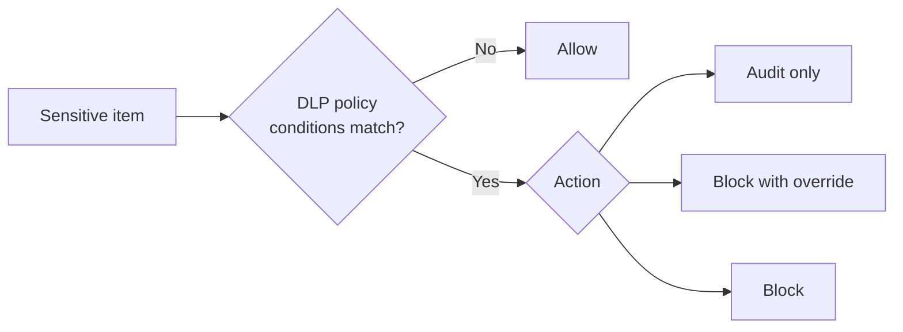
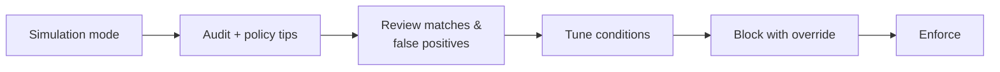

# Data Loss Prevention

*Detect and prevent risky or inappropriate sharing of sensitive information across Microsoft 365 and endpoints — set it up **and** verify it, all on this page. No jumping around.*

## Lab details

| Level | Audience | Estimated time | What you'll build |
|---|---|---|---|
| 200 · Intermediate | Security / Compliance administrator | ~4–5.5 hrs (all 6 surfaces) | A DLP policy that detects credit-card data and warns/blocks external sharing (in simulation mode), then confirm it fires |

!!! info "Complexity: Medium · Est. time: ~4–5.5 hrs total (all 6 surfaces); ~45 min for the first policy"
    A first Microsoft 365 DLP policy in **simulation mode** is quick (~45 min). Adding endpoint DLP (device onboarding), custom sensitive information types, or Adaptive Protection pushes it to **High**. This lab keeps it simple and safe: **simulation mode first**.

## Why this matters

Unintentional sharing of sensitive items — a credit-card number pasted into an external email, a customer export uploaded to personal cloud storage — can cause financial harm and breach regulations. DLP catches and stops these **in the moment**.

Common challenges this lab solves:

- "Sensitive data is leaving over email and SharePoint and we can't see it."
- "We need PCI/GDPR-style controls, but we don't want to block legitimate business."
- "We want to start safely, without disrupting users on day one."

## Overview video

<div class="video-embed">
<iframe src="https://www.youtube-nocookie.com/embed/hvqq8L_0kgI" title="Microsoft Mechanics: Data Loss Prevention" loading="lazy" allow="accelerometer; autoplay; clipboard-write; encrypted-media; gyroscope; picture-in-picture; web-share" referrerpolicy="strict-origin-when-cross-origin" allowfullscreen></iframe>
</div>
<p class="video-caption"><strong>▶ Watch — Data Loss Prevention across endpoints, apps &amp; services</strong><br>Microsoft Mechanics · 12:43 — See how one Microsoft Purview DLP policy protects sensitive data across endpoints, apps, and services — with restrictions that differ by location, volume, and data type, user override/justification, custom notifications, and monitoring.</p>

## Introduction

**Microsoft Purview Data Loss Prevention (DLP)** helps protect your organization against the unintentional or accidental sharing of sensitive information — inside and outside your organization.

In a DLP policy you define four things:

| You define… | Examples |
|---|---|
| **What** sensitive information to monitor for | Financial, health, medical, and privacy data |
| **Where** to monitor | Exchange, SharePoint, OneDrive, Teams, Windows/macOS devices, Fabric/Power BI, on-premises repositories |
| **Conditions** that must match | Items containing credit card, driver's license, or national ID numbers |
| **Actions** to take on a match | Audit, block the activity, or block with user override |



!!! tip "Real-world example"
    A finance team must stop primary account numbers (PAN) from being emailed externally. With DLP they detect the **Credit Card Number** type and **block external sharing with a justification override** — no help-desk tickets, no code, and internal collaboration keeps working.

## Core concepts

| Term | What it means |
|---|---|
| **Policy** | The container for locations, rules, conditions, and actions |
| **Rule** | Conditions + actions inside a policy; a policy can have several rules |
| **Sensitive information type (SIT)** | A pattern (regex/function) such as a credit card number, or a **trainable classifier** that recognizes categories by example |
| **Simulation mode** | Deploys a policy that only *reports* what it would do, without impacting users — so you can tune before enforcing |
| **Adaptive Protection** | Dynamically tightens DLP controls based on a user's calculated insider-risk level |

## Prerequisites

=== "Licensing"

    DLP is broadly available; advanced capabilities are gated:

    - **Base DLP** for Microsoft 365 (Exchange/SharePoint/OneDrive/Teams) is included in subscriptions such as **E1, E3, E5, F1, and G-plans**.
    - **Endpoint DLP** requires your organization to be licensed for it (typically **Microsoft 365 E5**, E5 Compliance, or **E5 Information Protection & Governance**).
    - **Aggregated (threshold-based) alerts** require **E5/G5/A5**, or an **E1/F1/G1/E3/G3** plan with an add-on such as the Microsoft Purview suite.

    Confirm against the [Microsoft Purview service description](https://learn.microsoft.com/office365/servicedescriptions/microsoft-365-service-descriptions/microsoft-365-tenantlevel-services-licensing-guidance/microsoft-365-security-compliance-licensing-guidance).

=== "Roles & permissions"

    To create and manage DLP policies, your account must belong to one of these role groups:

    - Compliance Administrator
    - Compliance Data Administrator
    - Security Administrator
    - Information Protection / Information Protection Admins

    To view the **DLP alert dashboard** you also need the *Manage alerts* role plus *DLP Compliance Management* (or *View-Only DLP Compliance Management*). Follow least privilege — see [Permissions in the Microsoft Purview portal](https://learn.microsoft.com/purview/purview-permissions).

=== "Endpoint DLP (for Use case 2)"

    Required for **Use case 2** — extending DLP to devices (USB, print, clipboard, browser/cloud upload, IM, webmail, GenAI). To protect **Windows devices**:

    - Windows 10 **x64** build **1809 or later** (or Windows 11); **macOS** (three latest major versions) is also supported.
    - Antimalware Client version **4.18.2202.x or later**.
    - Devices **onboarded** to Purview endpoint DLP via **Intune / Defender for Endpoint**, script, or **GPO** — see [onboarding tools and methods](https://learn.microsoft.com/purview/device-onboarding-overview).
    - Turn on **Advanced classification** so files are scanned **on the device** (needed for content-based rules).
    - Install the **[Microsoft Purview extension](https://learn.microsoft.com/purview/dlp-chrome-learn-about)** for **Chrome/Firefox** (Edge for Business is built-in) to cover web egress.

## What you'll accomplish

By the end of this lab you will:

- [x] Generate synthetic sensitive data — including **four-tier classified** files (Public → Restricted)
- [x] Stand up a **Microsoft 365 DLP** policy (simulation) and validate it
- [x] Configure **Endpoint DLP** across USB, print, clipboard, browser/cloud, IM, webmail, and GenAI
- [x] Extend DLP to **on-premises repositories**, **non-Microsoft cloud apps**, **Teams**, and **Microsoft 365 Copilot**

## Use cases covered

Each use case is one deployment surface, walked through as **preconfig → configure → validate**:

| # | Surface | What you configure | Time |
|---|---|---|---|
| 1 | **Microsoft 365 DLP** (Exchange, SharePoint, OneDrive) | Block external sharing of sensitive data (simulation) | ~30–45 min |
| 2 | **Endpoint DLP** (devices) | USB, print, clipboard, browser/cloud, IM, webmail, GenAI | ~60–90 min |
| 3 | **On-premises repositories** (file shares, SharePoint Server) | Scanner + at-rest protective actions | ~60–90 min |
| 4 | **Instances** (non-Microsoft cloud apps) | DLP via Defender for Cloud Apps app instances | ~45 min |
| 5 | **Teams** (chat & channel messages) | Block sensitive messages with policy tips | ~30 min |
| 6 | **Microsoft 365 Copilot** | Exclude labeled content from Copilot processing | ~30 min |

---

## Generate lab data

To exercise DLP you need content that *looks* sensitive. This script writes a few text files containing **synthetic, non-real** test values (fake credit-card-format and national-ID-format numbers) into a folder you can email, upload, or copy to trigger a DLP rule.

!!! warning "Synthetic data only"
    These numbers are **format-valid test values, not real credentials**. Use them only in a non-production lab tenant.

```powershell
# Generate synthetic "sensitive" files to exercise Microsoft Purview DLP.
# All values are fake, for lab testing only.
$labFolder = Join-Path $env:USERPROFILE 'DLP-Lab-Data'
New-Item -ItemType Directory -Path $labFolder -Force | Out-Null

# Well-known synthetic test card numbers (not real accounts).
$testCards = @(
    '4111 1111 1111 1111',  # Visa test number
    '5500 0000 0000 0004',  # Mastercard test number
    '3400 0000 0000 009'    # Amex test number
)

# Fake US SSN-format values in the reserved 900-xx-xxxx range (never issued).
$fakeSsns = 1..5 | ForEach-Object { '900-{0:00}-{1:0000}' -f (Get-Random -Max 99), (Get-Random -Max 9999) }

# 1) A "customer export" that mixes names with fake card numbers.
$rows = 1..5 | ForEach-Object {
    "Customer {0},Card {1},SSN {2}" -f $_, ($testCards | Get-Random), ($fakeSsns | Get-Random)
}
$rows | Set-Content (Join-Path $labFolder 'customer-export.csv')

# 2) A memo that trips a "credit card" sensitive information type.
@"
CONFIDENTIAL — Payment reconciliation (LAB TEST DATA)
Primary card on file: $($testCards[0])
Backup card: $($testCards[1])
Do not distribute outside Finance.
"@ | Set-Content (Join-Path $labFolder 'payment-memo.txt')

Write-Host "Created lab files in $labFolder" -ForegroundColor Green
Get-ChildItem $labFolder | Select-Object Name, Length
```

You'll email `payment-memo.txt` to an external test mailbox, or upload `customer-export.csv` to a covered SharePoint site, to trigger the policy in Use case 1.

### Classified test data (four sensitivity tiers)

The endpoint scenarios in Use case 2 work best with files at **four classification tiers** — **Public, Internal, Confidential, Restricted** — containing synthetic national-ID (**KTP/NIK**), subscriber, finance, and source-code samples. This script builds them into per-tier folders; then **apply the matching sensitivity label** to each file so the endpoint rules can act on the label.

```powershell
# Build classified test data (Public/Internal/Confidential/Restricted) for Endpoint DLP.
# ALL values are synthetic — safe for a lab tenant only.
$root = Join-Path $env:USERPROFILE 'DLP-DataTrust-Lab'
'Public','Internal','Confidential','Restricted' | ForEach-Object {
    New-Item -ItemType Directory -Path (Join-Path $root $_) -Force | Out-Null
}

# Synthetic Indonesian national ID (KTP/NIK = 16 digits) and subscriber MSISDN.
function New-Nik { -join (1..16 | ForEach-Object { Get-Random -Maximum 10 }) }
function New-Msisdn { '+62812' + (-join (1..7 | ForEach-Object { Get-Random -Maximum 10 })) }
$testCards = @('4111 1111 1111 1111','5500 0000 0000 0004')  # test PANs, not real

# Public — no sensitive data.
'Public marketing FAQ — approved for external release. Contains no customer data.' |
    Set-Content (Join-Path $root 'Public\press-release.txt')

# Internal — business-only, low sensitivity.
'Internal operations note: support-queue targets and on-call roster. No customer PII.' |
    Set-Content (Join-Path $root 'Internal\ops-note.txt')

# Confidential — subscriber + finance PII (synthetic).
$rows = 1..8 | ForEach-Object {
    'Subscriber {0},NIK {1},MSISDN {2},Card {3}' -f $_, (New-Nik), (New-Msisdn), ($testCards | Get-Random)
}
$rows | Set-Content (Join-Path $root 'Confidential\subscriber-billing.csv')

# Restricted — source code + secrets (synthetic).
@'
# RESTRICTED (LAB TEST) — do not distribute
CONNECTION_STRING = "Server=db;User=svc;Password=FAKE-Passw0rd!"
API_KEY = "sk-lab-000000000000000000000000"
def charge(nik, card):   # handles NIK + PAN
    return bill(nik, card)
'@ | Set-Content (Join-Path $root 'Restricted\billing-service.py')

Write-Host "Created classified lab data under $root" -ForegroundColor Green
Get-ChildItem $root -Recurse -File | Select-Object Directory, Name, Length
```

After generating, **apply sensitivity labels** (Public / Internal / Confidential / Restricted) to the files — manually (File Explorer → **Sensitivity**) or via an auto-labeling policy — so the endpoint rules can act on the label. Build the labels in the **[Information Protection lab](../information-protection/index.md#generate-lab-data)**.

## Recommended starter policy

A good first policy is **narrow, in simulation mode, and audit-first**.

!!! tip "A safe, high-value first policy"
    Protect the most common regulated data (payment-card data) across the collaboration workloads, in **simulation mode** with **policy tips** on, before you ever block anything.

| Setting | Recommended starting value | Why |
|---|---|---|
| **Template** | Built-in *PCI Data Security Standard*, or a **Custom** policy | Templates pre-select relevant SITs |
| **Locations** | Exchange, SharePoint, OneDrive, Teams | Where accidental oversharing is most common |
| **Condition** | Content contains **Credit Card Number** SIT, confidence *High*, instance count ≥ 1 | High confidence reduces false positives |
| **Action (external)** | **Block with override** + notify user | Stops external leaks but allows justified business |
| **Action (internal)** | **Audit** | Visibility without friction inside the org |
| **User notifications** | **Policy tips on** | Educates users in the moment |
| **Mode** | **Simulation mode** first | See impact with zero user disruption |
| **Alerts** | Single-event alerts on high-severity matches | Immediate signal for the SOC |



---

## How DLP detects sensitive data

Choose whichever detection method fits the data you're protecting — combine them across any surface below:

| Method | Where to set it | Good for |
|---|---|---|
| **Sensitivity labels** | Label as a rule condition | Foundational — see the [Information Protection lab](../information-protection/index.md) |
| **Sensitive info types (SIT)** | Content contains → SIT | 300+ built-in; add custom |
| **Exact Data Match (EDM)** | Custom SIT → EDM schema | Match against *your own* data table |
| **Document fingerprinting** | Custom SIT → fingerprint | Standard forms/templates |
| **OCR** | Optical character recognition setting | Text inside images/screenshots |
| **Custom regex + keyword dictionaries** | Custom SIT | National IDs (e.g. **KTP/NIK**) and account formats |

!!! info "Every use case below follows the same shape"
    **Preconfig** (what to set up first) → **Configure** (create the policy) → **Validate** (prove it works). Start in **simulation mode**, then enforce.

---

## Use case 1 — Microsoft 365 DLP (Exchange, SharePoint, OneDrive)

*Stop finance staff from emailing credit-card numbers (PAN) to external recipients — and block external sharing of card-bearing files from SharePoint and OneDrive — while internal collaboration keeps working.*

### Preconfig

No device or connector setup is required. Optionally publish **sensitivity labels** first (see the [Information Protection lab](../information-protection/index.md)) if you want label-based rules — otherwise go straight to the policy.

### Configure the policy

**Objective:** create a policy that detects **Credit Card Number** across Microsoft 365 and **blocks external sharing with override**, running in **simulation mode** with policy tips on. Do it in the portal *or* with PowerShell.

=== "Portal"

    1. Sign in to the **[Microsoft Purview portal](https://purview.microsoft.com)** and open **Data Loss Prevention → Policies**.
    2. Select **＋ Create policy**.
    3. Choose a **category** and **template** — pick **Financial → PCI Data Security Standard (PCI DSS)**, or **Custom → Custom policy**. Select **Next**.
    4. Enter a **Name** (for example, `Starter — PCI credit card`) and a description. Select **Next**.
    5. On **Assign admin units**, leave the **full directory** selected. Select **Next**.
    6. On **locations**, turn **on**: **Exchange email**, **SharePoint sites**, **OneDrive accounts**. Leave **Devices** off (that's Use case 2). Select **Next**.
    7. On **Define policy settings → Create or customize advanced DLP rules → ＋ Create rule**:
        - **Name** the rule (for example, `Block external credit card sharing`).
        - **Conditions:** add **Content contains → Sensitive info types → Credit Card Number**; set **confidence = High**, **instance count = 1 to Any**.
        - Add **Recipient domain is not** your own domain(s) to scope the block to **external** sharing.
        - **Actions:** add **Restrict access or encrypt the content → Block only people outside your organization**.
        - Turn on **policy tips** and **Allow overrides** with a **business justification**.
        - Turn on **alerts** for every high-severity match. Select **Save**.
    8. Select **Next → Policy mode → Run the policy in simulation mode** (optionally show policy tips). Select **Next**.
    9. **Review** and **Submit**. The policy appears with a **Simulation** status.

    { loading=lazy }

    *DLP "Create policy" experience. Image source: [Configure DLP policies for Fabric](https://learn.microsoft.com/fabric/governance/data-loss-prevention-configure).*

=== "PowerShell"

    Use **Security & Compliance PowerShell** (`Install-Module -Name ExchangeOnlineManagement` once).

    ```powershell
    # 1) Connect to Security & Compliance PowerShell (opens sign-in).
    Connect-IPPSSession -UserPrincipalName admin@contoso.onmicrosoft.com   # (1)!

    # 2) Create the policy in simulation mode across Microsoft 365 collaboration locations.
    New-DlpCompliancePolicy `
        -Name "Starter - PCI credit card" `
        -Comment "Blocks external sharing of credit card numbers (lab)" `
        -Mode TestWithNotifications `
        -ExchangeLocation All `
        -SharePointLocation All `
        -OneDriveLocation All   # (2)!

    # 3) Add a rule: block EXTERNAL sharing of high-confidence credit card data.
    New-DlpComplianceRule `
        -Name "Block external credit card sharing" `
        -Policy "Starter - PCI credit card" `
        -ContentContainsSensitiveInformation @{ Name = "Credit Card Number"; minconfidence = "85" } `
        -ExceptIfRecipientDomainIs @("contoso.com") `
        -BlockAccess $true `
        -BlockAccessScope PerUser `
        -NotifyUser Owner `
        -NotifyPolicyTipDisplayOption "Tip" `
        -NotifyAllowOverride "WithJustification" `
        -GenerateAlert $true   # (3)!
    ```

    1. `Connect-IPPSSession` authenticates you to the endpoint used by Purview policy cmdlets.
    2. `-Mode TestWithNotifications` = **simulation mode with policy tips**. Use `TestWithoutNotifications` for silent simulation, or `Enable` to enforce once you've reviewed results.
    3. `-GenerateAlert $true` raises a DLP alert on each match; `-NotifyAllowOverride "WithJustification"` lets users override with a reason.

!!! success "Checkpoint"
    The policy appears under **Data Loss Prevention → Policies** with a **Simulation** status. Give it a little time to deploy across locations before testing.

### Validate

Trigger the policy with your lab data and confirm the signal shows up.

=== "Email test"

    1. From a test mailbox, compose an email to an **external** address.
    2. Paste the contents of `payment-memo.txt` (a synthetic credit-card number) into the body.
    3. With policy tips on, you should see a **policy tip**. In enforce mode you'd be blocked (with override).

=== "SharePoint / OneDrive test"

    1. Upload `customer-export.csv` to a SharePoint site or OneDrive covered by the policy.
    2. Attempt to **share** it with an external user — a policy tip / restriction should appear.

Then confirm the match: in **Data Loss Prevention → Alerts** open the alert (see the **matched SIT**, **user**, **location**, **action**), and cross-check **Activity explorer** for **DLPRuleMatch** events.

!!! success "What 'good' looks like"
    Your test action appears as a **DLP alert** with the correct SIT (Credit Card Number) and severity; in **simulation mode** you see matches **without** users being blocked.

---

## Use case 2 — Endpoint DLP (devices)

*Stop a departing engineer from copying a **Restricted** file to a USB stick, pasting customer PII into ChatGPT, or uploading a **Confidential** document to personal Google Drive — across USB, print, clipboard, network share, browser, cloud, IM, webmail, and GenAI.*

<div class="video-embed">
<iframe src="https://www.youtube-nocookie.com/embed/rhvlmfPsgrE" title="Microsoft Learn: Implement and manage endpoint DLP policies" loading="lazy" allow="accelerometer; autoplay; clipboard-write; encrypted-media; gyroscope; picture-in-picture; web-share" referrerpolicy="strict-origin-when-cross-origin" allowfullscreen></iframe>
</div>
<p class="video-caption"><strong>▶ Watch — Implement and manage endpoint DLP policies (SC-401, ep. 6)</strong><br>Microsoft Learn · 38:43 — Onboard devices, configure endpoint settings, and enforce protections across USB, print, clipboard, and browser uploads (Edge for Business, plus the Chrome and Firefox extensions).</p>

### Preconfig — onboard devices & set global endpoint settings

=== "Onboard"

    1. **Purview portal → Settings → Device onboarding** → turn **Onboarding** on.
    2. Onboard Windows/macOS devices via **Intune / Defender for Endpoint**, the local script, or **GPO**. Confirm they report in **Reports → Devices**.

=== "Global endpoint settings"

    Under **Data Loss Prevention → Endpoint DLP settings**, prepare the reusable building blocks the device rules rely on:

    - **Advanced classification** — **on** (scan content on the device).
    - **Unallowed apps / app groups** — add desktop **WhatsApp** and **Telegram** so their desktop clients are controlled.
    - **Unallowed browsers** — mark browsers without the Purview extension so web egress is controlled.
    - **Sensitive service domain groups** — group **personal cloud** (`drive.google.com`, `dropbox.com`), **webmail** (`mail.google.com`, `outlook.live.com`), **IM web** (`web.whatsapp.com`, `web.telegram.org`), and **GenAI** (`chatgpt.com`, `gemini.google.com`).
    - **Network share coverage** and **removable-storage** groups.

### Configure — enforce proportionally by sensitivity

On the **Devices** location, add **one rule per sensitivity label** so enforcement escalates with classification:

| Label | USB · print · network share | Clipboard → unallowed app | Web · cloud · webmail · GenAI upload |
|---|---|---|---|
| **Public** | Allow | Allow | Allow |
| **Internal** | Audit | Audit | Audit |
| **Confidential** | Block with override (justify) | Warn | Warn / block with override |
| **Restricted** | Block | Block | Block |

Each channel is an **activity** you set to *audit*, *warn/override*, or *block*:

| Channel | Typical scenario | Endpoint DLP activity to set |
|---|---|---|
| **Removable media** | Copy a file to a USB drive | *Copy to a removable USB device* |
| **Print** | Print a sensitive document | *Print* |
| **Clipboard** | Paste from a labeled file into another app | *Copy to clipboard* / paste to an unallowed app |
| **Network share** | Copy to an internal or unauthorized share | *Copy to a network share* |
| **Browser / web upload** | Upload to a web form or unmanaged SaaS | *Upload to a sensitive service domain* + unallowed browsers |
| **Personal cloud** | Sync to Google Drive, Dropbox, personal OneDrive | Personal-cloud **domain group** |
| **Webmail** | Attach to Gmail / personal Outlook | Webmail **domain group** |
| **Instant messaging** | Send via WhatsApp / Telegram (web or desktop) | IM **domain group** + desktop apps in **unallowed apps** |
| **GenAI** | Paste or upload into ChatGPT / Gemini | GenAI **domain group** + Purview browser extension |

Keep it in **simulation** first, then enforce.

### Validate

1. On an onboarded device, sign in as a test user and try a **Restricted**-labeled file: copy it to a **USB** drive (or print it, or upload it to a personal-cloud domain).
2. Confirm the **policy tip** / block appears per your rule.
3. In **Data Loss Prevention → Activity explorer**, filter for the device and confirm the **endpoint event** (device, file, label/SIT, action).

!!! tip "Detection follows the file"
    Endpoint DLP classifies by **content and sensitivity label**, not by file name — so **renaming** a file or changing its extension doesn't evade a rule, and enforcement keeps working **offline** (events sync when the device reconnects).

!!! note "Good to know — endpoint limits"
    - **Archives (ZIP):** on-device inspection of content *inside* an archive is limited; the sensitivity label/encryption still travels with the file.
    - **Screenshots:** endpoint DLP does not block OS-level screen capture — use **labels with visual markings/watermarks** and user education instead.

---

## Use case 3 — On-premises repositories DLP (file shares & SharePoint Server)

*Find a spreadsheet of national IDs (KTP/NIK) sitting on a legacy HR file share and automatically strip **Everyone** access — or quarantine the file — without moving the data to the cloud.*

### Preconfig — deploy the Information Protection scanner

On-premises DLP relies on the **Microsoft Purview Information Protection scanner**:

1. Ensure at least **one sensitivity label and one label policy are published** (required even if your rules use only SITs).
2. Install the **Information Protection client** and **configure/install the scanner** (see [Deploy the scanner](https://learn.microsoft.com/purview/deploy-scanner)).
3. Create a **content scan job**, specify the **repositories** (file shares / SharePoint Server), and **enable DLP rules** in the job (set **Enforce = Off** to start).
4. Assign the job to the scanner **cluster**, add repositories, and run the scan (**schedule**, **Scan now**, or `Start-Scan`).

### Configure — an on-premises DLP policy

1. **Purview portal → Data Loss Prevention → Policies → ＋ Create policy** (start in **simulation mode**).
2. Turn on the **On-premises repositories** location (scope to specific repositories, or **All**).
3. Add a rule — detect by **SIT**, **sensitivity label**, **file extension**, or **custom document property**.
4. Choose an **action**:

| Action | Effect |
|---|---|
| **Block everyone** | Removes all NTFS/SharePoint permissions except owner, last modifier, admin, and the scanner |
| **Block network / unauthorized users** | Removes *Everyone*, *Authenticated Users*, *Domain Users* from the ACL |
| **Set permissions (inherit parent)** | Forces the file to inherit its parent folder's permissions |
| **Remove file** | Replaces the file with a `.txt` stub and moves the original to a **quarantine** folder |

### Validate

1. Place a synthetic sensitive file (e.g., `payment-memo.txt`) in a scanned repository.
2. Run the scan, then confirm the file appears in **Activity explorer** with the match.
3. Move the rule from simulation to **enforce**, rescan, and confirm the chosen **action** (permissions changed, or file quarantined with a stub).

---

## Use case 4 — Instances DLP (non-Microsoft cloud apps)

*Detect a customer export stored in a corporate **Box** or **Dropbox** instance and restrict or remove it — protecting third-party SaaS data at rest via **Microsoft Defender for Cloud Apps** app connectors.*

### Preconfig — connect the app in Defender for Cloud Apps

1. In **[Microsoft Defender for Cloud Apps](https://learn.microsoft.com/defender-cloud-apps/what-is-defender-for-cloud-apps)**, connect the app with an **app connector** (this creates the app **instance**) and enable **file monitoring**.
2. Confirm the instance appears and files are being indexed.

### Configure — an Instances DLP policy

1. **Purview portal → Data Loss Prevention → Policies → ＋ Create policy → Custom**.
2. Turn on the **Instances** location and select the **cloud app instance** to include.
3. Add a rule with a **Content contains → SIT / sensitivity label** condition.
4. Set an action such as **Restrict access or remove** the file in the connected app. See [Use DLP policies for non-Microsoft cloud apps](https://learn.microsoft.com/purview/dlp-use-policies-non-microsoft-cloud-apps).

### Validate

1. Upload a synthetic sensitive file to the connected app instance.
2. Confirm the DLP policy matches, the **action** applies (access restricted / file removed), and the event shows in **Activity explorer**.

---

## Use case 5 — Teams DLP (chat & channel messages)

*Stop a support agent from pasting a customer's credit-card number into a **Teams** channel or DM — show a policy tip and block the message before it's sent.*

### Preconfig

Confirm your users are licensed for **Teams DLP** (E5 / Purview suite or equivalent) and decide which **users, groups, or teams** are in scope.

### Configure — a Teams DLP policy

1. **Purview portal → Data Loss Prevention → Policies → ＋ Create policy** (Custom or a template).
2. Turn on the **Teams chat and channel messages** location; scope to your pilot users/teams.
3. Add a rule: **Content contains → SIT** (e.g., Credit Card Number) or **sensitivity label**.
4. Actions: **Block the message** for external/everyone as appropriate, with a **policy tip** and **user override** where allowed. Run in **simulation** first.

### Validate

1. From a scoped test user, post a message containing a synthetic SIT (e.g., a test card number) in a chat/channel.
2. Confirm the **policy tip** appears (and the message is blocked in enforce mode).
3. Confirm the match in **Alerts** / **Activity explorer**.

---

## Use case 6 — Microsoft 365 Copilot DLP (protect what Copilot can process)

*Keep files labeled **Highly Confidential** out of Microsoft 365 Copilot answers, so it can't summarize or surface board-level financials — a key control before a Copilot rollout.*

### Preconfig

Publish the **sensitivity labels** you want to gate on (for example *Highly Confidential*, *Personal*) — see the [Information Protection lab](../information-protection/index.md).

### Configure — a Copilot DLP policy

1. **Purview portal → Data Loss Prevention → Policies → ＋ Create policy → Custom → Custom policy** (the Copilot location is Custom-only).
2. On **Locations**, turn on **Microsoft 365 Copilot and Copilot Chat**.
3. Add a rule with **Content contains → Sensitivity labels** and choose the label(s) to exclude.
4. Set the action **Prevent Copilot from processing content**. (You can also use a **Sensitive info types** condition to block **prompt processing** or **web-search grounding**.)
5. Turn the policy on.

### Validate

1. Apply a gated label (e.g., *Highly Confidential*) to a test file the user can access.
2. In **Microsoft 365 Copilot / Copilot Chat**, ask it to summarize that file.
3. Confirm the file's **content is excluded** from the response summary (it may still appear as a **citation**), proving the label-based exclusion works.

---

## Across all surfaces

- **Detection** — the same [detection methods](#how-dlp-detects-sensitive-data) (labels, SITs, EDM, fingerprinting, OCR, regex, keyword dictionaries) work on every location above.
- **Keep protection when data leaves** — pair DLP with **sensitivity labels + encryption (IRM)** so protection travels with the file; build these in the **[Information Protection lab](../information-protection/index.md)**.
- **Get alerts to your SOC** — DLP alerts flow into **Microsoft Defender XDR** and can stream to **Microsoft Sentinel** — see the **[Sentinel module](../../../sentinel/index.md)**.

## Extensibility

- **Custom sensitive information types** — your own patterns (regex + keywords + [document fingerprinting](https://learn.microsoft.com/purview/sit-document-fingerprinting)).
- **Adaptive Protection** — connect [Insider Risk Management](https://learn.microsoft.com/purview/insider-risk-management-adaptive-protection) so DLP tightens automatically for higher-risk users.
- **Microsoft Defender for Cloud Apps** — extend DLP-style controls to third-party SaaS apps and sessions.
- **Power Automate & Graph** — route DLP alerts to ticketing/SOAR via the [Microsoft Graph security API](https://learn.microsoft.com/graph/api/resources/security-api-overview).
- **Security Copilot in Purview** — natural-language investigation of DLP alerts ([overview](https://learn.microsoft.com/purview/copilot-in-purview-overview)).

| Integration | Requirement |
|---|---|
| Endpoint DLP | Onboarded Windows 10/11 (x64, build 1809+) or macOS devices |
| Chrome coverage | [Microsoft Purview extension for Chrome](https://learn.microsoft.com/purview/dlp-chrome-learn-about) on onboarded devices |
| Adaptive Protection | Insider Risk Management configured; appropriate role groups |
| SOAR / ticketing | Graph security API permissions; Power Automate or a connector |

## Industry use cases

=== "Financial services"

    Block outbound email and external SharePoint sharing containing **primary account numbers (PAN)** to support **PCI DSS**; use **block with override** so brokers can still service clients with a logged justification.

=== "Telecommunication"

    Prevent leakage of **subscriber PII and CDR (call detail record)** exports to personal cloud storage from agent workstations, using **endpoint DLP**.

=== "Public sector & SOE"

    Enforce **data residency and classification** — block sharing of citizen records labeled *Highly Confidential* to external or personal accounts; pair DLP with sensitivity labels.

=== "Energy & resources"

    Protect **operational technology diagrams, well/seismic data, and grid schematics** from being emailed to competitors or uploaded to consumer apps.

=== "Manufacturing & conglomerates"

    Stop exfiltration of **CAD files, BOMs, and supplier pricing** across business units; scope rules per business unit using admin units.

## Change management & rollout

Never switch a new policy on for the whole tenant at once. Roll it out in controlled waves so you protect data **without surprising users or blocking legitimate work**. DLP can block sharing and email — great for protection, disruptive if mis-scoped — so always simulate first.

| Phase | What you do | Who's affected | Move on when… |
|---|---|---|---|
| **1. Pilot** | Create the policy in **simulation mode** (optionally with policy tips), scoped to a pilot group; watch matches without enforcing. | Pilot group (10–50 users) | Simulation shows real matches with few false positives |
| **2. Expand** | Turn on **policy tips**, then move the policy from simulation to **enforce** for the pilot; widen scope gradually. | Department(s) | Block/override rates are sensible; users understand tips |
| **3. Tenant-wide** | Enforce across all locations (Exchange, SharePoint, OneDrive, Teams, endpoints) after comms + training. | All users | Steady state; alerts understood |
| **4. Operate** | Review DLP alerts and reports; tune rules and exceptions; add locations/SITs over time. | Ongoing | — |

!!! tip "Least-disruption levers"
    - **Start in a safe mode:** **simulation mode** (with or without policy tips) before you enforce.
    - **Communicate first:** explain what will be blocked or warned, and how to use the override/justification.
    - **Keep a rollback path:** flip the policy back to **simulation** or **off**, or narrow its scope, in one click.
    - **Log the change:** record scope, approver, and date in your change-management system (e.g., a change ticket).

## Summary & golden rules

You built a DLP policy that detects credit-card data, warns/blocks external sharing, and raises alerts — and you verified it, all from this page.

- **Start in simulation mode.** Measure, tune, *then* enforce.
- **Prefer block-with-override** for external sharing — protect without blocking legitimate work.
- **Name policies and rules clearly**, and use **High** confidence to cut false positives.
- **Tune with analytics** before enforcing; give it real activity first.
- **Expand deliberately** — endpoints and Adaptive Protection *after* the Microsoft 365 policy is solid.

## Sources

- [Learn about Microsoft Purview Data Loss Prevention](https://learn.microsoft.com/purview/dlp-learn-about-dlp)
- [Plan for data loss prevention (DLP)](https://learn.microsoft.com/purview/dlp-overview-plan-for-dlp)
- [Design a DLP policy](https://learn.microsoft.com/purview/dlp-policy-design)
- [Create and deploy data loss prevention policies](https://learn.microsoft.com/purview/dlp-create-deploy-policy)
- [New-DlpCompliancePolicy](https://learn.microsoft.com/powershell/module/exchangepowershell/new-dlpcompliancepolicy) · [New-DlpComplianceRule](https://learn.microsoft.com/powershell/module/exchangepowershell/new-dlpcompliancerule) · [Connect to Security & Compliance PowerShell](https://learn.microsoft.com/powershell/exchange/connect-to-scc-powershell)
- [Get started with Endpoint DLP](https://learn.microsoft.com/purview/endpoint-dlp-getting-started) · [Device onboarding](https://learn.microsoft.com/purview/device-onboarding-overview)
- [Get started with DLP alerts](https://learn.microsoft.com/purview/dlp-alerts-get-started) · [DLP analytics](https://learn.microsoft.com/purview/dlp-analytics-get-started)
- [Adaptive Protection](https://learn.microsoft.com/purview/insider-risk-management-adaptive-protection) · [Security Copilot in Purview](https://learn.microsoft.com/purview/copilot-in-purview-overview)
- [Permissions in the Microsoft Purview portal](https://learn.microsoft.com/purview/purview-permissions) · [Microsoft 365 security & compliance licensing guidance](https://learn.microsoft.com/office365/servicedescriptions/microsoft-365-service-descriptions/microsoft-365-tenantlevel-services-licensing-guidance/microsoft-365-security-compliance-licensing-guidance)
