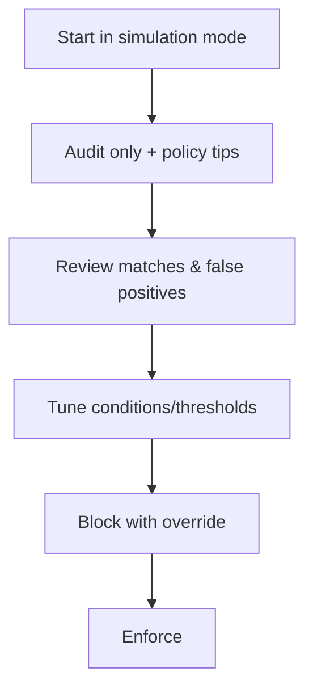

# Data Loss Prevention — Part 2

!!! abstract "Step 2 of 4 · Recommended policy setup"
    1. Overview & prerequisites → **2. Recommended policy setup** → 3. Step-by-step configuration → 4. Verification.

## Design your first policy the right way

Microsoft Learn recommends you *plan* before you build: identify stakeholders, describe the categories of sensitive information to protect, and set goals and strategy. A good first policy is **narrow, in simulation mode, and audit-first**.

## Recommended starter policy

!!! tip "A safe, high-value first policy"
    Protect the most common regulated data (payment card data) across the collaboration workloads, in **simulation mode** with **policy tips** on, before you ever block anything.

| Setting | Recommended starting value | Why |
|---|---|---|
| **Template** | Start from a built-in regulatory template (for example, *PCI Data Security Standard*) or a **Custom** policy | Templates pre-select relevant sensitive information types |
| **Locations** | Exchange, SharePoint, OneDrive, Teams | The workloads where accidental oversharing is most common |
| **Condition** | Content contains **Credit Card Number** SIT, with a confidence level of *High* and instance count ≥ 1 | High confidence reduces false positives |
| **Action (external)** | **Block with override** + notify user | Stops external leaks but lets legitimate business proceed with justification |
| **Action (internal)** | **Audit** | Visibility without friction inside the org |
| **User notifications** | **Policy tips on** | Educates users in the moment |
| **Mode** | **Simulation mode** first | See impact with zero user disruption |
| **Alerts** | Single-event alerts on high-severity matches | Immediate signal for the SOC |

### Rollout sequence

1. **Simulation + tips off** — measure the true match volume.
2. **Simulation + tips on** — preview the user experience.
3. **Enforce with Audit** — start recording real activity.
4. **Block with override** — begin preventing external oversharing.
5. **Expand** — add endpoints, more SITs, and Adaptive Protection.

!!! note "Adaptive Protection"
    Once you have Insider Risk Management, [Adaptive Protection](https://learn.microsoft.com/purview/insider-risk-management-adaptive-protection) can automatically apply stricter DLP actions to users whose calculated risk level is elevated — so most users see minimal friction while risky users are contained.

## What to protect first (by data category)

=== "Financial data"

    Credit Card Number, Bank Account Number, SWIFT Code. Start with **Credit Card Number** — it's high-signal and widely regulated (PCI DSS).

=== "Identity data"

    National ID / Social Security numbers, passport numbers, driver's license numbers. Useful for privacy regulations (GDPR, local privacy laws).

=== "Health data"

    Diagnosis and medical record identifiers via the health/HIPAA templates. Prioritize if you handle patient data.

## Continue

With the policy designed, build it.

[:octicons-arrow-left-24: Back to Part 1](index.md){ .md-button }
[:octicons-arrow-right-24: Part 3 · Step-by-step configuration](configuration.md){ .md-button .md-button--primary }

## Sources

- [Plan for data loss prevention (DLP)](https://learn.microsoft.com/purview/dlp-overview-plan-for-dlp)
- [Design a DLP policy](https://learn.microsoft.com/purview/dlp-policy-design)
- [Data Loss Prevention policy reference](https://learn.microsoft.com/purview/dlp-policy-reference)
- [Create and deploy data loss prevention policies](https://learn.microsoft.com/purview/dlp-create-deploy-policy)
- [Help dynamically mitigate risks with Adaptive Protection](https://learn.microsoft.com/purview/insider-risk-management-adaptive-protection)
