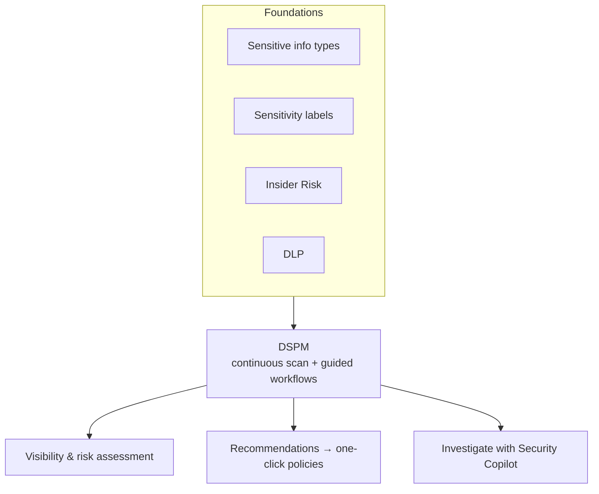

# Data Security Posture Management

!!! warning "Preview & evolving"
    DSPM is generally referred to as **preview / evolving**, and there are **classic** versions (DSPM classic and DSPM for AI classic). This page covers the **current** DSPM. Verify capabilities on Microsoft Learn for your tenant.

!!! info "Complexity: Medium · Est. time: ~30–60 min to first insights (analytics scans take time)"
    DSPM is largely **guided** through built-in setup tasks, and it *unifies* other Purview solutions rather than replacing them. Value depends on having foundations (SITs, labels, DLP, Insider Risk) in place first.

## 1. Description

**Microsoft Purview Data Security Posture Management** helps you **discover, protect, and investigate** sensitive-data risks across your **digital estate** — Microsoft 365, Azure, Fabric, and integrated third-party SaaS — for both traditional apps and **AI apps and agents**. Rather than focusing on infrastructure or endpoints, DSPM centers on the **data itself**: where it resides, who can access it, how it's used, and whether it's adequately protected. It continuously scans to identify sensitive data, assess risk, and recommend actions, **consolidating insights** from other Purview solutions (DLP, Insider Risk Management, Information Protection).



!!! tip "When to use DSPM"
    Use DSPM to get a **single, data-centric view** of risk — especially to reduce **oversharing** before rolling out **Microsoft 365 Copilot** and agents, and to prioritize where to apply DLP/labels next.

## 2. Prerequisites

=== "Licensing"

    DSPM requires **Microsoft 365 E5** or the **Microsoft Purview** suite (formerly Microsoft 365 E5 Compliance), and your **region** must be supported. Monitoring **Copilot/agents** requires users to have a **Microsoft 365 Copilot** license. Confirm on the [service description](https://learn.microsoft.com/office365/servicedescriptions/microsoft-365-service-descriptions/microsoft-365-tenantlevel-services-licensing-guidance/microsoft-purview-service-description).

=== "Roles"

    Least-privilege roles such as **Purview Compliance Administrator**, **Information Protection Admin**, **Security Administrator**, **Purview Data Security AI Admin**, or **Entra Global Admin**. See [permissions](https://learn.microsoft.com/purview/ai-microsoft-purview-permissions).

=== "Foundations"

    - **Microsoft Purview Audit** enabled (default for new tenants).
    - Built-in/custom **SITs** identified and a **sensitivity labeling** schema configured.
    - Optionally an **Insider Risk Management** program and **Security Copilot** for investigation.
    - For third-party AI sites: onboard devices + install the **Purview browser extension**.

## 3. Generate sample data (make the estate "interesting")

DSPM scans existing content, so seed your tenant with labeled/sensitive data. Reuse the [Information Protection](information-protection/index.md#3-generate-sample-content-for-your-lab) and [DLP](dlp/index.md#generate-lab-data) sample scripts, then upload the files to a few SharePoint sites and OneDrive accounts.

```powershell
# Quick estate seeding: create oversharable sensitive content, then upload to SharePoint/OneDrive.
$lab = Join-Path $env:USERPROFILE 'DSPM-Lab-Data'
New-Item -ItemType Directory -Path $lab -Force | Out-Null
1..3 | ForEach-Object {
    @"
Confidential pricing (LAB #$_)
Synthetic card: 4111 1111 1111 1111
Share scope: (intentionally broad for DSPM oversharing detection)
"@ | Set-Content (Join-Path $lab "pricing-$_.txt")
}
Write-Host "Seeded $lab. Upload these to test SharePoint sites, then let DSPM scan." -ForegroundColor Green
```

!!! note "DSPM auto-scans SharePoint"
    DSPM for AI automatically runs a **weekly data risk assessment** for the **top 100 SharePoint sites** by usage — so oversharing in your seeded sites will surface over time.

## 4. Recommended setup

!!! tip "Do the foundations, then follow setup tasks"
    DSPM is only as insightful as the foundations beneath it. Configure SITs + labels + audit first, then work the built-in **setup tasks** and **one-click policies**.

| Recommendation | Why |
|---|---|
| Enable **Audit + analytics** first | The required initial setup task |
| Turn on **one-click** DSPM-for-AI policies | Fast insight into Copilot/agent data flows |
| Prioritize **oversharing** remediation | Highest risk before Copilot rollout |
| Iterate **monthly** | Review recommendations, update policies |

## 5. Step-by-step configuration

1. In the **[Microsoft Purview portal](https://purview.microsoft.com)**, open **Data Security Posture Management**.
2. Go to **Actions → Setup tasks** and complete the required **Auditing and analytics** task.
3. Optionally create **collection policies** to capture AI interactions, and activate recommended **one-click DSPM for AI** policies.
4. Review the **Overview**, **Reports**, and **Recommendations** as data accumulates (allow **~24 hours** for policy data to appear).
5. Act on recommendations — many generate **DLP/label policies** directly; investigate deeper with **Security Copilot**.

### The four-step deployment model

| Step | Outcome |
|---|---|
| 1. Establish foundations (SITs, labels, IRM, Security Copilot) | Data estate understood |
| 2. Configure access & analytics; start initial scan | DSPM starts pulling insights |
| 3. Understand data landscape & risks | Risks assessed |
| 4. Take action & investigate with Security Copilot | Environment secured |

## 6. Verification

1. Confirm the **Auditing and analytics** setup task shows **complete**.
2. After scans run, open **Reports** — you should see sensitive-data insights and **oversharing** findings for your seeded sites.
3. Confirm at least one **recommendation** appears and can be turned into a policy.
4. If enabled, confirm **Copilot/agent** interaction insights appear in the reports.

!!! success "What 'good' looks like"
    DSPM shows your seeded sensitive content, flags oversharing on the test sites, and offers **actionable recommendations** (for example create a DLP policy or apply a label) that you can enact in one click.

## 7. Extensibility

- **DSPM for AI** — dedicated posture management for Microsoft 365 Copilot, agents, and third-party AI apps.
- **Security Copilot & the Data Security Posture agent** — AI-assisted investigation (consumes **SCUs**).
- **Third-party SaaS & multicloud** — extend visibility beyond Microsoft 365 (Azure, Fabric, integrated SaaS).
- **One-click policies** — turn recommendations into DLP/label/collection policies.

### Integration requirements

| Integration | Requirement |
|---|---|
| Copilot monitoring | Microsoft 365 Copilot licenses; audit enabled |
| Third-party AI sites | Devices onboarded + Purview browser extension |
| Posture agent | Security Copilot **SCUs** |
| Fabric/Copilot in Fabric | Enterprise Purview data governance + collection policy |

## 8. Industry use cases

=== "Financial services"

    Reduce **oversharing of client and deal data** in SharePoint before enabling Copilot for advisors.

=== "Telecommunication"

    Get a **data-centric risk map** across support, billing, and engineering repositories.

=== "Public sector & SOE"

    Continuously assess exposure of **citizen and national-interest data** and prioritize remediation.

=== "Energy & resources"

    Surface unprotected **IP and operational data** across cloud and SaaS before AI adoption.

=== "Manufacturing & conglomerates"

    Prioritize protection of **designs and trade secrets** by seeing where sensitive data concentrates across BUs.

## 9. Sources

- [Learn about Data Security Posture Management](https://learn.microsoft.com/purview/data-security-posture-management-learn-about)
- [Setup tasks for Data Security Posture Management](https://learn.microsoft.com/purview/data-security-posture-management-setup)
- [Considerations for DSPM (prerequisites)](https://learn.microsoft.com/purview/data-security-posture-management-considerations)
- [Deploy and use DSPM (deployment model)](https://learn.microsoft.com/purview/deploymentmodels/depmod-dspm-intro)
- [Learn about DSPM for AI](https://learn.microsoft.com/purview/dspm-for-ai)
