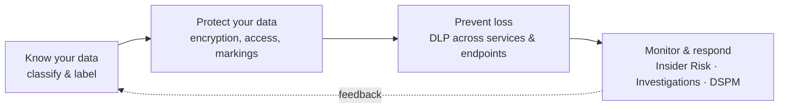

# Microsoft Purview — Data Security

!!! info "Complexity: Low to read · Est. time: ~10 min"
    This is the module map for Purview **data security**. Each solution below has its own deep-dive page with prerequisites, a sample-data script, recommended policy, a step-by-step walkthrough, and verification.

## What "data security" means in Purview

Microsoft Purview data security solutions help you **dynamically secure data throughout its lifecycle** — discovering and classifying sensitive information, protecting it with labels and encryption, preventing accidental loss, detecting risky insider activity, and limiting standing privileged access. Your information-protection strategy should be driven by business needs, but every organization has a requirement to protect some or all of its data.

## Solutions in this module

-   :material-label-multiple:{ .lg .middle } __Information Protection__

    ---

    Discover, classify, label, and protect sensitive information wherever it lives or travels.

    [:octicons-arrow-right-24: Open the Information Protection lab](information-protection/index.md)

-   :material-shield-alert:{ .lg .middle } __Data Loss Prevention__

    ---

    Detect and prevent risky or inappropriate sharing of sensitive information across Microsoft 365, endpoints, and more.

    [:octicons-arrow-right-24: Open the DLP lab](dlp/index.md)

-   :material-account-alert:{ .lg .middle } __Insider Risk Management__

    ---

    Identify, triage, and act on risky user activity using service and third-party signals — with privacy by design.

    [:octicons-arrow-right-24: Open the Insider Risk lab](insider-risk-management/index.md)

-   :material-wall:{ .lg .middle } __Information Barriers__

    ---

    Restrict two-way communication and collaboration between groups in Teams, SharePoint, and OneDrive.

    [:octicons-arrow-right-24: Open Information Barriers](information-barriers.md)

-   :material-key-chain:{ .lg .middle } __Privileged Access Management__

    ---

    Enforce just-in-time, scoped, time-limited access to sensitive Exchange configuration tasks.

    [:octicons-arrow-right-24: Open PAM](privileged-access-management.md)

-   :material-magnify-scan:{ .lg .middle } __Data Security Investigations__

    ---

    Use generative AI to analyze and respond to data security incidents, risky insiders, and breaches.

    [:octicons-arrow-right-24: Open Investigations](data-security-investigations.md)

-   :material-chart-box-outline:{ .lg .middle } __Data Security Posture Management__

    ---

    Discover, protect, and investigate sensitive-data risks across your digital estate (preview).

    [:octicons-arrow-right-24: Open DSPM](dspm.md)

## The three foundations: know, protect, prevent

=== "Know your data"

    Identify which items are sensitive and gain visibility into how they're used:

    - **[Sensitive information types](https://learn.microsoft.com/purview/sensitive-information-type-learn-about)** — identify data using built-in or custom regular expressions or a function (for example, credit card or national ID numbers).
    - **[Trainable classifiers](https://learn.microsoft.com/purview/classifier-learn-about)** — identify sensitive items using *examples* of the data rather than exact patterns.
    - **[Data classification](https://learn.microsoft.com/purview/data-classification-overview)** — a graphical view of items that carry a sensitivity or retention label, and the actions users take on them.

=== "Protect your data"

    **Sensitivity labels** are the foundational capability: they give users and admins visibility into data sensitivity and can apply protection actions including **encryption**, **access restrictions**, and **visual markings**. For the strictest requirements, [Double Key Encryption](https://learn.microsoft.com/purview/double-key-encryption) and [Customer Key](https://learn.microsoft.com/purview/customer-key-overview) give you control over encryption keys.

=== "Prevent data loss"

    **[Data Loss Prevention](https://learn.microsoft.com/purview/dlp-learn-about-dlp)** protects against unintentional or accidental sharing of sensitive information inside and outside your organization. You define *what* to monitor for, *where* to monitor, the *conditions* that trigger a policy, and the *actions* to take (audit, block, or block with override).

## Licensing at a glance

!!! warning "Confirm per-solution entitlements"
    Each solution licenses differently. As a rule of thumb, **base classification and manual labeling** are broadly available, while **automatic labeling, advanced DLP, and Insider Risk Management** typically require **Microsoft 365 E5** or the **Microsoft Purview** suite (formerly Microsoft 365 E5 Compliance). Always confirm against the [Microsoft Purview service description](https://learn.microsoft.com/office365/servicedescriptions/microsoft-365-service-descriptions/microsoft-365-tenantlevel-services-licensing-guidance/microsoft-purview-service-description).

## Sources

- [Microsoft Purview data security solutions](https://learn.microsoft.com/purview/purview-security)
- [Learn about Microsoft Purview Data Loss Prevention](https://learn.microsoft.com/purview/dlp-learn-about-dlp)
- [Learn about sensitivity labels](https://learn.microsoft.com/purview/sensitivity-labels)
- [Insider Risk Management](https://learn.microsoft.com/purview/insider-risk-management-solution-overview)
- [Data classification overview](https://learn.microsoft.com/purview/data-classification-overview)
- [Microsoft Purview service description](https://learn.microsoft.com/office365/servicedescriptions/microsoft-365-service-descriptions/microsoft-365-tenantlevel-services-licensing-guidance/microsoft-purview-service-description)
