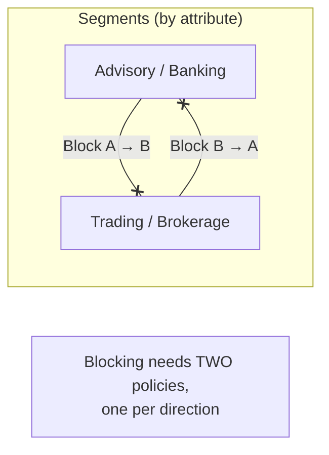

# Information Barriers

*Restrict two-way communication and collaboration between groups in Teams, SharePoint, and OneDrive — build an "ethical wall" and verify it, all on this page.*

## Lab details

| Level | Audience | Estimated time | What you'll build |
|---|---|---|---|
| 300 · Advanced | Compliance administrator | ~60–90 min (+ up to 24 h to propagate) | Two directional Block policies between segments, verified in Teams |

!!! info "Complexity: Medium–High · Est. time: ~60–90 min (+ up to 24 h to propagate)"
    Segmenting users and writing directional Block policies is methodical work, and changes take **up to 24 hours** to propagate. The concepts (segments, directions, modes) require care, so budget planning time.

## Why this matters

Some groups **must not** communicate — investment bankers and public-side research, or teams evaluating competing bids. Information Barriers enforces that **ethical wall** automatically across Teams, SharePoint, and OneDrive, so a conflict of interest can't happen by accident.

## 1. Description

<div class="video-embed">
<iframe src="https://www.youtube-nocookie.com/embed/lLiwMq41uac" title="Microsoft Purview Information Barriers" loading="lazy" allow="accelerometer; autoplay; clipboard-write; encrypted-media; gyroscope; picture-in-picture; web-share" referrerpolicy="strict-origin-when-cross-origin" allowfullscreen></iframe>
</div>
<p class="video-caption"><strong>▶ Watch — Learn Microsoft Purview Information Barriers in ~15 minutes</strong><br>Andy Malone MVP · 13:25 — A concise tour of Information Barriers: how this often-overlooked feature ethically segments your organization so specific groups can't communicate or collaborate — widely used in regulated environments.</p>

**Microsoft Purview Information Barriers (IB)** is a compliance solution that lets you **restrict two-way communication and collaboration** between groups and users in **Microsoft Teams, SharePoint, and OneDrive**. It's often used in **highly regulated industries** to avoid conflicts of interest and safeguard internal information.

### Key concepts

- **User account attributes** — Entra ID / Exchange attributes (department, job title, location, etc.) used to assign users to segments.
- **Segments** — sets of users defined by attributes. Non-legacy organizations support up to **5,000 segments**, with a user in up to **10 segments** (Legacy mode: 250 segments, one per user).
- **IB policies** — **Block** policies prevent one segment from communicating with another; **Allow** policies restrict a segment to communicating only with certain segments.
- **IB modes** — *Legacy*, *SingleSegment*, *MultiSegment*. Multi-segment requires **Allow-only** policies.



!!! tip "When to use IB"
    Use IB to enforce an **ethical wall** — for example, keeping investment bankers and public-side research analysts from communicating, or separating case teams that must not collaborate.

## 2. Prerequisites

=== "Licensing"

    IB is included in several enterprise subscriptions (for example **Microsoft 365 E5** and equivalents). Confirm entitlements via the [Microsoft 365 enterprise plans / subscription requirements](https://aka.ms/M365EnterprisePlans) and the [service description](https://learn.microsoft.com/office365/servicedescriptions/microsoft-365-service-descriptions/microsoft-365-tenantlevel-services-licensing-guidance/microsoft-purview-service-description).

=== "Roles"

    To configure IB you need one of: **Microsoft 365 Global Administrator**, **Compliance Administrator**, or the **IB Compliance Management** role. Follow least privilege.

=== "Other prerequisites"

    - **Directory data** populated with the attributes you'll segment on.
    - **Audit logging** enabled.
    - Decide your **IB mode**; in *Legacy* mode, remove existing Exchange **address book policies** first.
    - Optional: **Microsoft Graph PowerShell SDK** for user/group management and **Security & Compliance PowerShell** for segments/policies.

## 3. Generate sample data (segment attributes)

Segments are built from directory attributes, so "sample data" here means test users with a **Department** attribute you can segment on. This Microsoft Graph PowerShell script sets departments on test users.

```powershell
# Requires: Install-Module Microsoft.Graph
Connect-MgGraph -Scopes "User.ReadWrite.All"

# Assign departments to two test users so you can build two segments.
$assignments = @{
    "advisor@contoso.onmicrosoft.com" = "Advisory"
    "broker@contoso.onmicrosoft.com"  = "Brokerage"
}
foreach ($upn in $assignments.Keys) {
    Update-MgUser -UserId $upn -Department $assignments[$upn]
    Write-Host "Set $upn department = $($assignments[$upn])" -ForegroundColor Green
}
```

## 4. Recommended policy setup

!!! tip "Start with Block, one direction at a time"
    For most scenarios, Microsoft recommends **Block** policies for a consistent user experience. To block two segments from talking, create **two policies** — one for each direction. **Don't assign more than one policy to a segment.**

| Recommendation | Why |
|---|---|
| Use the **minimum number** of policies | Easier to reason about and audit |
| Prefer **Block** policies | Most predictable UX |
| Keep policies **inactive** until ready | Defining/editing doesn't affect users until applied |
| Plan **modes** up front | Multi-segment (Allow-only) vs. single/legacy affects design |

## 5. Step-by-step configuration

=== "Portal"

    1. In the **[Microsoft Purview portal](https://purview.microsoft.com)**, open **Information Barriers → Segments → ＋ New segment**.
    2. Name the segment, add a **user group filter** (for example *Department equals Advisory*), and **Submit**. Repeat for *Brokerage*.
    3. Open **Information Barriers → Policies → ＋ Create policy**. Name it (for example `Block Advisory→Brokerage`).
    4. Choose the **assigned segment** (*Advisory*) and set communication to **Blocked** with the *Brokerage* segment. Keep it **inactive** for now.
    5. Create the **reverse** policy `Block Brokerage→Advisory`.
    6. Open **Policy application → Apply all policies**. Application can take **several hours**.
    7. (Optional) Configure IB for **SharePoint/OneDrive**, IB **modes**, and **user discoverability**.

=== "PowerShell"

    Use **Security & Compliance PowerShell** (`Connect-IPPSSession`). Segments and policies are managed with the IB cmdlets, then applied:

    ```powershell
    Connect-IPPSSession -UserPrincipalName admin@contoso.onmicrosoft.com

    # Define segments from a directory attribute.
    New-OrganizationSegment -Name "Advisory"  -UserGroupFilter "Department -eq 'Advisory'"
    New-OrganizationSegment -Name "Brokerage" -UserGroupFilter "Department -eq 'Brokerage'"

    # Create two directional Block policies (kept inactive until applied).
    New-InformationBarrierPolicy -Name "Block Advisory-Brokerage" `
        -AssignedSegment "Advisory" -SegmentsBlocked "Brokerage" -State Inactive
    New-InformationBarrierPolicy -Name "Block Brokerage-Advisory" `
        -AssignedSegment "Brokerage" -SegmentsBlocked "Advisory" -State Inactive

    # Activate and apply.
    Set-InformationBarrierPolicy -Identity "Block Advisory-Brokerage" -State Active
    Set-InformationBarrierPolicy -Identity "Block Brokerage-Advisory" -State Active
    Start-InformationBarrierPoliciesApplication
    ```

    See the exact parameters in [Get started with Information Barriers](https://learn.microsoft.com/purview/information-barriers-policies).

## 6. Verification

1. Wait **~24 hours** for propagation, then check **Policy application** status shows completed.
2. As an *Advisory* user in **Teams**, try to start a chat with a *Brokerage* user — you should be **prevented**.
3. Confirm search/people-picker discoverability behaves as configured.
4. Review the **audit log** for IB policy application events.

!!! success "What 'good' looks like"
    Blocked users can't chat, call, or add each other in Teams; SharePoint/OneDrive collaboration is restricted per policy; policy application status is **completed** with no validation errors.

## 7. Extensibility

- **SharePoint & OneDrive IB** — extend barriers to files and sites (enabled together in one action).
- **Moderated meetings** — an *Allow moderation* policy lets a moderator segment host cross-segment meetings (requires E5 + **Teams Premium** for organizers).
- **Multi-segment mode** — supports up to 5,000 segments and users in multiple segments (Allow-only policies).
- **PowerShell automation** — script segment/policy lifecycle with Security & Compliance PowerShell + Graph.

### Integration requirements

| Integration | Requirement |
|---|---|
| SharePoint/OneDrive IB | Active IB policies; 24 h propagation |
| Moderated meetings | Microsoft 365 E5 for all users + Teams Premium for organizers |
| Multi-segment | Non-legacy mode; Allow-only policies |

## 8. Industry use cases

=== "Financial services"

    Classic **ethical wall** between investment banking and public-side research/trading to prevent conflicts of interest.

=== "Telecommunication"

    Separate **wholesale** and **retail** teams that serve competing downstream customers.

=== "Public sector & SOE"

    Keep **case-handling** or **tender-evaluation** teams from colluding or sharing bid information.

=== "Energy & resources"

    Separate **trading desks** from **asset operations** to prevent misuse of market-sensitive information.

=== "Manufacturing & conglomerates"

    Isolate **business units** that supply competing OEMs so pricing and design data can't cross.

## Change management & rollout

Never switch a new policy on for the whole tenant at once. Roll it out in controlled waves so you protect data **without surprising users or blocking legitimate work**. IB blocks communication between groups, so a mis-defined segment can cut off the wrong people — test before you apply.

| Phase | What you do | Who's affected | Move on when… |
|---|---|---|---|
| **1. Pilot** | Define segments and policies in an **inactive/test** state; validate the intended blocks on a pilot pair of segments before activating. | Pilot segment pair | Test shows the right pairs blocked and nothing unintended |
| **2. Expand** | Activate policies segment-pair by segment-pair; monitor Teams/SharePoint/OneDrive for accidental blocks. | Added segments | No false blocks reported; support prepared |
| **3. Tenant-wide** | Activate all required segments after informing affected groups and support. | All in-scope groups | Steady state; alerts understood |
| **4. Operate** | Review segment membership as people change teams; adjust policies for reorganizations. | Ongoing | — |

!!! tip "Least-disruption levers"
    - **Start in a safe mode:** define and **evaluate** segments before activating policies.
    - **Communicate first:** tell affected groups that certain cross-group chat/sharing will be restricted (and why).
    - **Keep a rollback path:** set a policy back to **inactive** to immediately restore communication.
    - **Log the change:** record scope, approver, and date in your change-management system (e.g., a change ticket).

## Summary & golden rules

- Prefer **Block** policies for a predictable experience; create **two** (one per direction).
- **Never** assign more than one policy to a segment.
- Keep policies **inactive** until you're ready to apply them.
- Plan your **IB mode** up front (multi-segment = Allow-only policies).
- Allow **~24 hours** for changes to propagate before you test.

## 9. Sources

- [Information Barriers (overview)](https://learn.microsoft.com/purview/information-barriers)
- [Get started with Information Barriers](https://learn.microsoft.com/purview/information-barriers-policies)
- [Information Barriers attributes](https://learn.microsoft.com/purview/information-barriers-attributes)
- [Use Information Barriers with SharePoint](https://learn.microsoft.com/purview/information-barriers-sharepoint)
- [Use multi-segment support in Information Barriers](https://learn.microsoft.com/purview/information-barriers-multi-segment)
- [Information Barriers and moderated meetings](https://learn.microsoft.com/purview/information-barriers-teams-moderated-meetings)
