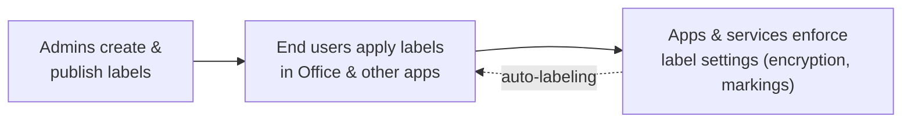

# Information Protection — Part 1

!!! abstract "Step 1 of 3 · Overview & prerequisites"
    1. **Overview & prerequisites** → 2. Step-by-step configuration → 3. Verification. Use **Next** at the bottom to page through.

!!! info "Complexity: Medium · Est. time: ~60–90 min for a first label set"
    Creating and publishing a small label taxonomy is straightforward (~60 min). Adding **encryption**, **auto-labeling**, and the **Information Protection client / scanner** raises it to **High**. Start with manual labels, then layer on protection.

## 1. Description

**Microsoft Purview Information Protection** helps you **discover, classify, protect, and govern** sensitive information wherever it lives or travels. Its foundational capability is the **sensitivity label**.

Sensitivity labels give users and admins visibility into how sensitive an item is, and can apply protection actions:

- **Encryption** — restrict who can open content and what they can do with it.
- **Access restrictions** — control sharing and usage rights.
- **Visual markings** — headers, footers, and watermarks.



*The sensitivity label flow, adapted from [Get started with sensitivity labels](https://learn.microsoft.com/purview/get-started-with-sensitivity-labels).*

### Know your data first

- **[Sensitive information types (SITs)](https://learn.microsoft.com/purview/sensitive-information-type-learn-about)** — pattern-based detection (regex/function).
- **[Trainable classifiers](https://learn.microsoft.com/purview/classifier-learn-about)** — example-based detection of content categories.
- **[Data classification](https://learn.microsoft.com/purview/data-classification-overview)** — see what's labeled and how it's used.

!!! tip "When to use Information Protection"
    Use it to create a **consistent classification taxonomy** (for example *Public → Highly Confidential*) that follows your data into email, documents, Teams, and beyond — and to **encrypt** the most sensitive items so protection travels with the file.

## 2. Prerequisites

=== "Licensing"

    Licensing depends on the features you use:

    - **Scanner-based discovery** is supported with **Microsoft 365 E3**.
    - **Sensitivity labeling**, including **automatic / policy-based labeling**, requires **Microsoft 365 E5** or **Microsoft 365 Information Protection & Governance (IPG)**.
    - Admins **and** end users each need an appropriate license; some plans require a Plan 1 license assigned alongside a Plan 2/premium license.
    - Applying labels to **Power BI** content additionally requires **Azure Information Protection Premium P1/P2** plus a **Power BI Pro/PPU** license.

    Confirm details in the [Microsoft Purview service description — Information Protection](https://learn.microsoft.com/office365/servicedescriptions/microsoft-365-service-descriptions/microsoft-365-tenantlevel-services-licensing-guidance/microsoft-purview-service-description#microsoft-purview-information-protection-sensitivity-labeling).

=== "Roles & permissions"

    To create and manage sensitivity labels and policies, use least-privilege roles such as **Information Protection Admin** (or Compliance Administrator). See [Permissions required to create and manage sensitivity labels](https://learn.microsoft.com/purview/get-started-with-sensitivity-labels#permissions-required-to-create-and-manage-sensitivity-labels).

=== "Client (optional)"

    To extend labeling to **Windows File Explorer**, **PowerShell**, and on-premises scanning, install the **[Microsoft Purview Information Protection client](https://learn.microsoft.com/purview/information-protection-client)**. Supported on **Windows 11**, **Windows 10 (x64)**, **Windows Server 2019/2016**. A cloud-based subscription for sensitivity labeling is required.

## 3. Generate sample content for your lab

Create a few documents at different sensitivity levels so you can practice applying (and auto-applying) labels. This script writes plain-text stand-ins you can open in Office and label.

```powershell
# Create sample content at varied sensitivity levels for labeling practice.
$lab = Join-Path $env:USERPROFILE 'InfoProtection-Lab'
New-Item -ItemType Directory -Path $lab -Force | Out-Null

@"
Company picnic details — everyone welcome!
Location: Central Park. Bring your family.
"@ | Set-Content (Join-Path $lab 'public-newsletter.txt')

@"
Internal roadmap (General) — do not share externally.
Q3 priorities: onboarding, reliability, cost.
"@ | Set-Content (Join-Path $lab 'internal-roadmap.txt')

@"
CONFIDENTIAL — Customer contract terms.
Contains pricing and account IDs. Restrict to Sales + Legal.
Synthetic card for auto-label testing: 4111 1111 1111 1111
"@ | Set-Content (Join-Path $lab 'confidential-contract.txt')

Write-Host "Sample content created in $lab" -ForegroundColor Green
Get-ChildItem $lab | Select-Object Name, Length
```

The `confidential-contract.txt` file contains a synthetic credit-card-format number so you can also test **automatic labeling** based on a sensitive information type.

## Continue

Next, define a label taxonomy and publish it.

[:octicons-arrow-right-24: Part 2 · Step-by-step configuration](configuration.md){ .md-button .md-button--primary }

## Sources

- [Learn about sensitivity labels](https://learn.microsoft.com/purview/sensitivity-labels)
- [Get started with sensitivity labels](https://learn.microsoft.com/purview/get-started-with-sensitivity-labels)
- [Microsoft Purview service description — Information Protection](https://learn.microsoft.com/office365/servicedescriptions/microsoft-365-service-descriptions/microsoft-365-tenantlevel-services-licensing-guidance/microsoft-purview-service-description#microsoft-purview-information-protection-sensitivity-labeling)
- [Microsoft Purview Information Protection client](https://learn.microsoft.com/purview/information-protection-client)
- [Data classification overview](https://learn.microsoft.com/purview/data-classification-overview)
