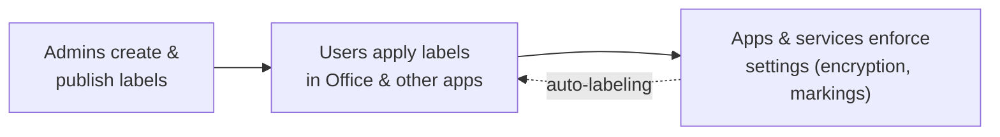

# Information Protection

*Discover, classify, label, and protect sensitive information wherever it lives or travels — build a label taxonomy **and** verify it, all on this page.*

## Lab details

| Level | Audience | Estimated time | What you'll build |
|---|---|---|---|
| 200 · Intermediate | Security / Compliance administrator | ~60–90 min | A small sensitivity-label taxonomy with protection, published to a pilot group, then verified in Office apps |

!!! info "Complexity: Medium · Est. time: ~60–90 min"
    Creating and publishing a small label taxonomy is straightforward (~60 min). Adding **encryption**, **auto-labeling**, and the **Information Protection client / scanner** raises it to **High**. This lab starts with manual labels, then layers on protection.

## Why this matters

Sensitive data — contracts, designs, customer records — moves through email, documents, Teams, and beyond. Sensitivity labels let protection **travel with the file**, so a "Confidential" document stays encrypted even after it's forwarded.

Common challenges this lab solves:

- "We have no consistent way to classify data across the company."
- "Protection stops working the moment a file leaves SharePoint."
- "We want encryption on our most sensitive files without slowing everyone down."

## Introduction

**Microsoft Purview Information Protection** helps you **discover, classify, protect, and govern** sensitive information. Its foundational capability is the **sensitivity label**, which can apply:

- **Encryption** — restrict who can open content and what they can do with it.
- **Access restrictions** — control sharing and usage rights.
- **Visual markings** — headers, footers, and watermarks.



!!! tip "Real-world example"
    A legal team must ensure M&A documents can only be opened by the deal team — even if forwarded. They create a **Highly Confidential** label that **encrypts** the file and grants access to a named group only. Protection travels with the document.

## Core concepts

| Term | What it means |
|---|---|
| **Sensitivity label** | A classification (for example *Confidential*) that can apply encryption, access limits, and markings |
| **Label policy** | Publishes a set of labels to chosen users/groups and sets defaults |
| **Sensitive information type (SIT)** | Pattern-based detection (regex/function), used for **auto-labeling** |
| **Trainable classifier** | Example-based detection of content categories |
| **Auto-labeling** | Applies/recommends a label automatically based on content, at rest or in transit |

## Prerequisites

=== "Licensing"

    Depends on the features you use:

    - **Scanner-based discovery** is supported with **Microsoft 365 E3**.
    - **Sensitivity labeling**, including **automatic / policy-based labeling**, requires **Microsoft 365 E5** or **Microsoft 365 Information Protection & Governance (IPG)**.
    - Admins **and** end users each need an appropriate license; some plans require a Plan 1 license alongside a Plan 2/premium license.
    - Labeling **Power BI** content additionally requires **Azure Information Protection Premium P1/P2** plus a **Power BI Pro/PPU** license.

    Confirm in the [service description — Information Protection](https://learn.microsoft.com/office365/servicedescriptions/microsoft-365-service-descriptions/microsoft-365-tenantlevel-services-licensing-guidance/microsoft-purview-service-description#microsoft-purview-information-protection-sensitivity-labeling).

=== "Roles & permissions"

    Use least-privilege roles such as **Information Protection Admin** (or Compliance Administrator). See [Permissions required to create and manage sensitivity labels](https://learn.microsoft.com/purview/get-started-with-sensitivity-labels#permissions-required-to-create-and-manage-sensitivity-labels).

=== "Client (optional)"

    To extend labeling to **Windows File Explorer**, **PowerShell**, and on-premises scanning, install the **[Information Protection client](https://learn.microsoft.com/purview/information-protection-client)** (Windows 11, Windows 10 x64, Server 2019/2016).

## What you'll accomplish

By the end of this lab you will:

- [x] Generate sample content at different sensitivity levels
- [x] Create a small **label taxonomy** (Public → Highly Confidential) with protection
- [x] **Publish** the labels to a pilot group
- [x] **Verify** labels appear in Office apps and that encryption is enforced
- [x] Know how to turn on **auto-labeling** at scale

## Use cases covered

| # | Use case | Outcome | Time |
|---|---|---|---|
| 1 | **Create and publish sensitivity labels** | A published label taxonomy | ~40 min |
| 2 | **Verify labeling & protection** | Confirmed labels + enforced encryption | ~20 min |
| 3 | *(Optional)* **Auto-label at scale** | Content labeled without user action | ~30 min |

---

## Generate lab data

Create documents at different sensitivity levels so you can practice applying (and auto-applying) labels.

```powershell
# Create sample content at varied sensitivity levels for labeling practice.
$lab = Join-Path $env:USERPROFILE 'InfoProtection-Lab'
New-Item -ItemType Directory -Path $lab -Force | Out-Null

@"
Company picnic details — everyone welcome!
Location: Central Park. Bring your family.
"@ | Set-Content (Join-Path $lab 'public-newsletter.txt')

@"
Internal roadmap (General) — do not share externally.
Q3 priorities: onboarding, reliability, cost.
"@ | Set-Content (Join-Path $lab 'internal-roadmap.txt')

@"
CONFIDENTIAL — Customer contract terms.
Contains pricing and account IDs. Restrict to Sales + Legal.
Synthetic card for auto-label testing: 4111 1111 1111 1111
"@ | Set-Content (Join-Path $lab 'confidential-contract.txt')

Write-Host "Sample content created in $lab" -ForegroundColor Green
Get-ChildItem $lab | Select-Object Name, Length
```

`confidential-contract.txt` contains a synthetic credit-card-format number so you can also test **auto-labeling** based on a sensitive information type.

## Recommended label taxonomy

If you don't already have a taxonomy, start with clear, business-friendly names and use **sublabels** for related sensitivities.

| Label | Meaning | Suggested protection |
|---|---|---|
| **Public** | Approved for public release | None |
| **General** | Internal, non-sensitive | Optional footer marking |
| **Confidential** | Sensitive; limit distribution | Encryption + watermark; sublabels *Internal* / *External* |
| **Highly Confidential** | Most sensitive; strict control | Encryption with tightly scoped permissions |

!!! tip "Keep it small"
    Start with **3–5 labels** and one or two high-impact scenarios. Test names and tooltips with the people who'll apply them, then expand.

---

## Use case 1 — Create and publish sensitivity labels

**Objective:** create a *Confidential* label with protection and publish it to a pilot group.

=== "Portal"

    **Step 1 — Create the labels**

    1. Sign in to the **[Microsoft Purview portal](https://purview.microsoft.com)** → **Information Protection → Sensitivity labels**.
    2. Select **＋ Create a label**. Enter a **Name**, **Display name**, and a helpful **tooltip** (for example, *"Business data that shouldn't be shared externally"*). Select **Next**.
    3. On **Scope**, choose **Items** (files, emails, meetings), **Groups & sites**, and/or **Schematized data assets**. Select **Next**.

    **Step 2 — Define what the label does (protection)**

    4. For **Items**, choose protection settings:
        - **Encryption** — *Configure* → assign permissions (for example, *Confidential* → your org can Co-Author; *Highly Confidential* → a named group has Viewer only).
        - **Content marking** — add a header/footer/watermark such as *"Confidential"*.
        - **Auto-labeling** (optional) — detect a SIT (for example **Credit Card Number**) and apply/recommend this label.
    5. Finish the wizard and **Save**. Repeat for each label in your taxonomy.

    **Step 3 — Publish a label policy**

    6. Go to **Sensitivity labels → Label policies → ＋ Publish label**.
    7. **Choose the labels**, then select the **users and groups** (start with a pilot group).
    8. Configure **policy settings** — for example a **default label**, and whether users must **justify** lowering a label.
    9. **Name** the policy, review, and **Submit**. Allow time for it to reach users' apps.

    { loading=lazy }

    *Image source: [Get started with sensitivity labels](https://learn.microsoft.com/purview/get-started-with-sensitivity-labels).*

=== "PowerShell"

    ```powershell
    # Connect to Security & Compliance PowerShell.
    Connect-IPPSSession -UserPrincipalName admin@contoso.onmicrosoft.com

    # Review any existing labels.
    Get-Label | Format-List DisplayName, Name, Guid, ContentType

    # Create a "Confidential" label for files and emails.
    New-Label `
        -DisplayName "Confidential" `
        -Name "Confidential" `
        -Tooltip "Business data that shouldn't be shared externally." `
        -ContentType "File, Email"

    # Publish the label to users via a label policy.
    New-LabelPolicy `
        -Name "Pilot label policy" `
        -Labels "Confidential" `
        -ExchangeLocation "All"
    ```

    !!! note "Encryption & advanced settings"
        Encryption and content-marking are configured with extra parameters on `Set-Label` (for example `-EncryptionEnabled`, `-EncryptionRightsDefinitions`, `-ApplyContentMarkingFooterEnabled`). See the [Set-Label reference](https://learn.microsoft.com/powershell/module/exchangepowershell/set-label), or configure them in the portal.

!!! success "Checkpoint"
    Your labels exist under **Sensitivity labels**, and a **label policy** is published to your pilot group. Give it time to propagate to apps.

---

## Use case 2 — Verify labeling & protection

### Confirm labels reach users

1. Sign in to **Word/Excel/PowerPoint** or **Outlook** (web or desktop) as a **pilot user**.
2. Look for the **Sensitivity** button on the ribbon (or the label bar) — your published labels (for example *Confidential*) should appear.
3. Apply **Confidential** to `confidential-contract.txt`. Confirm any configured **header/footer/watermark** appears.

### Confirm protection is enforced

1. As a user **outside** the permitted group, try to open the encrypted document — you should be **denied** or limited to the assigned rights (for example, view-only).
2. If you set a default or mandatory label, confirm new documents get labeled and that **lowering** a label prompts for **justification** (if required).

!!! success "What 'good' looks like"
    - Pilot users **see** and can apply the labels in their apps.
    - Encrypted items **enforce** permissions for unauthorized users.
    - **Activity explorer** shows *Label applied* / *Label changed* events.

!!! warning "Give it time & test broadly"
    Policies take time to propagate, and apps enforce labels slightly differently. Test on the platforms your users actually use (Windows, macOS, web, mobile).

---

## Use case 3 (optional) — Auto-label at scale

To label existing content **at rest** (SharePoint/OneDrive) or **in transit** (Exchange) without user action:

1. Open **Information Protection → Auto-labeling → ＋ Create auto-labeling policy**.
2. Choose the **SIT(s)** to detect (for example **Credit Card Number**) and the **label** to apply.
3. Start it in **simulation** to preview matches (the credit-card SIT in `confidential-contract.txt` should match).
4. Review results, then **turn it on**. See [Apply a sensitivity label automatically](https://learn.microsoft.com/purview/apply-sensitivity-label-automatically).

## Extensibility

- **[Double Key Encryption](https://learn.microsoft.com/purview/double-key-encryption)** and **[Customer Key](https://learn.microsoft.com/purview/customer-key-overview)** — for the strictest key-control needs.
- **[Information Protection client & scanner](https://learn.microsoft.com/purview/information-protection-client)** — extend labeling to File Explorer/PowerShell and discover/label files in **on-premises** repositories.
- **[Information Protection SDK](https://learn.microsoft.com/information-protection/develop/overview)** — third-party apps read/write label metadata and apply encryption.
- **Data Map integration** — apply sensitivity labels to [schematized data assets](https://learn.microsoft.com/purview/data-map-sensitivity-labels-apply).

| Integration | Requirement |
|---|---|
| Information Protection client/scanner | Windows 11 / 10 (x64) / Server 2019–2016; labeling subscription |
| Double Key Encryption | You host and control the second key; DKE service configured |
| SDK / partner apps | MIP SDK; app registration and permissions |
| Data Map labeling | Microsoft 365 licensing in the same Entra tenant; pay-as-you-go for non-M365 sources |

## Industry use cases

=== "Financial services"

    Apply **Highly Confidential** with encryption to M&A and client-portfolio documents so only deal-team members can open them, even if forwarded.

=== "Telecommunication"

    Standardize a **Public → Highly Confidential** taxonomy; auto-label engineering docs containing network topology as **Confidential**.

=== "Public sector & SOE"

    Map labels to a **government classification scheme**; enforce visual markings and encryption for citizen and national-interest data.

=== "Energy & resources"

    Encrypt **reservoir, geophysical, and plant-design** documents so IP stays protected when shared with JV partners.

=== "Manufacturing & conglomerates"

    Label and encrypt **product designs and trade secrets**; auto-label CAD/BOM content across business units.

## Summary & golden rules

You created a label taxonomy, added protection, published it, and verified enforcement — all from this page.

- **Start small** — 3–5 clear labels beat a sprawling taxonomy.
- **Manual first, protection next** — get labels adopted, then add encryption.
- **Pilot before org-wide** — publish to a small group and gather feedback.
- **Simulate auto-labeling** before enforcing it.
- **Test on real apps/platforms** — enforcement varies by client.

## Sources

- [Learn about sensitivity labels](https://learn.microsoft.com/purview/sensitivity-labels)
- [Get started with sensitivity labels](https://learn.microsoft.com/purview/get-started-with-sensitivity-labels)
- [Create and configure sensitivity labels and their policies](https://learn.microsoft.com/purview/create-sensitivity-labels)
- [Restrict access to content by using sensitivity labels to apply encryption](https://learn.microsoft.com/purview/encryption-sensitivity-labels)
- [Apply a sensitivity label to content automatically](https://learn.microsoft.com/purview/apply-sensitivity-label-automatically)
- [New-Label](https://learn.microsoft.com/powershell/module/exchangepowershell/new-label) · [New-LabelPolicy](https://learn.microsoft.com/powershell/module/exchangepowershell/new-labelpolicy) · [Set-Label](https://learn.microsoft.com/powershell/module/exchangepowershell/set-label)
- [Information Protection client](https://learn.microsoft.com/purview/information-protection-client) · [Information Protection SDK](https://learn.microsoft.com/information-protection/develop/overview)
- [Service description — Information Protection](https://learn.microsoft.com/office365/servicedescriptions/microsoft-365-service-descriptions/microsoft-365-tenantlevel-services-licensing-guidance/microsoft-purview-service-description#microsoft-purview-information-protection-sensitivity-labeling)
