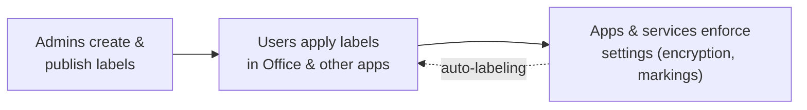

# Information Protection

*Discover, classify, label, and protect sensitive information wherever it lives or travels — build a label taxonomy **and** verify it, all on this page.*

## Lab details

| Level | Audience | Estimated time | What you'll build |
|---|---|---|---|
| 200 · Intermediate | Security / Compliance administrator | ~60–90 min | A small sensitivity-label taxonomy with protection, published to a pilot group, then verified in Office apps |

!!! info "Complexity: Medium · Est. time: ~60–90 min"
    Creating and publishing a small label taxonomy is straightforward (~60 min). Adding **encryption**, **auto-labeling**, and the **Information Protection client / scanner** raises it to **High**. This lab starts with manual labels, then layers on protection.

## Why this matters

Sensitive data — contracts, designs, customer records — moves through email, documents, Teams, and beyond. Sensitivity labels let protection **travel with the file**, so a "Confidential" document stays encrypted even after it's forwarded.

Common challenges this lab solves:

- "We have no consistent way to classify data across the company."
- "Protection stops working the moment a file leaves SharePoint."
- "We want encryption on our most sensitive files without slowing everyone down."

## Overview video

<div class="video-embed">
<iframe src="https://www.youtube-nocookie.com/embed/Jn09iBRLxqw" title="Microsoft Mechanics: Information Protection" loading="lazy" allow="accelerometer; autoplay; clipboard-write; encrypted-media; gyroscope; picture-in-picture; web-share" referrerpolicy="strict-origin-when-cross-origin" allowfullscreen></iframe>
</div>
<p class="video-caption"><strong>▶ Watch — Labeling files is worth it: speed &amp; protection benefits</strong><br>Microsoft Mechanics · 15:37 — Discover sensitive information across every file type and location with Microsoft Purview Information Protection: classify data, apply clear labels, and enforce protections that adapt to human and AI interactions without slowing down work.</p>

## Introduction

**Microsoft Purview Information Protection** helps you **discover, classify, protect, and govern** sensitive information. Its foundational capability is the **sensitivity label**, which can apply:

- **Encryption** — restrict who can open content and what they can do with it.
- **Access restrictions** — control sharing and usage rights.
- **Visual markings** — headers, footers, and watermarks.



!!! tip "Real-world example"
    A legal team must ensure M&A documents can only be opened by the deal team — even if forwarded. They create a **Highly Confidential** label that **encrypts** the file and grants access to a named group only. Protection travels with the document.

## Core concepts

| Term | What it means |
|---|---|
| **Sensitivity label** | A classification (for example *Confidential*) that can apply encryption, access limits, and markings |
| **Label policy** | Publishes a set of labels to chosen users/groups and sets defaults |
| **Sensitive information type (SIT)** | Pattern-based detection (regex/function), used for **auto-labeling** |
| **Trainable classifier** | Example-based detection of content categories |
| **Auto-labeling** | Applies/recommends a label automatically based on content, at rest or in transit |

## Prerequisites

=== "Licensing"

    Depends on the features you use:

    - **Scanner-based discovery** is supported with **Microsoft 365 E3**.
    - **Sensitivity labeling**, including **automatic / policy-based labeling**, requires **Microsoft 365 E5** or **Microsoft 365 Information Protection & Governance (IPG)**.
    - Admins **and** end users each need an appropriate license; some plans require a Plan 1 license alongside a Plan 2/premium license.
    - Labeling **Power BI** content additionally requires **Azure Information Protection Premium P1/P2** plus a **Power BI Pro/PPU** license.

    Confirm in the [service description — Information Protection](https://learn.microsoft.com/office365/servicedescriptions/microsoft-365-service-descriptions/microsoft-365-tenantlevel-services-licensing-guidance/microsoft-purview-service-description#microsoft-purview-information-protection-sensitivity-labeling).

=== "Roles & permissions"

    Use least-privilege roles such as **Information Protection Admin** (or Compliance Administrator). See [Permissions required to create and manage sensitivity labels](https://learn.microsoft.com/purview/get-started-with-sensitivity-labels#permissions-required-to-create-and-manage-sensitivity-labels).

=== "Client (optional)"

    To extend labeling to **Windows File Explorer**, **PowerShell**, and on-premises scanning, install the **[Information Protection client](https://learn.microsoft.com/purview/information-protection-client)** (Windows 11, Windows 10 x64, Server 2019/2016).

## What you'll accomplish

By the end of this lab you will:

- [x] Generate sample content at different sensitivity levels
- [x] Create and **publish** a small label taxonomy (manual labeling)
- [x] Add **encryption & rights (IRM)** to a label and prove it's enforced
- [x] Turn on **auto-labeling** (service-side and in Office apps)
- [x] Know how to label **on-premises** files and apply **Double Key Encryption**

## Use cases covered

Each use case is one way to implement Information Protection, walked through as **preconfig → configure → validate**:

| # | Surface | What you configure | Time |
|---|---|---|---|
| 1 | **Manual labels** | Create & publish a label taxonomy | ~30 min |
| 2 | **Encryption & rights (IRM)** | Add encryption + permissions + markings to a label | ~30 min |
| 3 | **Auto-labeling (service-side)** | Auto-label at rest/in transit (SharePoint, OneDrive, Exchange) | ~30 min |
| 4 | **Client/Office labeling** | Recommend or auto-apply labels in Office apps | ~30 min |
| 5 | **On-premises labeling** | Label file shares / SharePoint Server via the scanner | ~60–90 min |
| 6 | **Double Key Encryption** | Hold a second key yourself (advanced) | ~60 min |

---

## Generate lab data

Create documents at different sensitivity levels so you can practice applying (and auto-applying) labels.

```powershell
# Create sample content at varied sensitivity levels for labeling practice.
$lab = Join-Path $env:USERPROFILE 'InfoProtection-Lab'
New-Item -ItemType Directory -Path $lab -Force | Out-Null

@"
Company picnic details — everyone welcome!
Location: Central Park. Bring your family.
"@ | Set-Content (Join-Path $lab 'public-newsletter.txt')

@"
Internal roadmap (General) — do not share externally.
Q3 priorities: onboarding, reliability, cost.
"@ | Set-Content (Join-Path $lab 'internal-roadmap.txt')

@"
CONFIDENTIAL — Customer contract terms.
Contains pricing and account IDs. Restrict to Sales + Legal.
Synthetic card for auto-label testing: 4111 1111 1111 1111
"@ | Set-Content (Join-Path $lab 'confidential-contract.txt')

Write-Host "Sample content created in $lab" -ForegroundColor Green
Get-ChildItem $lab | Select-Object Name, Length
```

`confidential-contract.txt` contains a synthetic credit-card-format number so you can also test **auto-labeling** based on a sensitive information type.

## Recommended label taxonomy

If you don't already have a taxonomy, start with clear, business-friendly names and use **sublabels** for related sensitivities.

| Label | Meaning | Suggested protection |
|---|---|---|
| **Public** | Approved for public release | None |
| **General** | Internal, non-sensitive | Optional footer marking |
| **Confidential** | Sensitive; limit distribution | Encryption + watermark; sublabels *Internal* / *External* |
| **Highly Confidential** | Most sensitive; strict control | Encryption with tightly scoped permissions |

!!! tip "Keep it small"
    Start with **3–5 labels** and one or two high-impact scenarios. Test names and tooltips with the people who'll apply them, then expand.

---

## Use case 1 — Create & publish sensitivity labels (manual labeling)

*The foundation — give users labels they can apply by hand in their apps.*

### Preconfig

Decide a small [taxonomy](#recommended-label-taxonomy) (3–5 labels) and a **pilot group** to publish to. No other setup is required.

### Configure

=== "Portal"

    1. **[Microsoft Purview portal](https://purview.microsoft.com)** → **Information Protection → Sensitivity labels → ＋ Create a label**.
    2. Enter a **Name**, **Display name**, and a helpful **tooltip**. Select **Next**.
    3. On **Scope**, choose **Items** (files, emails, meetings) — leave protection off for now (that's Use case 2). Finish and **Save**. Repeat for each label.
    4. Go to **Label policies → ＋ Publish label**, choose the labels, select your **pilot group**, set policy settings (optional **default label**, justify-on-downgrade), name it, and **Submit**.

    { loading=lazy }

    *Image source: [Get started with sensitivity labels](https://learn.microsoft.com/purview/get-started-with-sensitivity-labels).*

=== "PowerShell"

    ```powershell
    Connect-IPPSSession -UserPrincipalName admin@contoso.onmicrosoft.com
    New-Label -DisplayName "Confidential" -Name "Confidential" `
        -Tooltip "Business data that shouldn't be shared externally." -ContentType "File, Email"
    New-LabelPolicy -Name "Pilot label policy" -Labels "Confidential" -ExchangeLocation "All"
    ```

### Validate the config

1. Sign in to **Word/Outlook** (web or desktop) as a pilot user; the **Sensitivity** button should show your labels.
2. Apply **Confidential** to `confidential-contract.txt`.
3. Confirm **Activity explorer** shows a *Label applied* event.

---

## Use case 2 — Label encryption & rights (IRM)

*Make a label actually protect content — encryption, permissions, and visual markings that travel with the file.*

### Preconfig

A label from Use case 1 (for example **Confidential**). Decide who should get which rights (e.g., your org = Co-Author; a named group = Viewer).

### Configure

1. **Sensitivity labels** → open your label → **Edit** → **Protection settings**.
2. Turn on **Encryption** → **Configure** → **Assign permissions**: add users/groups and pick a permission level (Co-Author, Reviewer, Viewer, or custom).
3. (Optional) Turn on **Content marking** — header/footer/watermark such as *"Confidential"*.
4. **Save**. In PowerShell, the equivalents are `Set-Label -EncryptionEnabled $true -EncryptionRightsDefinitions ... -ApplyContentMarkingFooterEnabled $true` ([reference](https://learn.microsoft.com/powershell/module/exchangepowershell/set-label)).

### Validate the config

1. Apply the encrypting label to a document; confirm any header/footer/watermark appears.
2. As a user **outside** the permitted group, open it — you should be **denied** or limited to the assigned rights (e.g., view-only), even if the file was forwarded or copied.

!!! warning "Pilot encryption carefully"
    Encryption can block legitimate collaboration if scoped too tightly. Test on the platforms users actually use (Windows, macOS, web, mobile) before widening.

---

## Use case 3 — Auto-labeling at rest & in transit (service-side)

*Label existing and flowing content without user action across SharePoint, OneDrive, and Exchange.*

### Preconfig

Labels published (Use cases 1–2) and the **SIT(s)** you'll detect (for example **Credit Card Number**).

### Configure

1. **Information Protection → Auto-labeling → ＋ Create auto-labeling policy**.
2. Pick the **locations** (SharePoint, OneDrive, Exchange), the **SIT(s)** to detect, and the **label** to apply.
3. Start it in **simulation** to preview matches, review, then **turn it on**. See [Apply a sensitivity label automatically](https://learn.microsoft.com/purview/apply-sensitivity-label-automatically).

### Validate the config

1. Ensure `confidential-contract.txt` (with its synthetic card number) is in a covered SharePoint/OneDrive site.
2. Run the policy in **simulation** and confirm the file is matched.
3. Turn it on and confirm the label is applied at rest.

---

## Use case 4 — Client-side auto & recommended labeling (Office apps)

*Guide users as they work — Office apps recommend or automatically apply a label when they detect sensitive content.*

### Preconfig

A label policy published to the users, and the label you'll add an auto-condition to.

### Configure

1. **Sensitivity labels** → open your label → **Auto-labeling for files and emails** → add a **SIT** condition.
2. Choose **Recommend** (prompts the user with a tooltip) or **Automatically** apply the label.
3. In the **label policy** settings, optionally set a **default label** and **downgrade justification**. Publish/refresh.

### Validate the config

1. In **Word**, paste a synthetic credit-card number into a document.
2. Confirm Office **recommends** (or auto-applies) the label with a tooltip.
3. Confirm the applied label in the app and in **Activity explorer**.

---

## Use case 5 — On-premises labeling (Information Protection scanner)

*Discover and label sensitive files at rest in on-premises file shares and SharePoint Server.*

### Preconfig

Deploy the **Microsoft Purview Information Protection client + scanner** (see [Deploy the scanner](https://learn.microsoft.com/purview/deploy-scanner)); at least one label + policy published.

### Configure

1. Create a **content scan job** and add your **repositories** (file shares / SharePoint Server).
2. Set the job to **apply a label automatically** based on conditions (SITs); run in **discover-only** first, then **enforce**.
3. Assign the job to the scanner **cluster** and run it (**schedule**, **Scan now**, or `Start-Scan`).

### Validate the config

1. Place a sensitive file in a scanned share and run the scan.
2. In **discover-only**, confirm the scanner reports what *would* be labeled; switch to **enforce** and confirm the label is applied.
3. Review results in the scanner reports and **Activity explorer**.

---

## Use case 6 — Double Key Encryption (advanced)

*For the most sensitive data, hold a **second key** yourself so not even Microsoft can decrypt the content.*

### Preconfig

Stand up the **Double Key Encryption service** (you host and control the second key) and make its endpoint reachable — see [Double Key Encryption](https://learn.microsoft.com/purview/double-key-encryption).

### Configure

1. Create (or edit) a label → **Encryption** → **Use Double Key Encryption** and enter your **DKE endpoint URL**.
2. Publish the label to the intended (small) group.

### Validate the config

1. Apply the DKE label to a document.
2. Confirm authorized users can open it (the client calls your key service) and that content can't be decrypted without your key.

## Extensibility

- **[Double Key Encryption](https://learn.microsoft.com/purview/double-key-encryption)** and **[Customer Key](https://learn.microsoft.com/purview/customer-key-overview)** — for the strictest key-control needs.
- **[Information Protection client & scanner](https://learn.microsoft.com/purview/information-protection-client)** — extend labeling to File Explorer/PowerShell and discover/label files in **on-premises** repositories.
- **[Information Protection SDK](https://learn.microsoft.com/information-protection/develop/overview)** — third-party apps read/write label metadata and apply encryption.
- **Data Map integration** — apply sensitivity labels to [schematized data assets](https://learn.microsoft.com/purview/data-map-sensitivity-labels-apply).

| Integration | Requirement |
|---|---|
| Information Protection client/scanner | Windows 11 / 10 (x64) / Server 2019–2016; labeling subscription |
| Double Key Encryption | You host and control the second key; DKE service configured |
| SDK / partner apps | MIP SDK; app registration and permissions |
| Data Map labeling | Microsoft 365 licensing in the same Entra tenant; pay-as-you-go for non-M365 sources |

## Industry use cases

=== "Financial services"

    Apply **Highly Confidential** with encryption to M&A and client-portfolio documents so only deal-team members can open them, even if forwarded.

=== "Telecommunication"

    Standardize a **Public → Highly Confidential** taxonomy; auto-label engineering docs containing network topology as **Confidential**.

=== "Public sector & SOE"

    Map labels to a **government classification scheme**; enforce visual markings and encryption for citizen and national-interest data.

=== "Energy & resources"

    Encrypt **reservoir, geophysical, and plant-design** documents so IP stays protected when shared with JV partners.

=== "Manufacturing & conglomerates"

    Label and encrypt **product designs and trade secrets**; auto-label CAD/BOM content across business units.

## Change management & rollout

Never switch a new policy on for the whole tenant at once. Roll it out in controlled waves so you protect data **without surprising users or blocking legitimate work**. Labels change how users classify content and how it's encrypted — the two things most likely to cause confusion or lock-outs — so pilot carefully.

| Phase | What you do | Who's affected | Move on when… |
|---|---|---|---|
| **1. Pilot** | Publish the label policy to a **pilot group**; start with **manual labeling only** (no mandatory/auto-labeling). Run any auto-labeling policy in **simulation**. | Pilot group (10–50 users) | Pilot users can apply labels; simulation matches expected content |
| **2. Expand** | Widen the policy team-by-team; enable **recommended/auto-labeling**, then encryption, for the pilot. | Department(s) | Few mislabels; encryption doesn't block collaboration |
| **3. Tenant-wide** | Publish to all users and (optionally) set a default or mandatory label after comms + training. | All users | Steady state; alerts understood |
| **4. Operate** | Review labeling analytics and auto-label simulation; refine SITs/label conditions; add labels as needs evolve. | Ongoing | — |

!!! tip "Least-disruption levers"
    - **Start in a safe mode:** manual labeling and **auto-label simulation** before you enforce or encrypt.
    - **Communicate first:** tell users what each label means and when to use it (a one-page guide + short demo).
    - **Keep a rollback path:** unpublish a label or narrow the policy scope; hold off on auto-encryption until confident.
    - **Log the change:** record scope, approver, and date in your change-management system (e.g., a change ticket).

## Summary & golden rules

You created a label taxonomy, added protection, published it, and verified enforcement — all from this page.

- **Start small** — 3–5 clear labels beat a sprawling taxonomy.
- **Manual first, protection next** — get labels adopted, then add encryption.
- **Pilot before org-wide** — publish to a small group and gather feedback.
- **Simulate auto-labeling** before enforcing it.
- **Test on real apps/platforms** — enforcement varies by client.

## Sources

- [Learn about sensitivity labels](https://learn.microsoft.com/purview/sensitivity-labels)
- [Get started with sensitivity labels](https://learn.microsoft.com/purview/get-started-with-sensitivity-labels)
- [Create and configure sensitivity labels and their policies](https://learn.microsoft.com/purview/create-sensitivity-labels)
- [Restrict access to content by using sensitivity labels to apply encryption](https://learn.microsoft.com/purview/encryption-sensitivity-labels)
- [Apply a sensitivity label to content automatically](https://learn.microsoft.com/purview/apply-sensitivity-label-automatically)
- [New-Label](https://learn.microsoft.com/powershell/module/exchangepowershell/new-label) · [New-LabelPolicy](https://learn.microsoft.com/powershell/module/exchangepowershell/new-labelpolicy) · [Set-Label](https://learn.microsoft.com/powershell/module/exchangepowershell/set-label)
- [Information Protection client](https://learn.microsoft.com/purview/information-protection-client) · [Information Protection SDK](https://learn.microsoft.com/information-protection/develop/overview)
- [Service description — Information Protection](https://learn.microsoft.com/office365/servicedescriptions/microsoft-365-service-descriptions/microsoft-365-tenantlevel-services-licensing-guidance/microsoft-purview-service-description#microsoft-purview-information-protection-sensitivity-labeling)
