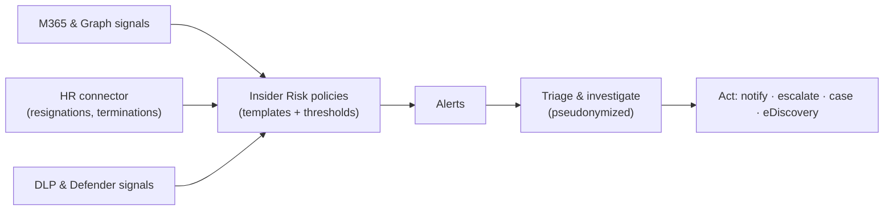

# Insider Risk Management — Part 1

!!! abstract "Step 1 of 4 · Overview & prerequisites"
    1. **Overview & prerequisites** → 2. Recommended policy setup → 3. Step-by-step configuration → 4. Verification.

!!! info "Complexity: High · Est. time: ~90 min to configure; analytics up to 48 h"
    Insider Risk Management touches **privacy, HR data connectors, and role separation**, and its **analytics scan can take up to 48 hours**. The configuration itself is guided, but plan for stakeholder sign-off (HR, legal, privacy) before enabling.

## 1. Description

**Microsoft Purview Insider Risk Management (IRM)** correlates signals from **Microsoft 365 and Microsoft Graph** — plus third-party indicators — to help you **identify, triage, and act on** risky user activity such as **IP theft, data leakage, and security violations**.

!!! info "Privacy by design"
    IRM is **built with privacy by design**: users are **pseudonymized by default**, and **role-based access controls** and **audit logs** help ensure user-level privacy. Insights about an individual can be calculated by administrators — so IRM must be used in compliance with applicable laws, and you should involve HR, legal, and privacy stakeholders.



### Key concepts

- **Policy template** — a starting point tuned to a scenario (for example *Data theft by departing users*, *Data leaks*, *Security violations*).
- **Indicators & thresholds** — the signals a policy watches and how much activity triggers an alert.
- **Analytics** — a no-policy scan that estimates risk in your tenant and recommends thresholds.
- **Alert → Case** — triage alerts, then open a case for deeper investigation and action.
- **Adaptive Protection** — feeds a user's risk level to DLP and Conditional Access.

## 2. Prerequisites

=== "Licensing"

    Insider Risk Management is offered in several Microsoft 365 subscriptions, including **Microsoft 365 E5**, the **Microsoft Purview** suite (formerly Microsoft 365 E5 Compliance), and **Microsoft 365 A5** (education). IRM is available in tenants hosted in **regions supported by its Azure service dependencies**. See [Getting started — Subscriptions and licensing](https://learn.microsoft.com/purview/insider-risk-management-configure#subscriptions-and-licensing).

=== "Roles & role groups"

    IRM uses **six role groups** for separation of duties:

    | Role group | Typical use |
    |---|---|
    | **Insider Risk Management** | Full access (super-user) |
    | **Insider Risk Management Admins** | Configure policies & settings |
    | **Insider Risk Management Analysts** | Investigate alerts & cases (no forensic evidence) |
    | **Insider Risk Management Investigators** | Investigate + forensic evidence + Content Explorer |
    | **Insider Risk Management Auditors** | View/export audit logs |
    | **Insider Risk Management Approvers** | Approve forensic evidence capture requests |

    To first make **Insider Risk Management** appear in the portal, you must be a **Microsoft Entra Global Administrator or Compliance Administrator**, or a member of **Organization Management**, **Insider Risk Management**, or **Insider Risk Management Admins**. Follow least privilege.

=== "Connectors & dependencies"

    - **HR connector** — for the *Data theft by departing users* template, configure the **[Microsoft 365 HR connector](https://learn.microsoft.com/purview/import-hr-data)** to import resignation/termination dates.
    - **DLP policy** — for the *Data leaks* template, you need at least one **DLP policy**.
    - **Audit** — ensure auditing is on so activities are captured.

## 3. Generate sample HR data for your lab

The *Data theft by departing users* template relies on an HR feed of leavers. The script below produces a **representative CSV** of synthetic employees with resignation dates you can import via the HR connector.

!!! warning "Match your connector mapping"
    Column names must match the **field mapping** you define when you set up the HR connector. Treat the file below as a starting template and adjust columns to your mapping — see [Import data with the HR connector](https://learn.microsoft.com/purview/import-hr-data).

```powershell
# Generate a synthetic HR "leavers" CSV for the Data theft by departing users template.
$lab = Join-Path $env:USERPROFILE 'IRM-Lab-Data'
New-Item -ItemType Directory -Path $lab -Force | Out-Null

$today = Get-Date
$rows = 1..5 | ForEach-Object {
    [pscustomobject]@{
        EmployeeId       = "user{0}@contoso.onmicrosoft.com" -f $_
        ResignationDate  = $today.AddDays(-$_).ToString('yyyy-MM-ddTHH:mm:ssZ')
        LastWorkingDate  = $today.AddDays(14 - $_).ToString('yyyy-MM-ddTHH:mm:ssZ')
        EffectiveDate    = $today.AddDays(-$_).ToString('yyyy-MM-ddTHH:mm:ssZ')
    }
}
$csv = Join-Path $lab 'hr-leavers.csv'
$rows | Export-Csv -Path $csv -NoTypeInformation -Encoding UTF8
Write-Host "Wrote $csv" -ForegroundColor Green
Get-Content $csv
```

To also generate *activity* to detect, reuse the [DLP sample-data script](../dlp/index.md#generate-lab-data) and have a test "departing" user copy those files to a USB drive or personal cloud location on an onboarded device.

## Continue

Next, choose a template and recommended settings.

[:octicons-arrow-right-24: Part 2 · Recommended policy setup](policy-setup.md){ .md-button .md-button--primary }

## Sources

- [Insider Risk Management (solution overview)](https://learn.microsoft.com/purview/insider-risk-management-solution-overview)
- [Get started with Insider Risk Management](https://learn.microsoft.com/purview/insider-risk-management-configure)
- [Assign permissions in Insider Risk Management](https://learn.microsoft.com/purview/insider-risk-management-permissions)
- [Plan for Insider Risk Management](https://learn.microsoft.com/purview/insider-risk-management-plan)
- [Import data with the HR connector](https://learn.microsoft.com/purview/import-hr-data)
