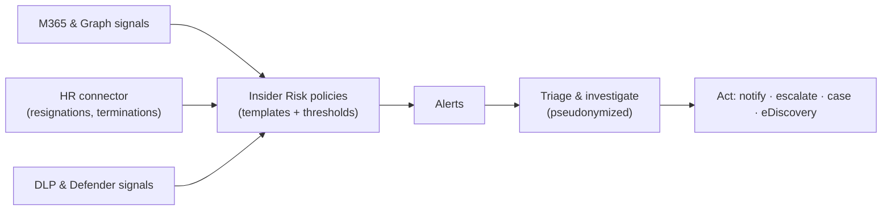
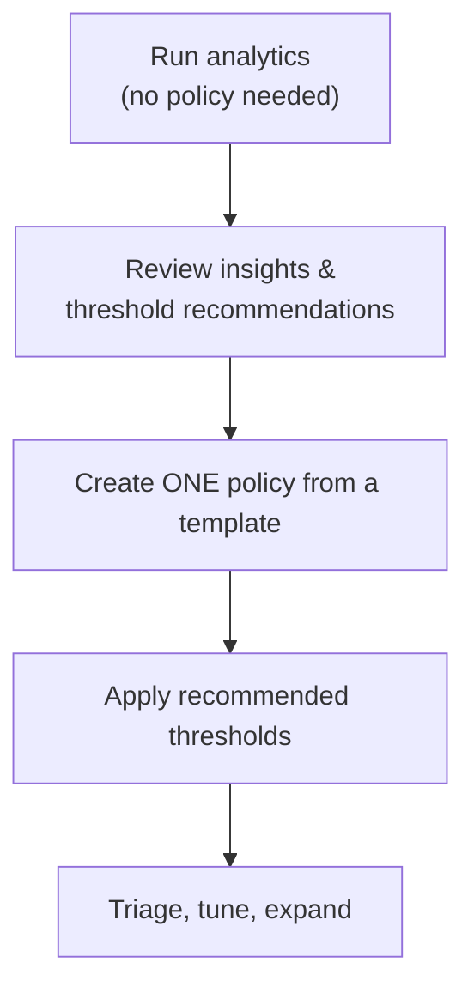

# Insider Risk Management

*Identify, triage, and act on risky user activity (IP theft, data leakage, security violations) — configure it **and** verify it, all on this page, with privacy by design.*

## Lab details

| Level | Audience | Estimated time | What you'll build |
|---|---|---|---|
| 300 · Advanced | Insider Risk / Compliance administrator | ~90 min (analytics scan up to 48 h) | A *Data theft by departing users* policy, plus verified alert triage |

!!! info "Complexity: High · Est. time: ~90 min (analytics up to 48 h)"
    IRM touches **privacy, HR data connectors, and role separation**, and its **analytics scan can take up to 48 hours**. The steps are guided, but plan for stakeholder sign-off (HR, legal, privacy) before you enable anything.

!!! warning "Privacy by design — read first"
    IRM is **built with privacy by design**: users are **pseudonymized by default**, and **role-based access controls** and **audit logs** protect user-level privacy. Insights about an individual can be calculated by administrators, so IRM must be used **in compliance with applicable laws** — involve **HR, legal, and privacy** stakeholders before enabling policies about people.

## Why this matters

Departing employees, accidental oversharing, and malicious insiders are among the hardest risks to catch — the activity often looks legitimate. IRM correlates many weak signals into a clear, prioritized picture, **while protecting employee privacy**.

Common challenges this lab solves:

- "We can't tell when a departing employee is taking data with them."
- "We need to investigate risky activity without exposing everyone's identity."
- "Alerts are too noisy to act on."

## Introduction

**Microsoft Purview Insider Risk Management (IRM)** correlates signals from **Microsoft 365 and Microsoft Graph** — plus third-party indicators — to help you **identify, triage, and act on** risky user activity.



!!! tip "Real-world example"
    An engineer resigns. The HR feed flags them as a **departing user**; over the next two weeks IRM notices unusual **copy-to-USB** and **personal-cloud upload** activity on priority content. An analyst triages the (pseudonymized) alert, opens a case, and escalates to legal hold.

## Core concepts

| Term | What it means |
|---|---|
| **Policy template** | A scenario-tuned starting point (*Data theft by departing users*, *Data leaks*, *Security violations*) |
| **Indicators & thresholds** | The signals a policy watches, and how much activity triggers an alert |
| **Analytics** | A no-policy scan that estimates risk and recommends thresholds |
| **Alert → Case** | Triage alerts, then open a case for deeper investigation and action |
| **Adaptive Protection** | Feeds a user's risk level to DLP and Conditional Access |

## Prerequisites

=== "Licensing"

    Offered in several subscriptions — **Microsoft 365 E5**, the **Microsoft Purview** suite (formerly M365 E5 Compliance), and **Microsoft 365 A5** (education). IRM is available in tenants hosted in **regions supported by its Azure dependencies**. See [Subscriptions and licensing](https://learn.microsoft.com/purview/insider-risk-management-configure#subscriptions-and-licensing).

=== "Roles & role groups"

    IRM uses **six role groups** for separation of duties:

    | Role group | Typical use |
    |---|---|
    | **Insider Risk Management** | Full access (super-user) |
    | **Insider Risk Management Admins** | Configure policies & settings |
    | **Insider Risk Management Analysts** | Investigate alerts & cases (no forensic evidence) |
    | **Insider Risk Management Investigators** | Investigate + forensic evidence + Content Explorer |
    | **Insider Risk Management Auditors** | View/export audit logs |
    | **Insider Risk Management Approvers** | Approve forensic evidence capture requests |

    To first make **Insider Risk Management** appear in the portal, be a **Global Administrator or Compliance Administrator**, or a member of **Organization Management**, **Insider Risk Management**, or **Insider Risk Management Admins**.

=== "Connectors & dependencies"

    - **HR connector** — for *Data theft by departing users*, configure the **[Microsoft 365 HR connector](https://learn.microsoft.com/purview/import-hr-data)** to import resignation/termination dates.
    - **DLP policy** — for *Data leaks*, you need at least one **DLP policy**.
    - **Audit** — ensure auditing is on so activities are captured.

## What you'll accomplish

By the end of this lab you will:

- [x] Import synthetic **HR leaver** data via the HR connector
- [x] Enable **analytics** and review threshold recommendations
- [x] Create a **Data theft by departing users** policy (pilot scope, pseudonymized)
- [x] Trigger and **triage** an alert, and open a **case**
- [x] Know how to pair IRM with **Adaptive Protection**

## Use cases covered

| # | Use case | Outcome | Time |
|---|---|---|---|
| 1 | **Configure IRM and create a policy** | A live departing-users policy | ~60 min |
| 2 | **Verify alerts & triage** | A confirmed, triaged alert / case | ~30 min |

---

## Generate lab data

The *Data theft by departing users* template relies on an HR feed of leavers. This script produces a **representative CSV** of synthetic employees with resignation dates.

!!! warning "Match your connector mapping"
    Column names must match the **field mapping** you define when you set up the HR connector. Adjust columns to your mapping — see [Import data with the HR connector](https://learn.microsoft.com/purview/import-hr-data).

```powershell
# Generate a synthetic HR "leavers" CSV for the Data theft by departing users template.
$lab = Join-Path $env:USERPROFILE 'IRM-Lab-Data'
New-Item -ItemType Directory -Path $lab -Force | Out-Null

$today = Get-Date
$rows = 1..5 | ForEach-Object {
    [pscustomobject]@{
        EmployeeId       = "user{0}@contoso.onmicrosoft.com" -f $_
        ResignationDate  = $today.AddDays(-$_).ToString('yyyy-MM-ddTHH:mm:ssZ')
        LastWorkingDate  = $today.AddDays(14 - $_).ToString('yyyy-MM-ddTHH:mm:ssZ')
        EffectiveDate    = $today.AddDays(-$_).ToString('yyyy-MM-ddTHH:mm:ssZ')
    }
}
$csv = Join-Path $lab 'hr-leavers.csv'
$rows | Export-Csv -Path $csv -NoTypeInformation -Encoding UTF8
Write-Host "Wrote $csv" -ForegroundColor Green
Get-Content $csv
```

To also generate *activity* to detect, reuse the [DLP sample-data script](../dlp/index.md#generate-lab-data) and have a test "departing" user copy those files to a USB drive or personal cloud location on an onboarded device.

## Recommended first policy

Microsoft Learn recommends running **analytics first** — it scans for potential insider risks **without any policy configured** and recommends thresholds, so your first real policy is well-tuned instead of noisy.



!!! tip "A high-value, privacy-respecting start"
    Begin with **Data theft by departing users** — concrete, time-bounded (tied to resignation/last-working dates), and easy to explain to stakeholders.

| Setting | Recommended start | Why |
|---|---|---|
| **Template** | **Data theft by departing users** | Focused, HR-triggered, high signal |
| **Prerequisite** | Microsoft 365 **HR connector** configured | Supplies resignation/termination dates |
| **Users in scope** | A **pilot group** | Limit blast radius while you learn |
| **Indicators** | **File exfiltration** (download, copy to USB, copy to personal cloud, print) | Core departing-user risks |
| **Thresholds** | **Analytics-recommended** | Reduces false positives |
| **Privacy** | Keep **pseudonymization on** (default) | Protects user identity during triage |

---

## Use case 1 — Configure IRM and create a policy

IRM is configured primarily in the **[Microsoft Purview portal](https://purview.microsoft.com)**. Follow these steps in order.

**Step 1 — Assign permissions (required)**

1. Ensure your account is a **Global Administrator / Compliance Administrator** (or **Organization Management**) so **Insider Risk Management** appears in the portal.
2. Open **Settings → Roles & scopes → Role groups** and add people to the six IRM role groups (Admins, Analysts, Investigators, Auditors, Approvers).
3. Allow **up to 30 minutes** for role membership to take effect.

{ loading=lazy }

*Image source: [Insider Risk Management solution overview](https://learn.microsoft.com/purview/insider-risk-management-solution-overview).*

**Step 2 — Configure the HR connector**

1. Open **Data connectors → Connectors** and create a **Microsoft 365 HR (Human Resources)** connector.
2. Define the **field mapping** to match your [sample HR CSV](#generate-lab-data).
3. Upload/import the CSV (production automates this on a schedule) per [Import data with the HR connector](https://learn.microsoft.com/purview/import-hr-data).

**Step 3 — Enable analytics (recommended)**

1. Open **Insider Risk Management → Analytics** and **turn on analytics**.
2. Wait for the scan — results can take **up to 48 hours**.
3. Review the insights and note the **recommended indicator thresholds**.

**Step 4 — Review settings & indicators**

1. Open **Insider Risk Management → Settings** and confirm **privacy** settings (keep **pseudonymization** on).
2. Under **Policy indicators**, enable the **file exfiltration** indicators (download, copy to USB, copy to personal cloud, print).
3. Optionally define **priority content** (specific SharePoint sites, or *Highly Confidential*–labeled content).

**Step 5 — Create the policy**

1. Open **Insider Risk Management → Policies → ＋ Create policy** and choose the **Data theft by departing users** template. Select **Next**.
2. **Name** it, choose **users/groups in scope** (start with your **pilot group**), and select **Next**.
3. Confirm the **HR connector** dependency is satisfied (the wizard flags it if not).
4. Select **priority content** and **indicators**, apply the **analytics-recommended thresholds**, and select **Next**.
5. **Review** and **Submit**. The policy begins evaluating in-scope users.

!!! success "Checkpoint"
    The policy is live under **Insider Risk Management → Policies**. It now needs activity + HR signals to generate alerts — trigger test activity next and allow processing time.

---

## Use case 2 — Verify alerts & triage

### Generate a test signal

1. Mark a test user as a **leaver** by importing the [sample HR CSV](#generate-lab-data) via the HR connector.
2. On an **onboarded device**, have that user perform exfiltration-like activity with the [DLP sample files](../dlp/index.md#generate-lab-data): copy to USB or upload to personal cloud.
3. Allow time for signals to process.

### Confirm alerts and triage

1. Open **Insider Risk Management → Alerts** — your test activity should appear as an **alert** with a **risk severity**.
2. Open it to review the **pseudonymized user**, the **triggering indicators** (for example *copy to USB*), and the **activity timeline**.
3. **Triage** the alert (Confirm / Dismiss) and, if warranted, **create a case**.
4. Review **Analytics** and the **Users** dashboard for risk distribution.

!!! success "What 'good' looks like"
    - A departing-user activity produces an **alert** with the expected indicators and severity.
    - The analyst sees a **pseudonymized** identity unless they hold the role to reveal it.
    - You can move an alert into a **case** and act (notify, escalate, or escalate to eDiscovery).

!!! warning "Interpret responsibly"
    IRM insights are a **starting point** for investigation, not a verdict. Conduct a full, lawful investigation and involve HR/legal before any employment action.

## Governance guardrails

- Involve **HR, legal, and privacy** before enabling policies about people.
- Keep at least one member in the **Insider Risk Management** or **Insider Risk Management Admins** role group to avoid a "zero administrator" state.
- Document your **investigation process** — analytics alone isn't a basis for employment decisions.

## Extensibility

- **[Adaptive Protection](https://learn.microsoft.com/purview/insider-risk-management-adaptive-protection)** — a user's risk level dynamically drives **DLP** actions and **Conditional Access**.
- **Third-party indicators & connectors** — import non-Microsoft signals via the HR connector and other [data connectors](https://learn.microsoft.com/purview/archive-third-party-data).
- **Microsoft Defender for Endpoint** — security-violation signals feed IRM policies.
- **eDiscovery escalation** — escalate a case to eDiscovery for legal hold and review.
- **Agent monitoring** — IRM can help [monitor AI agent activity](https://learn.microsoft.com/purview/insider-risk-management-monitoring-agents).

| Integration | Requirement |
|---|---|
| HR connector | Configured Microsoft 365 HR connector + mapped CSV feed |
| Data leaks template | At least one DLP policy |
| Security violations template | Microsoft Defender for Endpoint signals |
| Adaptive Protection | IRM policies live; DLP and/or Conditional Access configured |
| Forensic evidence | Investigator role + Approver sign-off; device onboarding |

## Industry use cases

=== "Financial services"

    Detect a departing **trader or analyst** exfiltrating client lists or models before joining a competitor; escalate to a case and legal hold.

=== "Telecommunication"

    Surface **mass export of subscriber data** by an agent, correlating DLP high-severity matches with unusual download volume.

=== "Public sector & SOE"

    Monitor for **leakage of citizen or national-interest data**, with strict pseudonymization and auditor oversight.

=== "Energy & resources"

    Catch **IP theft of seismic, reservoir, or plant-design data** by departing engineers on field or plant workstations.

=== "Manufacturing & conglomerates"

    Identify **trade-secret and CAD exfiltration** across business units; use Adaptive Protection to tighten DLP for elevated-risk users.

## Change management & rollout

Never switch a new policy on for the whole tenant at once. Roll it out in controlled waves so you protect data **without surprising users or blocking legitimate work**. IRM handles sensitive people-signals, so privacy and scope discipline matter as much as the rollout mechanics.

| Phase | What you do | Who's affected | Move on when… |
|---|---|---|---|
| **1. Pilot** | Start with **Analytics** (aggregated, de-identified) to size risk; then create one narrowly-scoped policy with **pseudonymization on**. | Pilot scope | Analytics shows meaningful signals; policy alerts are reviewable, not noisy |
| **2. Expand** | Add policy templates and scopes gradually; involve HR/Legal reviewers; keep role-based access tight. | Department(s) | Triage workflow works; stakeholders aligned |
| **3. Tenant-wide** | Extend policies to the intended population with agreed **privacy controls and approvals** in place. | Intended population | Steady state; alerts understood |
| **4. Operate** | Tune thresholds; review analytics and re-baseline; audit reviewer access periodically. | Ongoing | — |

!!! tip "Least-disruption levers"
    - **Start in a safe mode:** **Analytics** and **pseudonymization** before named-user policies.
    - **Communicate first:** coordinate with **HR, Legal, and privacy**; document the lawful basis and reviewer roles.
    - **Keep a rollback path:** pause or delete a policy; keep scopes minimal and privacy settings on.
    - **Log the change:** record scope, approver, and date in your change-management system (e.g., a change ticket).

## Summary & golden rules

You configured permissions, connectors, analytics, and a departing-user policy — and verified end-to-end triage, all from this page.

- **Analytics first** — tune thresholds before your first policy so it isn't noisy.
- **One template, pilot scope** — start focused, expand later.
- **Privacy by design** — keep pseudonymization on; involve HR/legal.
- **Never act on an alert alone** — investigate fully before any decision.
- **Pair with Adaptive Protection** to auto-tighten DLP for elevated-risk users.

## Sources

- [Insider Risk Management (solution overview)](https://learn.microsoft.com/purview/insider-risk-management-solution-overview)
- [Get started with Insider Risk Management](https://learn.microsoft.com/purview/insider-risk-management-configure)
- [Plan for Insider Risk Management](https://learn.microsoft.com/purview/insider-risk-management-plan)
- [Assign permissions in Insider Risk Management](https://learn.microsoft.com/purview/insider-risk-management-permissions)
- [Import data with the HR connector](https://learn.microsoft.com/purview/import-hr-data)
- [Insider Risk Management analytics](https://learn.microsoft.com/purview/insider-risk-management-settings-analytics) · [Policy indicators](https://learn.microsoft.com/purview/insider-risk-management-settings-policy-indicators)
- [Adaptive Protection](https://learn.microsoft.com/purview/insider-risk-management-adaptive-protection) · [Monitoring agents](https://learn.microsoft.com/purview/insider-risk-management-monitoring-agents)
