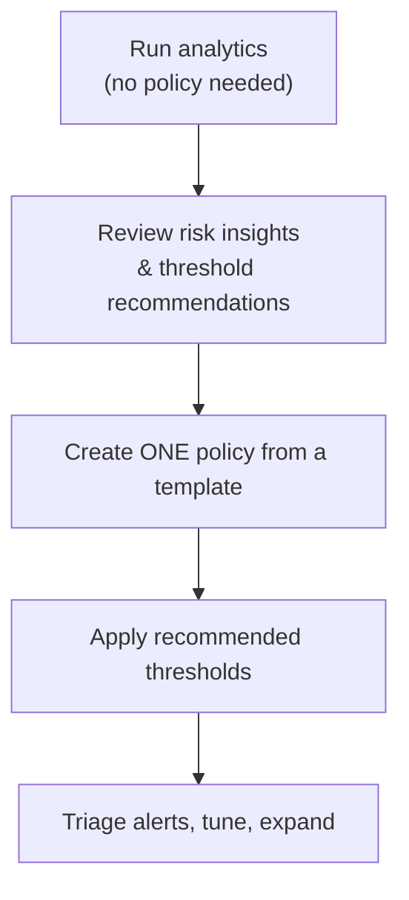

# Insider Risk Management — Part 2

!!! abstract "Step 2 of 4 · Recommended policy setup"
    1. Overview & prerequisites → **2. Recommended policy setup** → 3. Step-by-step configuration → 4. Verification.

## Start with analytics, then one template

Microsoft Learn recommends running **analytics first** — it scans for potential insider risks **without any policy configured** and recommends indicator thresholds, so your first real policy is well-tuned instead of noisy.

## Recommended first policy

!!! tip "A high-value, privacy-respecting start"
    Begin with **Data theft by departing users** — it's concrete, time-bounded (tied to resignation/last-working dates), and easy to explain to stakeholders.

| Setting | Recommended starting value | Why |
|---|---|---|
| **Template** | **Data theft by departing users** | Focused, HR-triggered, high signal |
| **Prerequisite** | Microsoft 365 **HR connector** configured | Supplies resignation/termination dates |
| **Users in scope** | A **pilot group** (or all, if analytics justifies) | Limit blast radius while you learn |
| **Indicators** | Enable **file exfiltration** indicators (download, copy to USB, copy to personal cloud, print) | Core departing-user risks |
| **Thresholds** | Use **analytics-recommended** thresholds | Reduces false positives |
| **Privacy** | Keep **pseudonymization on** (default) | Protects user identity during triage |
| **Priority content** | Add SharePoint sites / label = *Highly Confidential* | Focus on what matters most |

### Other templates to grow into

=== "Data leaks"

    Detect leaks of sensitive information. **Requires at least one DLP policy** — high-severity DLP matches become insider-risk signals.

=== "Security policy violations"

    Correlate signals from Microsoft Defender for Endpoint (for example malware or disabled security controls) to surface risky users.

=== "Risky AI usage / risky browser usage"

    Newer templates monitor risky activity involving AI apps/agents and browser-based exfiltration. Confirm availability and prerequisites on Learn.

!!! note "Pair with Adaptive Protection"
    Once policies are live, enable [Adaptive Protection](https://learn.microsoft.com/purview/insider-risk-management-adaptive-protection) so a user's **insider-risk level** dynamically drives **DLP** and **Conditional Access** — minimal friction for most users, tighter controls for elevated risk.

## Governance guardrails

- Involve **HR, legal, and privacy** before enabling policies about people.
- Keep at least one member in the **Insider Risk Management** or **Insider Risk Management Admins** role group to avoid a "zero administrator" state.
- Document your **investigation process** — analytics alone isn't a basis for employment decisions.

## Continue

With a plan and template chosen, configure it.

[:octicons-arrow-left-24: Back to Part 1](index.md){ .md-button }
[:octicons-arrow-right-24: Part 3 · Step-by-step configuration](configuration.md){ .md-button .md-button--primary }

## Sources

- [Get started with Insider Risk Management (analytics & steps)](https://learn.microsoft.com/purview/insider-risk-management-configure)
- [Plan for Insider Risk Management](https://learn.microsoft.com/purview/insider-risk-management-plan)
- [Insider Risk Management settings: Analytics](https://learn.microsoft.com/purview/insider-risk-management-settings-analytics)
- [Help dynamically mitigate risks with Adaptive Protection](https://learn.microsoft.com/purview/insider-risk-management-adaptive-protection)
