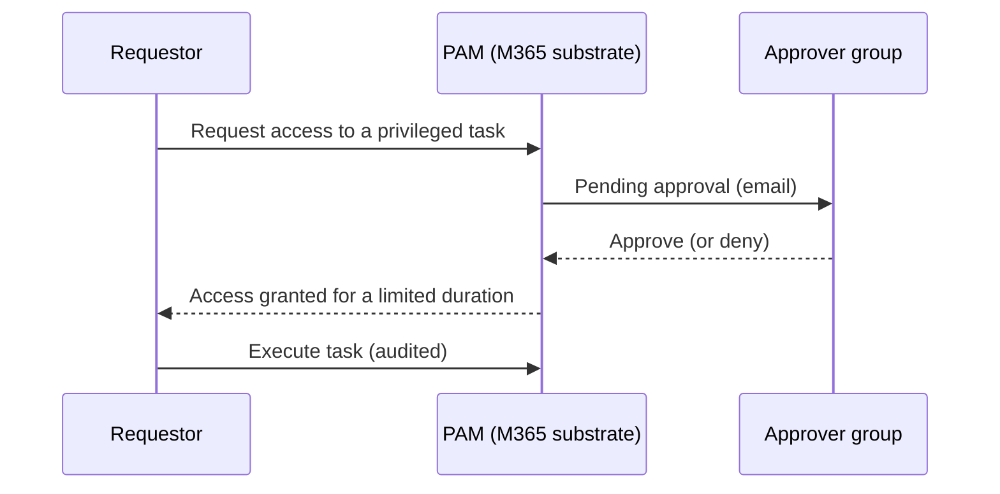

# Privileged Access Management

*Enforce just-in-time, approval-based access to sensitive Exchange Online tasks — zero standing access — set up and verified, all on this page.*

## Lab details

| Level | Audience | Estimated time | What you'll build |
|---|---|---|---|
| 200 · Intermediate | Global / Exchange administrator | ~45–60 min | An approval policy that gates a sensitive Exchange task behind just-in-time approval |

!!! info "Complexity: Medium · Est. time: ~45–60 min"
    The four-step setup (approver group → enable → policy → request/approve) is straightforward. Scoping the right tasks and approver groups, and coordinating with admins, is what takes the time.

## Why this matters

Standing admin access is a standing risk — a compromised admin account can quietly change mail flow or export mailboxes. PAM removes standing privilege: sensitive tasks require **explicit, time-limited, audited approval** every time.

## Overview video

<div class="video-embed">
<iframe src="https://www.youtube-nocookie.com/embed/Mya2vkW_IcU" title="Microsoft Mechanics: Privileged Access Management" loading="lazy" allow="accelerometer; autoplay; clipboard-write; encrypted-media; gyroscope; picture-in-picture; web-share" referrerpolicy="strict-origin-when-cross-origin" allowfullscreen></iframe>
</div>
<p class="video-caption"><strong>▶ Watch — Introducing Privileged Access Management</strong><br>Microsoft Mechanics · 5:43 — Enable PAM, create an access policy, request and approve just-in-time access to high-risk tasks, and audit the activity — enforcing zero standing access to prevent rogue or unauthorized admin actions.</p>

## Introduction

**Microsoft Purview Privileged Access Management (PAM)** limits **standing access** to sensitive tasks in **Microsoft Exchange Online**. Instead of administrators having constant (standing) privileges, PAM enforces **just-in-time (JIT)**, approval-based, time-limited access. When enabled for Exchange Online, your organization operates with **zero standing privileges**, adding a layer of defense against compromised accounts and insider threats.



!!! tip "When to use PAM"
    Use PAM when highly sensitive Exchange tasks (for example mailbox moves, transport rule changes, journaling) should require **explicit, logged approval** every time — not standing admin rights.

## Core concepts

| Term | What it means |
|---|---|
| **Standing access** | Always-on admin privilege — the risk PAM removes |
| **Just-in-time (JIT) access** | Time-limited access granted only when requested and approved |
| **Approval policy** | Binds a sensitive task to an approver group and an approval type |
| **Approver group** | A mail-enabled security group that approves or denies requests |
| **Access request** | A user's time-boxed request to run a gated task (default 4 hours) |

## Prerequisites

=== "Licensing"

    PAM works with a wide selection of Microsoft 365 subscriptions and add-ons; it's included with **Microsoft 365 Enterprise E5**. Confirm via the [subscription requirements](https://aka.ms/M365EnterprisePlans).

=== "Roles"

    - The **Global Administrator** role is required to **manage** privileged access in Microsoft 365.
    - Users in the **approvers' group** don't need Global Admin or Role Management to approve via PowerShell, but need the **Exchange Administrator** role to request/review/approve in the Microsoft 365 admin center.

=== "Scope & limits"

    - Scope is **Exchange Online** tasks.
    - Up to **30** privileged access policies per organization.
    - Default access duration is **4 hours**; requests await approval for up to **24 hours** before expiring.

## What you'll accomplish

By the end of this lab you will:

- [x] Create an **approver group** and enable privileged access
- [x] Gate a **task** with manual just-in-time approval
- [x] Gate a **role / role group** with approval
- [x] Configure an **auto-approval** policy for lower-risk tasks

## Use cases covered

Each use case is one way to implement PAM, walked through as **preconfig → configure → validate**:

| # | Surface | What you configure | Time |
|---|---|---|---|
| 1 | **Task policy (manual approval)** | Gate one Exchange task behind approval | ~30 min |
| 2 | **Role / role-group policy** | Gate a role or role group behind approval | ~20 min |
| 3 | **Auto-approval policy** | Auto-grant lower-risk tasks (still logged) | ~15 min |

## Generate lab data

"Sample data" for PAM is the **approver group** and a **test task** to gate. This script creates a mail-enabled security group you'll use as approvers.

```powershell
# Create a mail-enabled security group to act as PAM approvers (Exchange Online PowerShell).
Connect-ExchangeOnline -UserPrincipalName admin@contoso.onmicrosoft.com

New-DistributionGroup -Name "PAM Approvers" `
    -Alias "pamapprovers" `
    -Type Security `
    -PrimarySmtpAddress "pamapprovers@contoso.onmicrosoft.com"

Add-DistributionGroupMember -Identity "PAM Approvers" -Member "approver1@contoso.onmicrosoft.com"
Write-Host "Created PAM Approvers group." -ForegroundColor Green
```

A good **test task** to gate is `Exchange\New-MoveRequest` (mailbox moves) — visible and safe to exercise in a lab.

## Recommended policy setup

!!! tip "Start with one high-value task and manual approval"
    Gate a **single sensitive task** with **Manual** approval and a small approver group, then expand.

| Setting | Recommended start |
|---|---|
| Approver group | A dedicated **mail-enabled security group** (not individuals) |
| First policy scope | One task (for example `New-MoveRequest`) |
| Approval type | **Manual** (human in the loop) |
| Duration | Leave default (**4 hours**) |
| System accounts | Exclude only true automation accounts, exceptionally |

## Use case 1 — Task policy (manual approval)

*Gate a single sensitive Exchange task behind just-in-time, human approval — the core PAM pattern.*

### Preconfig

An **approver group** (from [lab data](#generate-lab-data)) and **Global Administrator** to enable PAM.

### Configure

=== "Admin center"

    1. **Enable privileged access** — Microsoft 365 admin center → **Settings → Org Settings → Security & Privacy → Privileged access** → turn on **Require approvals for privileged tasks** and set the **default approvers group**.
    2. **Create an access policy** — **Manage access policies and requests → Configure policies → Add a policy**: **Policy type = Task**, **scope = Exchange**, the **task** (e.g., `New-MoveRequest`), **approval type = Manual**, and the **approver group**. **Create**.

=== "PowerShell"

    ```powershell
    Connect-ExchangeOnline -UserPrincipalName admin@contoso.onmicrosoft.com

    # Enable PAM with the default approver group (exclude system accounts as needed).
    Enable-ElevatedAccessControl `
        -AdminGroup 'pamapprovers@contoso.onmicrosoft.com' `
        -SystemAccounts @('sys1@contoso.onmicrosoft.com')

    # Create a manual-approval policy for a specific Exchange task.
    New-ElevatedAccessApprovalPolicy `
        -Task 'Exchange\New-MoveRequest' `
        -ApprovalType Manual `
        -ApproverGroup 'pamapprovers@contoso.onmicrosoft.com'
    ```

### Validate the config

1. As a requestor, submit a request (`New-ElevatedAccessRequest -Task 'Exchange\New-MoveRequest' -Reason '...' -DurationHours 4`, or a portal request).
2. Confirm the **approver group** gets an **email**; approve it (`Approve-ElevatedAccessRequest -RequestId <id>`).
3. Confirm the requestor can run the task **only** within the window; check `Get-ElevatedAccessRequest` and the **audit log**.

!!! success "What 'good' looks like"
    Without approval the task is **denied**; after approval it's allowed for the **limited duration**, then reverts — every request/approval/execution is **audited**.

---

## Use case 2 — Role / role-group policy

*Gate an administrative **role** or **role group** (not just a single task) behind approval.*

### Preconfig

PAM enabled (Use case 1) and the approver group.

### Configure

1. **Manage access policies and requests → Configure policies → Add a policy**.
2. Set **Policy type = Role** (or **Role Group**), choose the **role/role group**, **approval type = Manual**, and the **approver group**. **Create**.

### Validate the config

1. A requestor requests access to the **role/role group**.
2. After approval, confirm they hold the role **only** for the granted window, and the activity is **audited**.

---

## Use case 3 — Auto-approval policy

*For lower-risk tasks, auto-grant access (no human step) while still logging every request — speed without standing access.*

### Preconfig

PAM enabled; a task/role you've assessed as lower-risk.

### Configure

1. Create a policy with **approval type = Auto**:

    ```powershell
    New-ElevatedAccessApprovalPolicy `
        -Task 'Exchange\Set-Mailbox' `
        -ApprovalType Auto `
        -ApproverGroup 'pamapprovers@contoso.onmicrosoft.com'
    ```

2. Keep it scoped narrowly and review usage periodically.

### Validate the config

1. Request the auto-approved task and confirm access is **granted immediately**, time-boxed.
2. Confirm the request and execution still appear in the **audit log**.

## Extensibility

- **Auto-approval policies** — for lower-risk tasks, set **ApprovalType Auto** to auto-grant while still logging.
- **Customer Lockbox** — complements PAM (Lockbox governs *Microsoft* access; PAM governs *internal* privileged tasks).
- **PowerShell automation** — manage policies/requests programmatically with the `*-ElevatedAccess*` cmdlets.

### Integration requirements

| Integration | Requirement |
|---|---|
| Admin-center approvals | Approvers hold **Exchange Administrator** role |
| PowerShell approvals | Membership in the approver group |
| Auditing | Unified audit log enabled |

## Industry use cases

=== "Financial services"

    Require approval for **journaling and transport-rule** changes that could affect regulatory capture of communications.

=== "Telecommunication"

    Gate **mailbox export/move** operations on executive mailboxes to prevent silent data access.

=== "Public sector & SOE"

    Enforce **zero standing access** to sensitive Exchange configuration to meet audit and separation-of-duties mandates.

=== "Energy & resources"

    Approve changes to **mail flow** for OT/plant notification systems only through reviewed requests.

=== "Manufacturing & conglomerates"

    Centralize approval of **cross-tenant / cross-BU** Exchange admin tasks under one approver group.

## Change management & rollout

Never switch a new policy on for the whole tenant at once. Roll it out in controlled waves so you protect data **without surprising users or blocking legitimate work**. PAM adds an approval step to admin tasks, so start with one task and a small approver group to avoid workflow bottlenecks.

| Phase | What you do | Who's affected | Move on when… |
|---|---|---|---|
| **1. Pilot** | Enable PAM and gate **one sensitive task** with **manual approval**; pilot with a small **approver group** and a couple of requesters. | Pilot admins | Requests route and approve cleanly; timing is acceptable |
| **2. Expand** | Add more tasks/policies and requesters; document who approves what and the SLA. | More admins | Approvers keep up; no admin work stalls |
| **3. Tenant-wide** | Apply policies to all in-scope admins after briefing them on the request/approve flow. | All in-scope admins | Steady state; alerts understood |
| **4. Operate** | Review approvals and audit logs; refine scopes and approver groups; exclude only true system accounts. | Ongoing | — |

!!! tip "Least-disruption levers"
    - **Start in a safe mode:** **one task + manual approval** with a pilot approver group first.
    - **Communicate first:** brief admins on how to request access and expected approval times.
    - **Keep a rollback path:** disable the policy to restore prior access, or broaden auto-approval temporarily.
    - **Log the change:** record scope, approver, and date in your change-management system (e.g., a change ticket).

## Summary & golden rules

- Gate **one high-value task** with **manual** approval first, then expand.
- Use a dedicated **approver group** (not individuals).
- Keep the default **time-limited** access window; every use is audited.
- Exclude only true **system accounts**, and only exceptionally.

## Sources

- [Privileged access management (overview)](https://learn.microsoft.com/purview/privileged-access-management-solution-overview)
- [Learn about privileged access management](https://learn.microsoft.com/purview/privileged-access-management)
- [Get started with privileged access management](https://learn.microsoft.com/purview/privileged-access-management-configuration)
- [Enable-ElevatedAccessControl / New-ElevatedAccessApprovalPolicy (Exchange PowerShell)](https://learn.microsoft.com/powershell/module/exchangepowershell/enable-elevatedaccesscontrol)
