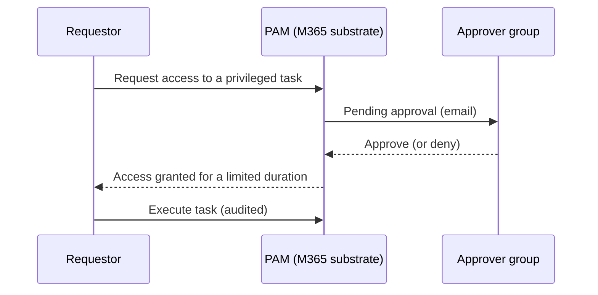

# Privileged Access Management

*Enforce just-in-time, approval-based access to sensitive Exchange Online tasks — zero standing access — set up and verified, all on this page.*

## Lab details

| Level | Audience | Estimated time | What you'll build |
|---|---|---|---|
| 200 · Intermediate | Global / Exchange administrator | ~45–60 min | An approval policy that gates a sensitive Exchange task behind just-in-time approval |

!!! info "Complexity: Medium · Est. time: ~45–60 min"
    The four-step setup (approver group → enable → policy → request/approve) is straightforward. Scoping the right tasks and approver groups, and coordinating with admins, is what takes the time.

## Why this matters

Standing admin access is a standing risk — a compromised admin account can quietly change mail flow or export mailboxes. PAM removes standing privilege: sensitive tasks require **explicit, time-limited, audited approval** every time.

## 1. Description

**Microsoft Purview Privileged Access Management (PAM)** limits **standing access** to sensitive tasks in **Microsoft Exchange Online**. Instead of administrators having constant (standing) privileges, PAM enforces **just-in-time (JIT)**, approval-based, time-limited access. When enabled for Exchange Online, your organization operates with **zero standing privileges**, adding a layer of defense against compromised accounts and insider threats.



!!! tip "When to use PAM"
    Use PAM when highly sensitive Exchange tasks (for example mailbox moves, transport rule changes, journaling) should require **explicit, logged approval** every time — not standing admin rights.

## 2. Prerequisites

=== "Licensing"

    PAM works with a wide selection of Microsoft 365 subscriptions and add-ons; it's included with **Microsoft 365 Enterprise E5**. Confirm via the [subscription requirements](https://aka.ms/M365EnterprisePlans).

=== "Roles"

    - The **Global Administrator** role is required to **manage** privileged access in Microsoft 365.
    - Users in the **approvers' group** don't need Global Admin or Role Management to approve via PowerShell, but need the **Exchange Administrator** role to request/review/approve in the Microsoft 365 admin center.

=== "Scope & limits"

    - Scope is **Exchange Online** tasks.
    - Up to **30** privileged access policies per organization.
    - Default access duration is **4 hours**; requests await approval for up to **24 hours** before expiring.

## 3. Generate sample data (approver group + test task)

"Sample data" for PAM is the **approver group** and a **test task** to gate. This script creates a mail-enabled security group you'll use as approvers.

```powershell
# Create a mail-enabled security group to act as PAM approvers (Exchange Online PowerShell).
Connect-ExchangeOnline -UserPrincipalName admin@contoso.onmicrosoft.com

New-DistributionGroup -Name "PAM Approvers" `
    -Alias "pamapprovers" `
    -Type Security `
    -PrimarySmtpAddress "pamapprovers@contoso.onmicrosoft.com"

Add-DistributionGroupMember -Identity "PAM Approvers" -Member "approver1@contoso.onmicrosoft.com"
Write-Host "Created PAM Approvers group." -ForegroundColor Green
```

A good **test task** to gate is `Exchange\New-MoveRequest` (mailbox moves) — visible and safe to exercise in a lab.

## 4. Recommended policy setup

!!! tip "Start with one high-value task and manual approval"
    Gate a **single sensitive task** with **Manual** approval and a small approver group, then expand.

| Setting | Recommended start |
|---|---|
| Approver group | A dedicated **mail-enabled security group** (not individuals) |
| First policy scope | One task (for example `New-MoveRequest`) |
| Approval type | **Manual** (human in the loop) |
| Duration | Leave default (**4 hours**) |
| System accounts | Exclude only true automation accounts, exceptionally |

## 5. Step-by-step configuration

=== "Admin center"

    1. **Create an approver's group** — Microsoft 365 admin center → **Groups** → add a **mail-enabled security group** and add approvers.
    2. **Enable privileged access** — **Settings → Org Settings → Security & Privacy → Privileged access** → turn on **Require approvals for privileged tasks** and set the **default approvers group**.
    3. **Create an access policy** — **Manage access policies and requests → Configure policies → Add a policy**: choose **Policy type** (Task/Role/Role Group), **scope = Exchange**, the **policy** (task), **approval type = Manual**, and the **approver group**. Select **Create**.
    4. **Request & approve** — under **New request**, a user requests the task for a number of hours; approvers **Approve/Deny** from the same area.

=== "PowerShell"

    Use **Exchange Online PowerShell**.

    ```powershell
    Connect-ExchangeOnline -UserPrincipalName admin@contoso.onmicrosoft.com

    # 2) Enable PAM with the default approver group (exclude system accounts as needed).
    Enable-ElevatedAccessControl `
        -AdminGroup 'pamapprovers@contoso.onmicrosoft.com' `
        -SystemAccounts @('sys1@contoso.onmicrosoft.com')

    # 3) Create an approval policy for a specific Exchange task.
    New-ElevatedAccessApprovalPolicy `
        -Task 'Exchange\New-MoveRequest' `
        -ApprovalType Manual `
        -ApproverGroup 'pamapprovers@contoso.onmicrosoft.com'

    # 4a) A user submits a request for elevated access.
    New-ElevatedAccessRequest `
        -Task 'Exchange\New-MoveRequest' `
        -Reason 'Fixing a stuck mailbox move' `
        -DurationHours 4

    # 4b) An approver approves it (by request ID from the notification email).
    Approve-ElevatedAccessRequest -RequestId <request id> -Comment 'Approved for maintenance'
    ```

## 6. Verification

1. As a requestor, submit `New-ElevatedAccessRequest` (or a portal request) for the gated task.
2. Confirm the **approver group** receives an **email** notification.
3. Approve it, then confirm the requestor can execute the task **only** within the granted window.
4. Check the status with `Get-ElevatedAccessRequest -Identity <id> | select RequestStatus`, and confirm actions appear in the **audit log**.

!!! success "What 'good' looks like"
    Without approval, the gated task is **denied**; after approval, it's allowed for the **limited duration** and then reverts; every request/approval/execution is **audited**.

## 7. Extensibility

- **Auto-approval policies** — for lower-risk tasks, set **ApprovalType Auto** to auto-grant while still logging.
- **Customer Lockbox** — complements PAM (Lockbox governs *Microsoft* access; PAM governs *internal* privileged tasks).
- **PowerShell automation** — manage policies/requests programmatically with the `*-ElevatedAccess*` cmdlets.

### Integration requirements

| Integration | Requirement |
|---|---|
| Admin-center approvals | Approvers hold **Exchange Administrator** role |
| PowerShell approvals | Membership in the approver group |
| Auditing | Unified audit log enabled |

## 8. Industry use cases

=== "Financial services"

    Require approval for **journaling and transport-rule** changes that could affect regulatory capture of communications.

=== "Telecommunication"

    Gate **mailbox export/move** operations on executive mailboxes to prevent silent data access.

=== "Public sector & SOE"

    Enforce **zero standing access** to sensitive Exchange configuration to meet audit and separation-of-duties mandates.

=== "Energy & resources"

    Approve changes to **mail flow** for OT/plant notification systems only through reviewed requests.

=== "Manufacturing & conglomerates"

    Centralize approval of **cross-tenant / cross-BU** Exchange admin tasks under one approver group.

## Summary & golden rules

- Gate **one high-value task** with **manual** approval first, then expand.
- Use a dedicated **approver group** (not individuals).
- Keep the default **time-limited** access window; every use is audited.
- Exclude only true **system accounts**, and only exceptionally.

## 9. Sources

- [Privileged access management (overview)](https://learn.microsoft.com/purview/privileged-access-management-solution-overview)
- [Learn about privileged access management](https://learn.microsoft.com/purview/privileged-access-management)
- [Get started with privileged access management](https://learn.microsoft.com/purview/privileged-access-management-configuration)
- [Enable-ElevatedAccessControl / New-ElevatedAccessApprovalPolicy (Exchange PowerShell)](https://learn.microsoft.com/powershell/module/exchangepowershell/enable-elevatedaccesscontrol)
