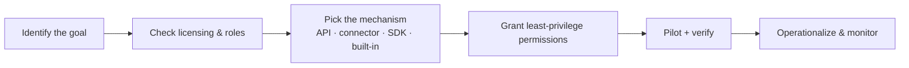

# Microsoft Purview — Extensibility & Integrations

!!! info "Complexity: Varies · Est. time: depends on the integration"
    This page summarizes how to **customize** Purview and **integrate** it with other Microsoft and third-party systems, with the requirements for each. Feature pages carry the deeper, per-feature integration details.

## Customization options

-   :material-regex:{ .lg .middle } __Custom sensitive information types__

    ---

    Define your own detection patterns (regex + keywords + confidence) and **document fingerprinting** when built-in SITs don't match your data.

    Requirement: Information Protection roles; classification permissions.

-   :material-brain:{ .lg .middle } __Trainable classifiers__

    ---

    Teach Purview to recognize content **categories** by example, then reuse the classifier across DLP, Insider Risk, and Communication Compliance.

    Requirement: sufficient training data; supported licensing.

-   :material-tune:{ .lg .middle } __Adaptive scopes & policies__

    ---

    Dynamically scope retention, communication compliance, and other policies by directory attribute.

    Requirement: adaptive scope created before the policy.

-   :material-shield-sync:{ .lg .middle } __Adaptive Protection__

    ---

    Let a user's insider-risk level dynamically drive **DLP** and **Conditional Access** controls.

    Requirement: Insider Risk Management configured; DLP/Conditional Access.

## Shared building blocks

Several capabilities are **shared across solutions**, so configuring them once benefits many:

- **[Sensitivity labels](https://learn.microsoft.com/purview/sensitivity-labels)** — used by Information Protection, DLP, auto-labeling, and Data Map.
- **[Classifiers (SITs + trainable)](https://learn.microsoft.com/purview/data-classification-overview)** — shared by DLP, Insider Risk, Communication Compliance, and classification reports.
- **[Data connectors](https://learn.microsoft.com/purview/archive-third-party-data)** — import third-party data so compliance solutions can act on it.
- **Retention labels/policies** — shared by Data Lifecycle Management and Records Management.

## Programmatic integration (APIs & SDKs)

| Integration | What it enables | Requirements |
|---|---|---|
| **[Microsoft Graph security API](https://learn.microsoft.com/graph/api/resources/security-api-overview)** | Read alerts (incl. DLP) and drive automation/SOAR | Graph app registration + permissions |
| **[Audit Search Graph API](https://learn.microsoft.com/purview/audit-solutions-overview)** / **Office 365 Management Activity API** | Programmatic audit search; stream audit data to SIEM | App registration; subscription to content types |
| **[Microsoft Purview Information Protection SDK](https://learn.microsoft.com/information-protection/develop/overview)** | Read/write label metadata; apply encryption in custom apps | MIP SDK; app permissions |
| **eDiscovery Graph APIs** | Automate cases, holds, searches, exports | Graph permissions; eDiscovery roles |
| **Security & Compliance PowerShell** | Script DLP, labels, retention, IB, and more | `Connect-IPPSSession`; appropriate roles |
| **Data governance REST APIs** | Automate Data Map registration/scan and catalog operations | Purview account; governance roles |

## Third-party & cross-product integrations

=== "Microsoft Defender"

    - **Endpoint DLP** and **Insider Risk** consume **Microsoft Defender for Endpoint** signals.
    - **Data Security Investigations** integrates with **Microsoft Defender XDR** so SOC teams launch investigations from incidents.
    - **Microsoft Defender for Cloud Apps** extends DLP-style controls to third-party SaaS.

=== "Microsoft Sentinel"

    - Stream **audit logs** (Management Activity API) and Purview alerts into **Microsoft Sentinel** for SIEM/SOAR correlation and response.

=== "Microsoft Security Copilot"

    - **[Security Copilot in Purview](https://learn.microsoft.com/purview/copilot-in-purview-overview)** brings natural-language investigation to DLP, Insider Risk, and DSPM.
    - The **Data Security Posture agent** surfaces posture insights (consumes **Security Compute Units**).

=== "Partners & ISVs"

    - Sensitivity labels are stored in **document metadata**, so many **partner apps/services** can read and honor them.
    - **Compliance Manager connectors** assess non-Microsoft services (for example **Salesforce**, **Zoom**).
    - **Data Map** connects to a broad set of **non-Microsoft sources** (for example Amazon Redshift/S3).

## How to approach an integration

!!! warning "Confirm entitlements first"
    Many integrations (endpoint DLP, Security Copilot agents, pay-as-you-go AI/eDiscovery locations) have specific **licensing or billing** prerequisites. Confirm on the [Microsoft Purview service description](https://learn.microsoft.com/office365/servicedescriptions/microsoft-365-service-descriptions/microsoft-365-tenantlevel-services-licensing-guidance/microsoft-purview-service-description) before you build.

## Sources

- [Learn about sensitivity labels](https://learn.microsoft.com/purview/sensitivity-labels)
- [Data classification overview](https://learn.microsoft.com/purview/data-classification-overview)
- [Archive third-party data (connectors)](https://learn.microsoft.com/purview/archive-third-party-data)
- [Microsoft Graph security API overview](https://learn.microsoft.com/graph/api/resources/security-api-overview)
- [Microsoft Purview Information Protection SDK](https://learn.microsoft.com/information-protection/develop/overview)
- [Microsoft Security Copilot in Microsoft Purview](https://learn.microsoft.com/purview/copilot-in-purview-overview)
