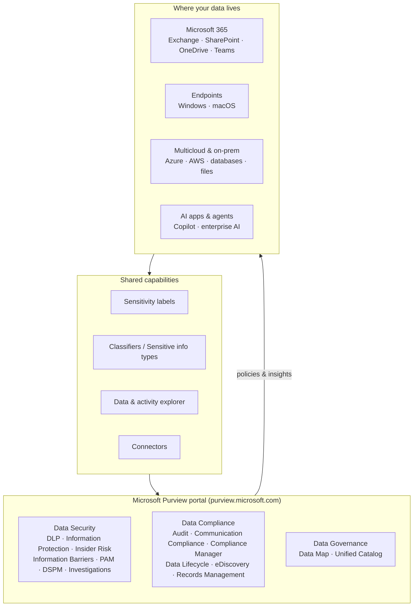

# Microsoft Purview

## Govern, protect, and manage your data — in the era of AI
Microsoft Purview is a **comprehensive set of solutions** that helps your organization govern, protect, and manage data wherever it lives. It brings **data security**, **data compliance**, and **data governance** together on one unified platform.

!!! info "Complexity: Low to start · Est. time: ~15 min to read this overview"
    Purview is a *family* of solutions, not a single product. This page is the map: read it first, then dive into a module. Individual feature pages carry their own complexity and time estimates.

## The problem Purview solves

Data is fragmented across clouds, apps, and devices, and the rise of generative AI makes it easier than ever to accidentally overshare or leak sensitive information. Microsoft Purview addresses four recurring challenges called out on Microsoft Learn:

- **Fragmentation** of data across the organization.
- **Lack of visibility** that hampers data protection and governance.
- **Rapid acceleration** of AI transformation.
- **Blurring** of traditional IT management roles.

Purview combines solutions and services into a [unified platform](https://learn.microsoft.com/purview/purview-portal) so you can gain visibility into data, safeguard and manage sensitive data across its lifecycle, govern data comprehensively, manage critical data risks and regulatory requirements, and protect against accidental oversharing and sensitive-data leakage in generative AI.

{ loading=lazy }

*Solution areas in Microsoft Purview. Image source: [Learn about Microsoft Purview](https://learn.microsoft.com/purview/purview).*

## The three solution categories

-   :material-shield-lock:{ .lg .middle } __Data Security__

    ---

    Dynamically secure data throughout its lifecycle — prevent loss, protect and label information, manage insider risk, and limit privileged access.

    [:octicons-arrow-right-24: Data Security module](data-security/index.md)

-   :material-scale-balance:{ .lg .middle } __Data Compliance__

    ---

    Minimize compliance risk and meet regulatory requirements — audit, communication compliance, records and lifecycle management, and eDiscovery.

    [:octicons-arrow-right-24: Data Compliance module](data-compliance/index.md)

-   :material-file-tree:{ .lg .middle } __Data Governance__

    ---

    Map your data estate and build a federated approach to governing data and unlocking business innovation — Data Map and Unified Catalog.

    [:octicons-arrow-right-24: Data Governance module](data-governance/index.md)

## Architecture at a glance

!!! note "Diagram is a simplified learning aid"
    The grouping above is a teaching model of how the pieces relate. For the authoritative solution list and portal experience, see the Sources at the bottom of this page.

## Modules & features

Each solution below links to a deep-dive page that follows the same template: description → prerequisites & licensing → complexity & time → sample-data script → recommended policy → step-by-step → verification → extensibility → industry use cases → sources.

### Data Security solutions

| Solution | What it does | Deep dive |
|---|---|---|
| Data Loss Prevention | Detect and prevent risky or inappropriate sharing of sensitive information across services and endpoints. | [Open](data-security/dlp/index.md) |
| Information Protection | Discover, classify, label, and protect sensitive information wherever it lives or travels. | [Open](data-security/information-protection/index.md) |
| Insider Risk Management | Identify, triage, and act on risky user activity using service and third-party signals. | [Open](data-security/insider-risk-management/index.md) |
| Information Barriers | Restrict two-way communication and collaboration between groups in Teams, SharePoint, and OneDrive. | [Open](data-security/information-barriers.md) |
| Privileged Access Management | Enforce just-in-time, scoped, time-limited access to sensitive Exchange configuration tasks. | [Open](data-security/privileged-access-management.md) |
| Data Security Investigations | Use generative AI to analyze and respond to data security incidents and breaches. | [Open](data-security/data-security-investigations.md) |
| Data Security Posture Management | Discover, protect, and investigate sensitive-data risks across your digital estate (preview). | [Open](data-security/dspm.md) |

### Data Compliance solutions

| Solution | What it does | Deep dive |
|---|---|---|
| Audit | Search a unified audit log of user and admin activity for investigations and forensics. | [Open](data-compliance/audit.md) |
| Communication Compliance | Detect and remediate inappropriate or risky messages in your organization's communications. | [Open](data-compliance/communication-compliance.md) |
| Compliance Manager | Measure and improve compliance posture against regulations with assessments and improvement actions. | [Open](data-compliance/compliance-manager.md) |
| Data Lifecycle Management | Retain what you need and delete what you don't, using retention labels and policies. | [Open](data-compliance/data-lifecycle-management.md) |
| eDiscovery | Identify, hold, collect, review, and export content for legal and investigative matters. | [Open](data-compliance/ediscovery.md) |
| Records Management | Declare, manage, and dispose of high-value records with defensible retention and disposition. | [Open](data-compliance/records-management.md) |

### Data Governance solutions

| Solution | What it does | Deep dive |
|---|---|---|
| Data Map | Create a unified map of your data estate through scanning and classification. | [Open](data-governance/data-map.md) |
| Unified Catalog | Catalog, curate, and govern data with business context, quality, and data products. | [Open](data-governance/unified-catalog.md) |

## Shared capabilities

Several capabilities are shared across multiple Purview solutions:

- **[Sensitivity labels](https://learn.microsoft.com/purview/sensitivity-labels)** — classify and (optionally) protect items with encryption, access restrictions, and visual markings.
- **[Classifiers](https://learn.microsoft.com/purview/data-classification-overview)** — sensitive information types (regex/function based) and trainable classifiers (example based).
- **[Data explorer](https://learn.microsoft.com/purview/data-classification-data-explorer) & [activity explorer](https://learn.microsoft.com/purview/data-classification-activity-explorer)** — see classified content and the actions users take on it.
- **[Connectors](https://learn.microsoft.com/purview/archive-third-party-data)** — import and archive third-party data so Purview solutions can act on it.

## Compatibility

=== "Supported workloads"

    Microsoft Purview data security and compliance solutions work primarily across the **Microsoft 365** workloads — **Exchange Online, SharePoint, OneDrive, and Microsoft Teams** — and extend to **Windows and macOS endpoints** for endpoint DLP and Information Protection. Purview also protects **generative AI experiences** (Microsoft 365 Copilot and agents), enterprise AI apps you build, and other AI apps you use.

=== "Clouds & standalone"

    Purview is delivered as a cloud service through the **Microsoft Purview portal** (`purview.microsoft.com`). Data governance (**Data Map** and **Unified Catalog**) extends discovery and cataloging across a **multicloud and on-premises** estate — including Azure, other clouds, databases, and file sources. Some solutions are available standalone or as part of Microsoft 365 E5/compliance suites; confirm entitlements per solution.

=== "Connectors"

    **Data connectors** let you import and archive non-Microsoft ("third-party") data — such as chat, social, and instant-message platforms — into Microsoft 365 so that Purview compliance solutions (eDiscovery, retention, communication compliance, and more) can operate on it.

## Licensing

Purview spans many solutions, each with its own licensing. Do not assume a single SKU covers everything.

!!! warning "Always confirm entitlements on the service description"
    Licensing varies by solution and by capability tier (for example, DLP has both a base tier and advanced endpoint capabilities). Use the official **[Microsoft Purview service description](https://learn.microsoft.com/office365/servicedescriptions/microsoft-365-service-descriptions/microsoft-365-tenantlevel-services-licensing-guidance/microsoft-purview-service-description)** and the **[Microsoft 365 guidance for security & compliance](https://learn.microsoft.com/office365/servicedescriptions/microsoft-365-service-descriptions/microsoft-365-tenantlevel-services-licensing-guidance/microsoft-365-security-compliance-licensing-guidance)** to confirm exactly which plan (for example Microsoft 365 E3 vs E5, or E5 Compliance) is required for each capability in *your* tenant.

## Where to go next

1. Start with the **[Data Security overview](data-security/index.md)** and its flagship feature, **[Data Loss Prevention](data-security/dlp/index.md)**.
2. Then explore **[Data Compliance](data-compliance/index.md)** and **[Data Governance](data-governance/index.md)**.
3. Finish with Purview **[Extensibility & Integrations](extensibility.md)** and **[Industry Use Cases](use-cases.md)**.

## Sources

- [Learn about Microsoft Purview](https://learn.microsoft.com/purview/purview)
- [Microsoft Purview data security solutions](https://learn.microsoft.com/purview/purview-security)
- [Microsoft Purview data compliance solutions](https://learn.microsoft.com/purview/purview-compliance)
- [Microsoft Purview data governance solutions](https://learn.microsoft.com/purview/data-governance-overview)
- [Learn about the Microsoft Purview portal](https://learn.microsoft.com/purview/purview-portal)
- [Microsoft Purview service description](https://learn.microsoft.com/office365/servicedescriptions/microsoft-365-service-descriptions/microsoft-365-tenantlevel-services-licensing-guidance/microsoft-purview-service-description)
