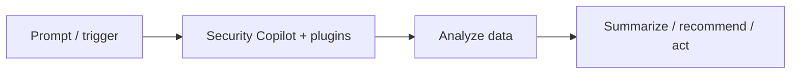

# Feature deep-dive — template

!!! info "Complexity: _Low / Medium / High_ · Est. time: _~N–N min_"
    Replace with the real rating and a one-line justification. Keep this admonition **at the top** of every feature page.

!!! note "This is a scaffold"
    This page shows the **standard 10-section template**. When filling it in, **ground every fact in [Microsoft Learn](https://learn.microsoft.com/copilot/security/)** and cite URLs in Sources. Mark anything unverifiable as **⚠️ Not verified on Microsoft Learn**.

## 1. Description

_What the capability/agent does, when to use it, and key concepts._



## 2. Prerequisites

=== "Licensing / capacity"
    _SCU provisioning and onboarding requirements. Link the get-started/capacity docs._
=== "Roles & permissions"
    _Owner/contributor and product-specific RBAC required._
=== "Other"
    _Which product plugins/data sources must be connected._

## 3. Complexity & time

_Justify the rating (onboarding, plugin setup, prompt/agent design)._

## 4. Generate sample data

```text
Example scaffold — replace with a real, grounded approach.
Use a test incident/entity from a connected product (for example a Defender
incident) as the subject of a Copilot prompt or promptbook.
```

## 5. Recommended setup

_Sensible defaults (connect key plugins, start with built-in promptbooks, set RBAC)._

## 6. Step-by-step configuration

=== "Standalone portal"
    1. _Step in the Security Copilot portal…_
=== "Embedded experience"
    1. _Step inside Defender/Sentinel/Entra/Intune/Purview…_

## 7. Verification

!!! success "What 'good' looks like"
    _Describe the expected end state (a useful, grounded response or a completed agent action)._

## 8. Extensibility

_Plugins, custom promptbooks, agents, and integration requirements._

## 9. Industry use cases

=== "Financial services"
    _…_
=== "Telco"
    _…_
=== "Public sector & SOE"
    _…_
=== "Energy & resources"
    _…_
=== "Manufacturing & conglomerates"
    _…_

## 10. Sources

- [Get started with Microsoft Security Copilot](https://learn.microsoft.com/copilot/security/get-started-security-copilot)
- _Add the specific Microsoft Learn URLs used on this page._
