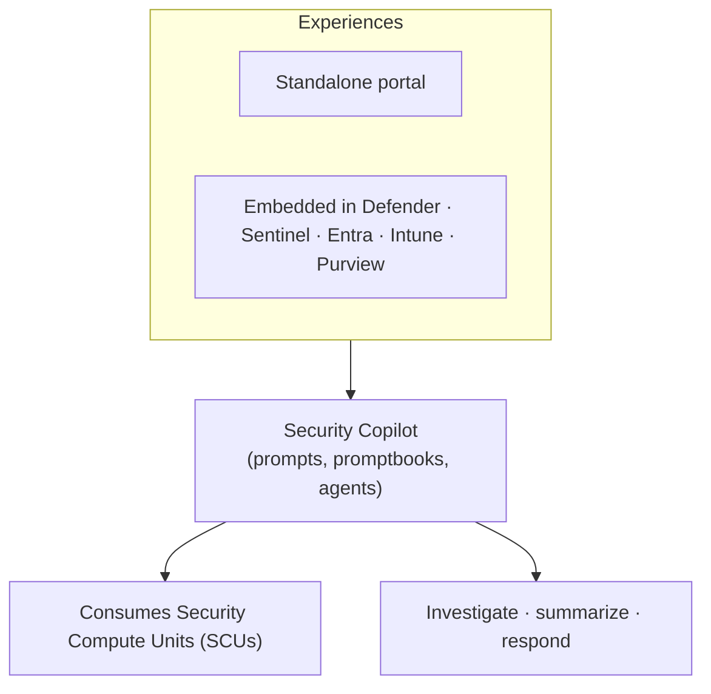

# Microsoft Security Copilot

## Generative AI for defenders
Microsoft Security Copilot is a **generative-AI-powered security solution** that helps security professionals and IT admins handle end-to-end scenarios — incident response, threat hunting, intelligence gathering, and posture management — at machine speed and scale.

!!! info "Section status: scaffolded"
    This section uses the **same template** as Purview and is **ready to be filled in**. The overview is grounded in Microsoft Learn; deep-dives will follow the [feature template](feature-template.md).

## What Security Copilot is

Security Copilot offers a **natural-language, assistive** experience — both a **standalone portal** ([securitycopilot.microsoft.com](https://securitycopilot.microsoft.com)) and **embedded experiences** inside Microsoft security products. It integrates with **Microsoft Defender XDR, Microsoft Sentinel, Microsoft Intune, Microsoft Entra, and Microsoft Purview**, plus supported third-party services.

## Capability areas

-   :material-message-processing:{ .lg .middle } __Standalone & embedded experiences__

    ---

    Use the standalone portal for cross-product work, or embedded Copilot inside each security product.

-   :material-robot:{ .lg .middle } __Security Copilot agents__

    ---

    Autonomous agents that perform security workflows within customer-defined logic, permissions, and triggers (with RBAC).

-   :material-book-open-page-variant:{ .lg .middle } __Promptbooks & plugins__

    ---

    Reusable prompt sequences and integrations that extend Copilot to more data sources.

-   :material-chip:{ .lg .middle } __Capacity (SCUs)__

    ---

    Provisioned **Security Compute Units** power Copilot workloads; monitor and manage usage.

## Where this section is going

Each capability will get a deep-dive page following the workshop template (description → prerequisites → complexity & time → sample data → policy → step-by-step → verification → extensibility → industry use cases → sources).

[:octicons-arrow-right-24: See the feature template](feature-template.md){ .md-button .md-button--primary }

!!! note "Capacity-based"
    Security Copilot is provisioned with **Security Compute Units (SCUs)**. Confirm current onboarding and capacity requirements on Microsoft Learn.

## Sources

- [Get started with Microsoft Security Copilot](https://learn.microsoft.com/copilot/security/get-started-security-copilot)
- [Microsoft Security Copilot (application card)](https://learn.microsoft.com/copilot/security/security-copilot-application-card-agents)
- [Security Copilot in Microsoft products](https://learn.microsoft.com/copilot/security/experiences-security-copilot)
- [Security compute units (SCUs)](https://learn.microsoft.com/copilot/security/manage-usage)
