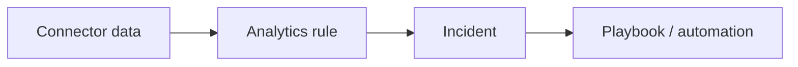

# Feature deep-dive — template

!!! info "Complexity: _Low / Medium / High_ · Est. time: _~N–N min_"
    Replace with the real rating and a one-line justification. Keep this admonition **at the top** of every feature page.

!!! note "This is a scaffold"
    This page shows the **standard 10-section template**. When filling it in, **ground every fact in [Microsoft Learn](https://learn.microsoft.com/azure/sentinel/)** and cite URLs in Sources. Mark anything unverifiable as **⚠️ Not verified on Microsoft Learn**.

## 1. Description

_What the capability does, when to use it, and key concepts._



## 2. Prerequisites

=== "Licensing / cost"
    _Workspace + ingestion/commitment tiers; Defender portal onboarding. Link the pricing/billing docs._
=== "Roles & permissions"
    _Least-privilege Sentinel/Defender RBAC roles required._
=== "Other"
    _Log Analytics workspace, connectors, and data source prerequisites._

## 3. Complexity & time

_Justify the rating (connector setup, rule tuning, playbook development)._

## 4. Generate sample data

```kusto
// Example scaffold — replace with a real, grounded approach.
// Use built-in sample data / the training lab, or a safe connector,
// then validate with a KQL query.
SecurityEvent
| take 10
```

## 5. Recommended policy setup

_Sensible defaults (enable relevant analytics rule templates, start in a controlled scope)._

## 6. Step-by-step configuration

=== "Portal"
    1. _Step in the Defender/Sentinel portal…_
=== "KQL / API"
    ```kusto
    // ...grounded query...
    ```

## 7. Verification

!!! success "What 'good' looks like"
    _Describe the expected end state (data flowing, rule firing, incident created, playbook run)._

## 8. Extensibility

_Content hub solutions, custom connectors, playbooks, Security Copilot, and requirements._

## 9. Industry use cases

=== "Financial services"
    _…_
=== "Telco"
    _…_
=== "Public sector & SOE"
    _…_
=== "Energy & resources"
    _…_
=== "Manufacturing & conglomerates"
    _…_

## 10. Sources

- [What is Microsoft Sentinel?](https://learn.microsoft.com/azure/sentinel/overview)
- _Add the specific Microsoft Learn URLs used on this page._
