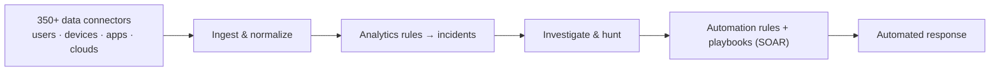

# Microsoft Sentinel

## Cloud-native SIEM + SOAR
Microsoft Sentinel is a **cloud-native SIEM** that delivers AI-powered security across multicloud and multiplatform environments — with **threat detection, investigation, response, and proactive hunting** — plus **SOAR** automation.

!!! info "Section status: scaffolded"
    This section uses the **same template** as Purview and is **ready to be filled in**. The overview is grounded in Microsoft Learn; deep-dives will follow the [feature template](feature-template.md).

## What Microsoft Sentinel is

Microsoft Sentinel gives security teams a **unified view** of the enterprise. It's available in the **Microsoft Defender portal** for a unified security operations experience, and integrates with **Security Copilot** for natural-language investigation and automated hunting.

## Core capability areas

-   :material-connection:{ .lg .middle } __Data connectors & ingestion__

    ---

    350+ out-of-the-box connectors (first- and third-party), normalization, and tiered analytics/data-lake storage.

-   :material-magnify:{ .lg .middle } __Analytics & incidents__

    ---

    Detection rules that correlate signals into incidents for investigation.

-   :material-robot-industrial:{ .lg .middle } __SOAR (automation)__

    ---

    Automation rules and playbooks to enrich, respond, and remediate at scale.

-   :material-target:{ .lg .middle } __Threat hunting__

    ---

    Proactive, query-based hunting across your collected security data.

## Where this section is going

Each capability will get a deep-dive page following the workshop template (description → prerequisites → complexity & time → sample data → policy → step-by-step → verification → extensibility → industry use cases → sources).

[:octicons-arrow-right-24: See the feature template](feature-template.md){ .md-button .md-button--primary }

!!! warning "Defender portal is the future home"
    After **March 31, 2027**, Microsoft Sentinel will be available **only in the Microsoft Defender portal** (Azure portal experience retires). Plan new work in the Defender portal. Confirm details on Learn.

## Sources

- [What is Microsoft Sentinel?](https://learn.microsoft.com/azure/sentinel/overview)
- [Microsoft Sentinel SIEM overview](https://learn.microsoft.com/azure/sentinel/sentinel-overview)
- [Automation in Microsoft Sentinel (SOAR)](https://learn.microsoft.com/azure/sentinel/automation/automation)
- [Microsoft Sentinel in the Defender portal](https://learn.microsoft.com/azure/sentinel/microsoft-sentinel-defender-portal)
